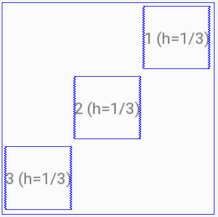

# Лабораторная работа №1. Layouts
## Цели
* Познакомиться со средой разработки Android Studio
* Изучить основные принципы верстки layout с использованием XML
* Изучить основные возможности и свойства `LinearLayout`
* Изучить основные возможности и свойства `ConstraintLayout`

## Задачи
### Задача 1.  LinearLayout
#### Задание
Создайте layout ресурсы для следующих макетов экрана с использованием [LinearLayout](https://developer.android.com/guide/topics/ui/layout/linear).

Изображение 1 согласно [варианту](linear).

Изображение 2 согласно [варианту](linear).

[Варианты](variants.txt):
```log
1:{1,10}
2:{2,11}
3:{3,12}
...
13:{13,22}
14:{14,1}
15:{15,2}
...
22:{22,9}
23:{1,10}
...
```

#### Указания
* Изучите `LinearLayout` по документации: https://developer.android.com/guide/topics/ui/layout/linear. Особое внимание обратите на атрибуты: `layout_weight`, `gravity`, `layout_gravity`, `orientation`, `layout_height`, `layout_width`.
* Изучите получившийся XML код. Опишите все XML теги и атрибуты, использованные в вёрстке. Объясните, почему выбраны именно такие значения для атрибутов у разных виджетов.
* Многие задачи можно решить разными способами. Предложите два решения хотя бы для одной из задач.

#### Пояснения
* Цифрами (1, 2, 3) обозначены произвольные widget’ы (`button`, `imageView`, `textView`, и т.д.). Используйте разные виджеты для разных цифр в рамках одного задания.
* Если в рисунке указана только высота или ширина (`w` или `h`), то второй размер можно выбрать произвольно (например, `wrap_content`). Например, на рисунке  
  
ширина (`w`) не указана, и может быть использована `wrap_content`. Небольшие отступы внутрь от обрамляющего квадрата добавлены только для улучшения визуального восприятия картинки и могут быть проигнорированы при xml вёрстке.

### Задача 2. ConstraintLayout
#### Задание
Решите задачу 1 (обе подзадачи) с использованием [ConstraintLayout](https://developer.android.com/training/constraint-layout)

#### Указания:
* Изучите `ConstraintLayout` по документации: https://developer.android.com/training/constraint-layout. Особое внимание обратите на атрибуты: `layout_constraintDimensionRatio`, `layout_constraintHorizontal_weight`, `layout_constraintVertical_weight`.
* Изучите получившийся XML код. Опишите все XML атрибуты, использованные в вёрстке, не использовавшиеся для решения предыдущего задания. Объясните, почему выбраны именно такие значения для атрибутов у разных виджетов.


### Задача 3. ConstraintLayout
Создайте layout ресурс для следующего макета экрана с использованием ConstraintLayout.

Изображение 3 согласно [варианту](constraint).

#### Пояснения
* Цифрами (1, 2, 3) обозначены произвольные widget’ы (`button`, `imageView`, `textView`, и т.д.). Используйте разные виджеты для разных цифр в рамках одного задания.
* `ConstraintLayout` имеет форму квадрата, занимает максимальную площадь и располагается в центре экрана.
* Все фигуры имеют размеры `A*B/5`, где `A` — некоторое число, легко угадываемое из иллюстрации к заданию, `B` — размер стороны квадрата `ConstraintLayoout`.

# Общие рекомендации

* Разные задачи рекомендуется решать в разных layout файлах. Всего должно получиться 6 (или более) xml файлов.
* Для выполнения заданий не обязательно запускать приложение на реальном устройстве или эмуляторе (достаточно результатов preview в Android Studio).  


## Отчет
Отчет должен содержать формулировку целей, решения задач с ответами на дополнительные вопросы из раздела «указания» и выводы. Работа должна содержать 6 листингов (по одному для каждой задачи)
Выводы должны содержать обоснование, почему автор отчета считает, что все цели были достигнуты, а также ответы на следующие вопросы:
* В каких случаях целесообразно использовать `LinearLayout`, в каких `ConstraintLayout`?

## Дополнительные файлы

1. Помимо отчёта необходимо прислать сами xml файлы одним архивом. Файлы внутри архива должны называться  
`layout_{task:1,2,3}_{img:1,2..}_[alt].xml`  
Например:
    * `layout_1_14.xml` — задача №1, решение для layout из рисунка `14.png`
    * `layout_1_14_alt.xml` — альтернативное решение задачи №1 для рисунка `14.png`
    * `layout_3_28.xml` — решение задачи №3 для layout из рисунка `28.png`
2. Отчёт или сопроводительное письмо должны содержать ссылку на полный проект (например, ссылку на репозиторий в github), который можно загрузить в Android Studio.


## Вспомогательные материалы:
* https://classroom.udacity.com/courses/ud9012 (Lesson 1 “Build Your First App”, Lesson 2 “Layouts”)
* startandroid [Урок 180](https://startandroid.ru/ru/uroki/vse-uroki-spiskom/489-urok-180-constraintlayout-osnovy.html), [Урок 181](https://startandroid.ru/ru/uroki/vse-uroki-spiskom/490-urok-181-constraintslayout-advanced.html), [Урок 182](https://startandroid.ru/ru/uroki/vse-uroki-spiskom/491-urok-182-constraintlayout-chain-weight-barrier-group.html)
