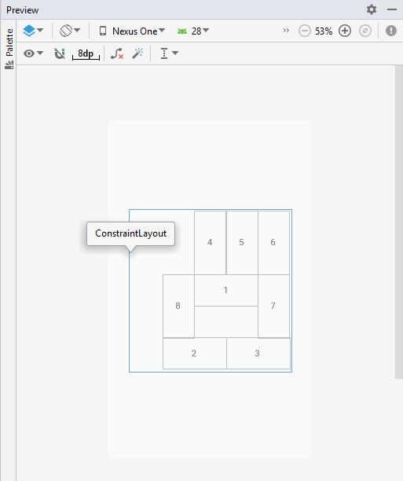

# Лабораторная работа №1. Layouts
## Цели
* Ознакомиться со средой разработки Android Studio
* Изучить основные принципы верстки layout с использованием View и ViewGroup
* Изучить основные возможности и свойства LinearLayout
* Изучить основные возможности и свойства ConstraintLayout

## Задачи
### Задача 1.  LinearLayout
#### Задание
Создайте layout ресурсы для следующих макетов экрана с использованием [LinearLayout](https://developer.android.com/guide/topics/ui/layout/linear).

Изображение 1 согласно [варианту](linear).

Изображение 2 согласно [варианту](linear).

#### Пояснения
* Цифрами (1, 2, 3) обозначены произвольные widget’ы (button, imageView, textView, и т.д.). Используйте разные виджеты для разных цифр в рамках одного задания.

#### Указания
* Изучите LinearLayout по документации от производителя ОС: https://developer.android.com/guide/topics/ui/layout/linear. Опишите свои наблюдения в отчете.
* Обратите внимание на атрибуты layout_weight, gravity, layout_gravity, orientation, layout_height, layout_width. Опишите их поведение и использование при решении задач в отчете (прим.: могут для решения задач могут потребоваться на все атрибуты).
* Изучите получившийся XML код. Докажите, что он не содержит избыточных тегов и атрибутов (например, продемонстрируйте, что удаление любого из тегов/атрибутов приведет к другой верстке)
* Многие задачи можно решить разными способами. Предложите два решения хотя бы для одной из задач.

### Задача 2. ConstraintLayout
#### Задание
Решите задачу 1 (обе подзадачи) с использованием [ConstraintLayout](https://developer.android.com/training/constraint-layout)

#### Указания:
* Изучите ConstraintLayout по документации от производителя ОС: https://developer.android.com/training/constraint-layout. Опишите свои наблюдения в отчете.
* Обратите внимание на атрибут layout_constraintDimensionRatio, layout_constraintHorizontal_weight, layout_constraintVertical_weight (прим.: может не использоваться для решения задач).
* Изучите получившийся XML код. Докажите, что он не содержит избыточных тегов и атрибутов 

### Задача 3. ConstraintLayout
Создайте layout ресурс для следующего макета экрана с использованием ConstraintLayout.

Изображение 3 согласно [варианту](constraint).

#### Пояснения
* Цифрами (1, 2, 3) обозначены произвольные widget’ы (button, imageView, textView, и т.д.). Используйте разные виджеты для разных цифр в рамках одного задания.
* ConstraintLayout имеет форму квадрата, занимает максимальную площадь и располагается в центре экрана.
* Все фигуры имеют размеры `A*B/5`, где `A` - некоторое число, легко угадываемое из иллюстрации к заданию, `B` - размер стороны квадрата ConstraintLayoout.
* Разные задачи рекомендуется решать в разных layout файлах. Всего должно получиться 6 xml файлов.
* Если в рисунке указана только высота или ширина (w или h), то второй размер можно выбрать произвольно (например, `wrap_content`)
* Для выполнения заданий не обязательно запускать приложение на реальном устройстве или эмуляторе (достаточно результатов preview в Android Studio).

## Отчет
Отчет должен содержать формулировку целей, решения задач с ответами на дополнительные вопросы из раздела «указания» и выводы. Работа должна содержать 6 листингов (по одному для каждой задачи)
Выводы должны содержать обоснование, почему автор отчета считает, что все цели были достигнуты, а также ответы на следующие вопросы:
* В каких случаях целесообразно использовать LinearLayout, и в каких ConstraintLayout.

## Вспомогательные материалы:
* https://classroom.udacity.com/courses/ud9012 (Lesson 1 “Build Your First App”, Lesson 2 “Layouts”)
* startandroid [Урок 180](https://startandroid.ru/ru/uroki/vse-uroki-spiskom/489-urok-180-constraintlayout-osnovy.html), [Урок 181](https://startandroid.ru/ru/uroki/vse-uroki-spiskom/490-urok-181-constraintslayout-advanced.html), [Урок 182](https://startandroid.ru/ru/uroki/vse-uroki-spiskom/491-urok-182-constraintlayout-chain-weight-barrier-group.html)
