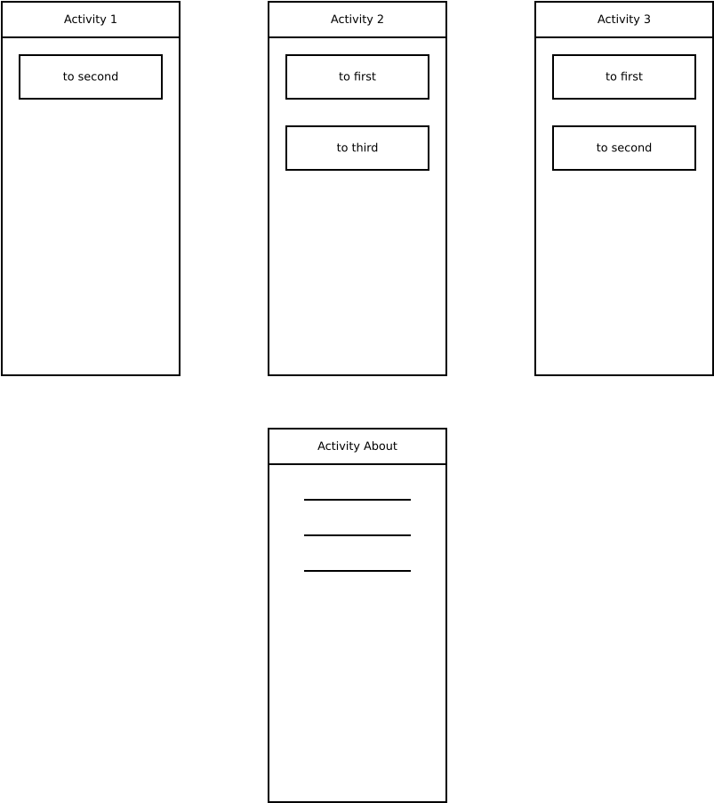

# Решение задачи №2
Посмотрим внимательнее на эскиз

* `Activity1` всегда запускает `Activity2`. Можно использовать `Activity1#startActivity` для этой операции.
* `Activity2` может вернуться в `Activity1` или перейти в новую `Activity3`. Для первой операции можно просто использовать метод `Activity2#finish`. Вторая операция интереснее, т.к. нам понадобится узнать, что привело к завершению `Activity3`. Используем `sartActivityForResult`.
* `Activity3` может вернуться в `Activity1` или в `Activity2`. Для возврата в `Activity2` можно просто использовать метод `Activity3#finish`. Для возврата в `Activity1` понадобится помощь со стороны `Activity2`. Для того, чтобы известить `Activity2` о необходимости завершиться, используем код возврата, который передадим с помощью метода `Activity3#setResult`, только после этого вызовем метод `Activity3#finish`.  `Activity2` в методе `Activity2#onActivityResult` должна проверить причину завершения `Activity3`: если `Activity3` завершилась из-за того, что пользователь нажал `toFirst`, то вызовем метод `Activity2#finish`. В случае `toSecond` дополнительных действий не требуется. 
