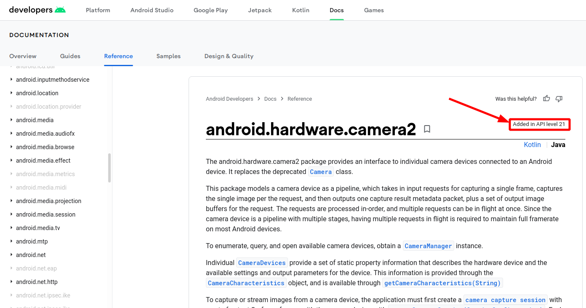
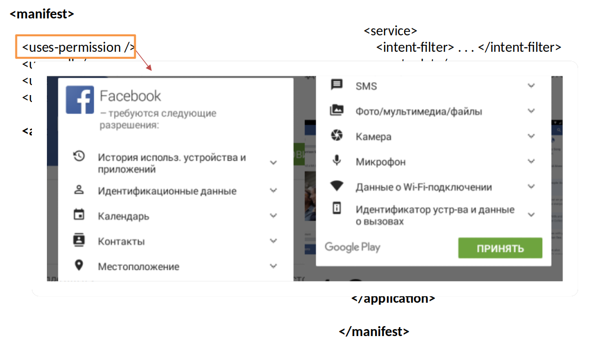
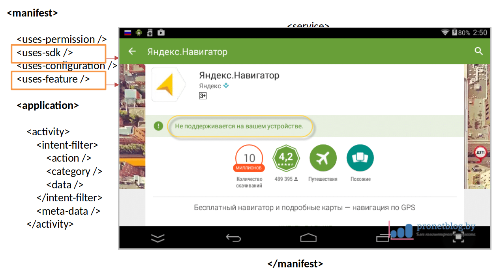

<style>
img[alt~="center"] {
  display: block;
  margin: 0 auto;
}
</style>


# Проектирование мобильных приложений
<!-- _paginate: false -->
<!-- _footer: "Creative Commons Attribution-ShareAlike 3.0" -->

## Орг. Вопросы

---

# Учебная нагрузка

Из учебного плана (часов):
- Лекции: 30
- Лабораторные + Курсовое проектирование: 30
- **Самостоятельная работа: 53**
- Экзамен: 11

В конце года: Зачёт по ЛР(КР) + экзамен с оценкой

---
# Лабораторные

Преподаватели:
- Алексюк Артём Олегович
- Егорова Инга Сергеевна
- Калашников Роман Андреевич (ассистент)
- Кузнецов Андрей Николаевич

---
# Лабораторные

Процедура:
- На выполнение задания даётся 2 недели
- Успешно выполненное задание - это:
  - Отчёт. Высылается на e-mail. Проверяется произвольным преподавателем. Является допуском к устному зачёту по теме ЛР
  - Устный зачёт по теме ЛР (у своего* преподавателя)

Те, кто успевают сдать тему за 2 недели (минус время проверки отчёта), освобождаются от темы на экзамене.

Те, кто не успевают, подвергаются общественному порицанию. Иногда отчисляются за неуспеваемость.

---

# Краткое понятие ЛР

<style scoped>
img { position:absolute; right:5%; top:5%;}
</style>

У ЛР есть 
- Цели (познакомиться с API ABC)
- Задачи (решить конкретную задачу с использованием изучаемых API)
- Ход работы (для того, чтобы A воспользуемся API таким образом, для того, чтобы B — другим)
- Выводы (API ABC используются так-то и так-то, в отличие от ранее изученных API, то-то и то-то)


https://github.com/andrei-kuznetsov/android-lectures/tree/master/labs

---

# Курсовая работа

Можно выполнять ЛР, используя свои задачи

- Цели (познакомиться с API ABC) — такие же, как и в ЛР
- Задачи (продемонстрировать как изучаемые API используются в курсовой работе)
- Ход работы (для того, чтобы A воспользуемся API таким образом, для того, чтобы B — другим)
- Выводы (API ABC используются так-то и так-то, в отличие от ранее изученных API, то-то и то-то)

---

# "Оно работает" – не аргумент!


Если API используется неправильно, то не важно, работает приложение или нет, т.к. цель — познакомиться с API/средой/библиотекой, а не решить задачу "лишь бы работало"

---

# Краткое содержание курса

В курсе рассматриваются базовые примитивы из которых строятся любые андроид-приложения. Современные библиотеки будут в курсе названы, но основное внимание будет уделено именно механизмам и концепциям самой ОС, а не изучению библиотек, потому что библиотеки — это абстракции, а любые нетривиальные абстракции протекают. [Joel Spolsky, 2002/11/11](https://www.joelonsoftware.com/2002/11/11/the-law-of-leaky-abstractions/)

[Перевод на русский by Firemoon](https://habr.com/ru/company/selectel/blog/512796/):
> Это ключевой элемент инженерной магии интернета, на которую мы полагаемся каждый день. Эта магия есть в протоколе TCP, в одном из ...

---

# Пример дырявой абстракции

```kotlin
// kotlin 1.5.30:
fun main(args: Array<String>) {
    var exception: Throwable? = null

    foo {
        if (0 > 1) exception = IllegalStateException()
    }

    if (exception != null) {
        println("Exception: $exception")
        throw exception!!
    }

    println("Hello, world")
}

fun foo(consumer: () -> Unit) {
    consumer()
}
```

---

# Рекомендованные источники

- https://developer.android.com/guide
- https://www.udacity.com/course/developing-android-apps-with-kotlin--ud9012
- Ещё можно заглянуть на https://startandroid.ru/


---

# Общение

Telegram?, WhatsApp?, VK?

e-mail: icc2013.mobile@gmail.com (общий)

---

# Вопросы

---

# Проектирование мобильных приложений
<!-- _paginate: false -->
<!-- _footer: "Creative Commons Attribution-ShareAlike 3.0" -->

## Android: Введение

---

# Инструментарий Разработчика

- Android Studio
  - https://developer.android.com/studio
  - Можно использовать IntelliJ Idea (лучше использовать Android Studio)
- Android SDK
  - https://developer.android.com/studio#command-tools
- Kotlin & Java

---

# Android SDK (1)

Build Tools (`<sdk>/build-tools/<ver>/`)
- aapt, aidl, apksigner, d8/dx, ...

SDK Tools (`<sdk>/tools/[bin]`)
- emulator, monkeyrunner, screenshot2, apkanalyzer, monitor, mksdcard, ...

SDK Platform-tools (`<sdk>/platform-tools/`)
- adb, fastboot, make2fs, sqlite3, ...

<!-- _footer: Информация больше не доступна по URL: http://developer.android.com/sdk/exploring.html -->

---

# Android SDK (2)

SDK Platform (`<sdk>/platforms/<android-version>/`)
- Одна SDK платформа для каждой версии Android.

System Images (`<sdk>/platforms/<android-version>/`)

Sources for Android SDK (`<sdk>/sources/`)

<!-- _footer: Информация больше не доступна по URL: http://developer.android.com/sdk/exploring.html -->

---

# Новый проект

## Демонстрация

---

# Структура проекта Android


<!-- _footer: https://developer.android.com/studio/projects -->

---

# Архитектура ОС Android


<!-- _footer: https://source.android.com/setup -->

---

# Архитектура ОС Android


<!-- _footer: https://source.android.com/devices/architecture -->

---

# Имена релизов и версии API

| Codename |	Version |	API level/NDK release |
| - | - | - |
Android11   |	11    |	API level 30
Android10   |	10    |	API level 29
Pie 	      | 9     |	API level 28
Oreo 	      | 8.1.0 |	API level 27
Oreo 	      | 8.0.0 |	API level 26
Nougat 	    | 7.1   |	API level 25
... 	      | ...   |	...

<!-- _footer: https://source.android.com/setup/start/build-numbers -->

---

# Значимость версии API для разработчика




<!-- _footer: https://developer.android.com/reference/android/hardware/camera2/package-summary -->

---

# Компиляция Проекта (1)


---

# Компиляция Проекта (2)


<!-- _footer: https://developer.android.com/studio/build -->

---


---

# Вопрос

Как запустить java приложение?

---

# Структура Android приложения

Android приложение – это совокупность компонентов, которые могут запускаться операционной системой независимо друг от друга.

Приложение предоставляет несколько точек входа

---

# Программные компоненты Android

- Activities
  - Окно приложения (UI)
- Services
  - Фоновая задача (без UI)
- Content Providers
  - Источник данных (пример: адресная книга)
- Broadcast Receivers
  - Получатель широковещательных уведомлений (примеры: низкий заряд батареи, экран выключен, изменился часовой пояс)

Разработчику нужно унаследовать соответствующий базовый класс компонента

---

# AndroidManifest.xml
или как Android узнает о компонентах приложения

---

# The AndroidManifest.xml File (1)

- Уникальный идентификатор приложения
  - А также: название приложения, иконка приложения и т.п.
- Объявлены компоненты приложения
  - activities, services, broadcast receivers, and content providers
- Привилегии, которыми обладает приложение (для доступа к защищенным API)
- Привилегии, которыми должны обладать другие приложения для доступа к этому приложению

---

# The AndroidManifest.xml File (2)

- Декларируются Instrumentation классы
  - Профилирование, юнит-тестирование и т.п.
- Минимальный уровень API
- Минимальная конфигурация системы
- Динамические библиотеки

---

<!-- _footer: https://developer.android.com/guide/topics/manifest/manifest-intro -->

<style scoped>
section {
    display: flex;
    flex-direction: row;
    flex-wrap: wrap;
}

h1 {
    flex: 0 1 100%;
}

pre {
    height: 500px;
    flex-basis: 50%;
}

pre code svg {
    max-height:470px;
}
</style>

```xml
<?xml version="1.0" encoding="utf-8"?>
<manifest>

    <uses-permission />
    <permission />
    <permission-tree />
    <permission-group />
    <instrumentation />
    <uses-sdk />
    <uses-configuration />  
    <uses-feature />  
    <supports-screens />  
    <compatible-screens />  
    <supports-gl-texture />  

    <application>

        <activity>
            <intent-filter>
                <action />
                <category />
                <data />
            </intent-filter>
            <meta-data />
        </activity>
```

```xml
        <activity-alias>
            <intent-filter> . . . </intent-filter>
            <meta-data />
        </activity-alias>

        <service>
            <intent-filter> . . . </intent-filter>
            <meta-data/>
        </service>

        <receiver>
            <intent-filter> . . . </intent-filter>
            <meta-data />
        </receiver>

        <provider>
            <grant-uri-permission />
            <meta-data />
            <path-permission />
        </provider>

        <uses-library />

    </application>

</manifest>
```

---



---



---

# AndroidManifest.xml

Для самостоятельного ознакомления
http://developer.android.com/guide/topics/manifest/manifest-intro.html


---

# Вопросы

- icc2013.mobile@gmail.com
- https://github.com/andrei-kuznetsov/android-lectures
