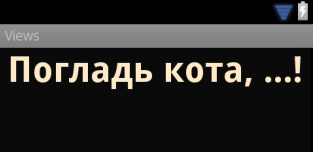
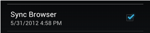
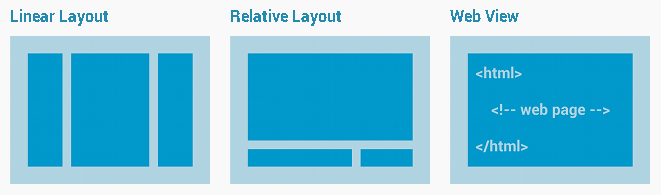
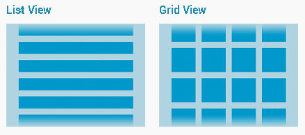
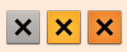
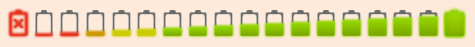

<style>
img[alt~="center"] {
  display: block;
  margin: 0 auto;
}
</style>


# Проектирование мобильных приложений
<!-- _paginate: false -->
<!-- _footer: "Creative Commons Attribution-ShareAlike 3.0" -->

## Android: Ресурсы

---

# Важное Замечание

В этой лекции мы узнаем как определять различные ресурсы

Навыки правильного использования различных ресурсов будут отрабатываться на практике.

---
# Типы Ресурсов

- Все ресурсы хранятся в каталоге “res”
- Тип ресурса определяется именем подкаталога

```
MyProject/
    src/
        MyActivity.java
    res/
        drawable/
            graphic.png
        layout/
            main.xml
            info.xml
        mipmap/
            icon.png
        values/
            strings.xml
```

<!-- _footer: https://developer.android.com/guide/topics/resources/providing-resources#ResourceTypes -->

---

# Типы Ресурсов

| Тип | Описание |
| --- | -------- |
| `layout`    | Верстка UI
| `drawable`  | Графические ресурсы
| `values`    | Значения (отступов, размеров, констант, строк и т.п.)
| `mipmap`    | Иконка приложения для Launcher
| {`anim`,`animator`} | XML файлы для {tween,property} анимации
| `color`     | XML файлы для color state list
| `raw`       | Неинтерпретируемый ресурс
| `menu`      | Меню
| `xml`       | XMl файл произвольной природы
| `font`      | Шрифты

<!-- _footer: https://developer.android.com/guide/topics/resources/providing-resources#ResourceTypes -->

---

# Доступ к Ресурсу

На ресурс можно сослаться:
- Из кода: `R.<type>.<name>`
- Из ресурса: `@[package:]<type>/<name>`

Например, ресурс: `layout/main.xml`:
- Из кода: `R.layout.main`
- Из ресурса: `@layout/main`

---

# Values

---

# Values

- String, String Array, Quantity Strings (Plurals) 
- Style
- Bool
- Color
- Dimesion
- ID
- Integer
- Integer Array
- Typed Array

---

# Values: String

```xml
<?xml version="1.0" encoding="utf-8"?>
<resources>
    <string name="hello">Hello!</string>
</resources> 
```

---

# Values: String Array

```xml
<?xml version="1.0" encoding="utf-8"?>
<resources>
    <string-array name="planets_array">
        <item>Mercury</item>
        <item>Venus</item>
        <item>Earth</item>
        <item>Mars</item>
    </string-array>
</resources>
```

---

# Values: Quantity Strings (Plurals)

```xml
<?xml version="1.0" encoding="utf-8"?>
<resources>
    <plurals name="numberOfSongsAvailable">
        <item quantity="one">One song found.</item>
        <item quantity="other">%d songs found.</item>
    </plurals>
</resources>
```

```xml
<?xml version="1.0" encoding="utf-8"?>
<resources>
    <plurals name="numberOfSongsAvailable">
        <item quantity="one">Znaleziono jedną piosenkę.</item>
        <item quantity="few">Znaleziono %d piosenki.</item>
        <item quantity="other">Znaleziono %d piosenek.</item>
    </plurals>
</resources> 
```

---

# Values: Quantity Strings (Plurals)

```xml
<?xml version="1.0" encoding="utf-8"?>
<resources>
    <plurals
        name="plural_name">
        <item
            quantity=["zero" | "one" | "two" | "few" | "many" | "other"]
            >text_string</item>
    </plurals>
</resources>
```

---

# Values: Dimension

```xml
<?xml version="1.0" encoding="utf-8"?>
<resources>
    <dimen name="textview_height">25dp</dimen>
    <dimen name="textview_width">150dp</dimen>
    <dimen name="ball_radius">30dp</dimen>
    <dimen name="font_size">16sp</dimen>
</resources>
```

---

# Values: Dimension Units

`px` Pixels 

`mm` Millimeters 

`in` Inches

`dp` Density-independent Pixels - An abstract unit that is based on the physical density of the screen.

`sp` Scale-independent Pixels - This is like the dp unit, but it is also scaled by the user's font size preference.

`pt` Points - 1/72 of an inch.

---

# Values (other)

```xml
<?xml version="1.0" encoding="utf-8"?>
<resources>
    <bool name="screen_small">true</bool>
    <color name="translucent_red">#80ff0000</color>
    <item type="id" name="button_ok" />
    <integer name="max_speed">75</integer>
    <integer-array name="bits">
        <item>4</item>
        <item>8</item>
    </integer-array>
    <array name="icons">
        <item>@drawable/home</item>
        <item>@drawable/settings</item>
    </array>
    <array name="colors">
        <item>#FFFF0000</item>
        <item>#FF00FF00</item>
    </array>
</resources> 
```


---

# Layout Resource
https://developer.android.com/guide/topics/ui/declaring-layout

---

# Layout Resource (.xml)

```xml
<?xml version="1.0" encoding="utf-8"?>
<ViewGroup xmlns:android="http://schemas.android.com/apk/res/android"
  android:id="@[+][package:]id/resource_name"
  android:layout_height=["dimension" | "match_parent" | "wrap_content"]
  android:layout_width=["dimension" | "match_parent" | "wrap_content"]
  [ViewGroup-specific attributes] >
  <View
    android:id="@[+][package:]id/resource_name"
    android:layout_height=["dimension" | "match_parent" | "wrap_content"]
    android:layout_width=["dimension" | "match_parent" | "wrap_content"]
    [View-specific attributes] >
    <requestFocus/>
  </View>
  <ViewGroup >
    <View />
  </ViewGroup>
  <include layout="@layout/layout_resource"/>
</ViewGroup> 
```

<!-- _footer: https://developer.android.com/guide/topics/resources/layout-resource -->

---

# Layout Resource. Root Element.

- `ViewGroup`
  - `LinearLayout`, `RelativeLayout`, `FrameLayout`, etc.
- `View`
  - `TextView`, `Button`, `CheckBox`, etc.
- `<merge>`
  - An alternative root element that is not drawn in the layout hierarchy

---

# `<include>`

`<merge>` часто используется с `<include>`

```xml
<include layout="@layout/layout_resource"
         android:id="@[+][package:]id/resource_name"
         android:layout_height=["dimension" | "fill_parent" | "wrap_content"]
         android:layout_width=["dimension" | "fill_parent" | "wrap_content"] />
```

---

# View Hierarchy


<!-- _footer: https://developer.android.com/guide/topics/ui/declaring-layout -->

---

# `android.view.{View & ViewGroup}`

```
java.lang.Object 
  ↳android.view.View (~ widgets)
    ↳android.view.ViewGroup (~ layout managers)
```

---

# Атрибуты `android.view.View`

```xml
<View
  android:id="@[+][package:]id/resource_name"
  android:layout_height=["dimension" | "match_parent" | "wrap_content"]
  android:layout_width=["dimension" | "match_parent" | "wrap_content"]
  [View-specific attributes] />
```

`@+id/<name>` — создать новый ресурс типа `ID` и сослаться на него
`@id/<name>` — ссылка на существующий ресурс типа `ID`

---

# Несколько часто используемых виджетов

---

# `android.widget.TextView`



```xml
<TextView
    android:id="@+id/pat_a_cat"
    android:layout_width="match_parent"
    android:layout_height="wrap_content"
    android:text="@string/patacat" />
```


---

# `android.widget.{Button,ImageButton}`


```xml
<Button
    android:layout_width="wrap_content"
    android:layout_height="wrap_content"
    android:text="@string/button_text” ... /> 
```

```xml
<ImageButton
    android:layout_width="wrap_content"
    android:layout_height="wrap_content"
    android:src="@drawable/button_icon”... />
```

```xml
<Button
    android:layout_width="wrap_content"
    android:layout_height="wrap_content"
    android:text="@string/button_text”
    android:drawableLeft="@drawable/button_icon” ... />
```

---

# `android.widget.EditText`

<style scoped>
img { position:absolute; right:7%; top:30%;}
</style>

```xml
<EditText
    android:id="@+id/email_address"
    android:layout_width="fill_parent"
    android:layout_height="wrap_content"
    android:hint="@string/email_hint"
    android:inputType="textEmailAddress" /> 
```

```

java.lang.Object
  ↳ android.view.View
     ↳ android.widget.TextView
        ↳ android.widget.EditText
```


---

# `android:inputType`

<style scoped>
ul { overflow: scroll;}
</style>

```xml
<EditText
    android:id="@+id/postal_address"
    android:layout_width="fill_parent"
    android:layout_height="wrap_content"
    android:hint="@string/postal_address_hint"
    android:inputType="textPostalAddress|
                       textCapWords|
                       textNoSuggestions" /> 
```

- `text` Normal text keyboard.
- `textEmailAddress` Normal text keyboard with the @ character.
- `textUri` Normal text keyboard with the / character.
- `number` Basic number keypad.
- `phone` Phone-style keypad.
- `textCapSentences` Normal text keyboard that capitalizes the first letter for each new sentence.
- `textCapWords` Normal text keyboard that capitalizes every word. Good for titles or person names.
- `textAutoCorrect` Normal text keyboard that corrects commonly misspelled words.
- `textPassword` Normal text keyboard, but the characters entered turn into dots.
- `textMultiLine` Normal text keyboard that allow users to input long strings of text that include line breaks (carriage returns).

---

# Keyboard Actions


```xml
<EditText
    android:id="@+id/search"
    android:layout_width="fill_parent"
    android:layout_height="wrap_content"
    android:hint="@string/search_hint"
    android:inputType="text"
    android:imeOptions="actionSend" /> 
```

---

# `android.widget.CheckBox`



```xml
<CheckBox android:id="@+id/checkbox_cheese"
          android:layout_width="wrap_content"
          android:layout_height="wrap_content"
          android:text="@string/cheese"/>
```

```
android.widget.Button
  ↳android.widget.CompoundButton 
    ↳android.widget.CheckBox
```

---

# `android.widget.RadioButton`


```xml
<RadioButton android:id="@+id/radio_ninjas"
             android:layout_width="wrap_content"
             android:layout_height="wrap_content"
             android:text="@string/ninjas"/> 
```

```
android.widget.Button
  ↳android.widget.CompoundButton
    ↳android.widget.RadioButton
```

---

# `android.widget.RadioGroup`

```xml
<?xml version="1.0" encoding="utf-8"?>
<RadioGroup xmlns:android="http://schemas.android.com/apk/res/android"
    android:layout_width="fill_parent"
    android:layout_height="wrap_content"
    android:orientation="vertical">
    <RadioButton android:id="@+id/radio_pirates"
        android:layout_width="wrap_content"
        android:layout_height="wrap_content"
        android:text="@string/pirates"/>
    <RadioButton android:id="@+id/radio_ninjas"
        android:layout_width="wrap_content"
        android:layout_height="wrap_content"
        android:text="@string/ninjas"/>
</RadioGroup> 
```

```
android.view.View
  ↳android.view.ViewGroup
    ↳android.widget.LinearLayout 
      ↳android.widget.RadioGroup
```

---

# `android.widget.Spinner`

<style scoped>
img { position:absolute; right:7%; top:30%; background-color: transparent; }
</style>


```xml
<Spinner android:id="@+id/planets_spinner"
         android:layout_width="fill_parent"
         android:layout_height="wrap_content" /> 
```

```
android.view.ViewGroup
  ↳android.widget.AdapterView<android.widget.SpinnerAdapter>
    ↳android.widget.AbsSpinner
      ↳android.widget.Spinner
```

---

# Layout Groups

---

# Layout Types

Common Layouts (\+**`ConstraintLayout`**)


Adapter-based Layouts (\+**`RecyclerView`**)


<!-- _footer: https://developer.android.com/guide/topics/ui/declaring-layout -->

---

# `LayoutParams`


---

# Linear Layout

```
android.view.View
  ↳android.view.ViewGroup
    ↳android.widget.LinearLayout
```

XML Attributes:
- `android:orientation`
- `android:gravity`
- **`android:layout_gravity`**
- **`android:layout_weight`**
- More: http://developer.android.com/reference/android/widget/LinearLayout.html

---

# Constraint Layout

```
android.view.View
  ↳android.view.ViewGroup
    ↳androidx.constraintlayout.widget.ConstraintLayout
```

XML Attributes:
- `android:gravity`
- **`app:layout_constraintBottom_toTopOf`**
- **`app:layout_constraintHorizontal_bias`**
- **`app:layout_constraintStart_toStartOf`**
- More: https://developer.android.com/reference/androidx/constraintlayout/widget/ConstraintLayout

---

# Demo

---

# Drawables
https://developer.android.com/guide/topics/resources/drawable-resource

---

# Drawable

- Bitmap files (png, 9.png, jpg, gif)
- Vector images (svg, webp)
- XML files
  - State lists (Layer List, State List, Level List)
  - Shapes
  - Others

---

# Drawable: Layer List


```xml
<?xml version="1.0" encoding="utf-8"?>
<layer-list xmlns:android="http://schemas.android.com/apk/res/android">
    <item>
      <bitmap android:src="@drawable/android_red"
        android:gravity="center" />
    </item>
    <item android:top="10dp" android:left="10dp">
      <bitmap android:src="@drawable/android_green"
        android:gravity="center" />
    </item>
    <item android:top="20dp" android:left="20dp">
      <bitmap android:src="@drawable/android_blue"
        android:gravity="center" />
    </item>
</layer-list>
```

---

# Drawable: Layer List


```xml
<?xml version="1.0" encoding="utf-8"?>
<layer-list
    xmlns:android="http://schemas.android.com/apk/res/android" >
    <item
        android:drawable="@[package:]drawable/drawable_resource"
        android:id="@[+][package:]id/resource_name"
        android:top="dimension"
        android:right="dimension"
        android:bottom="dimension"
        android:left="dimension" />
</layer-list> 
```

---

# Drawable: State List



```xml
<?xml version="1.0" encoding="utf-8"?>
<selector xmlns:android="http://schemas.android.com/apk/res/android">
    <item android:state_pressed="true"
          android:drawable="@drawable/button_pressed" /> <!-- pressed -->
    <item android:state_focused="true"
          android:drawable="@drawable/button_focused" /> <!-- focused -->
    <item android:state_hovered="true"
          android:drawable="@drawable/button_focused" /> <!-- hovered -->
    <item android:drawable="@drawable/button_normal" /> <!-- default -->
</selector>
```

---

# Drawable: State List


```xml
<?xml version="1.0" encoding="utf-8"?>
<selector xmlns:android="http://schemas.android.com/apk/res/android"
    android:constantSize=["true" | "false"]
    android:dither=["true" | "false"]
    android:variablePadding=["true" | "false"] >
    <item
        android:drawable="@[package:]drawable/drawable_resource"
        android:state_pressed=["true" | "false"]
        android:state_focused=["true" | "false"]
        android:state_hovered=["true" | "false"]
        android:state_selected=["true" | "false"]
        android:state_checkable=["true" | "false"]
        android:state_checked=["true" | "false"]
        android:state_enabled=["true" | "false"]
        android:state_activated=["true" | "false"]
        android:state_window_focused=["true" | "false"] />
</selector> 
```

---

# Drawable: Level List



```xml
<?xml version="1.0" encoding="utf-8"?>
<level-list
    xmlns:android="http://schemas.android.com/apk/res/android" >
    <item
        android:drawable="@drawable/drawable_resource"
        android:maxLevel="integer"
        android:minLevel="integer" />
</level-list> 
```


---

# Drawable: Level List


```xml
<?xml version="1.0" encoding="utf-8"?>
<level-list xmlns:android="http://schemas.android.com/apk/res/android" >
    <item
        android:drawable="@drawable/status_off"
        android:maxLevel="0" />
    <item
        android:drawable="@drawable/status_on"
        android:maxLevel="1" />
</level-list> 
```

---

# Drawable: Other

<style scoped>
p { overflow: scroll;}
</style>

**Transition Drawable**
An XML file that defines a drawable that can cross-fade between two drawable resources

**Inset Drawable**
An XML file that defines a drawable that insets another drawable by a specified distance. This is useful when a View needs a background drawble that is smaller than the View's actual bounds.

**Clip Drawable**
An XML file that defines a drawable that clips another Drawable based on this Drawable's current level value

**Scale Drawable**
An XML file that defines a drawable that changes the size of another Drawable based on its current level value

---

# Drawable: Shape

```xml
<?xml version="1.0" encoding="utf-8"?>
<shape xmlns:android="http://schemas.android.com/apk/res/android"
    android:shape="rectangle">
    <gradient
        android:angle="45"
        android:endColor="#80FF00FF"
        android:startColor="#FFFF0000" />
    <padding
        android:bottom="7dp"
        android:left="7dp"
        android:right="7dp"
        android:top="7dp" />
    <corners android:radius="8dp" />
</shape>
```

---

# Drawable: Shape

<style scoped>
pre { overflow: scroll; }
section pre code svg { max-height: 5000px; }
</style>

```xml
<?xml version="1.0" encoding="utf-8"?>
<shape
    xmlns:android="http://schemas.android.com/apk/res/android"
    android:shape=["rectangle" | "oval" | "line" | "ring"] >
    <corners
        android:radius="integer"
        android:topLeftRadius="integer"
        android:topRightRadius="integer"
        android:bottomLeftRadius="integer"
        android:bottomRightRadius="integer" />
    <gradient
        android:angle="integer"
        android:centerX="integer"
        android:centerY="integer"
        android:centerColor="integer"
        android:endColor="color"
        android:gradientRadius="integer"
        android:startColor="color"
        android:type=["linear" | "radial" | "sweep"]
        android:useLevel=["true" | "false"] /> 
    <padding
        android:left="integer"
        android:top="integer"
        android:right="integer"
        android:bottom="integer" />
    <size
        android:width="integer"
        android:height="integer" />
    <solid
        android:color="color" />
    <stroke
        android:width="integer"
        android:color="color"
        android:dashWidth="integer"
        android:dashGap="integer" />
</shape>
```

---

# Вопросы