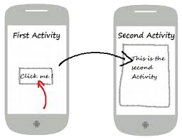
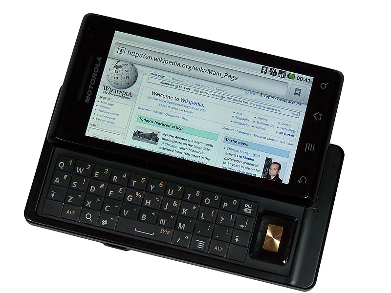

<style>
img[alt~="center"] {
  display: block;
  margin: 0 auto;
}
</style>


# Проектирование мобильных приложений
<!-- _paginate: false -->
<!-- _footer: "Creative Commons Attribution-ShareAlike 3.0" -->

## Альтернативные ресурсы, Activity

---
# В предыдущих лекциях ...


<!-- _footer: https://developer.android.com/docs -->

---

# В предыдущих лекциях ...


<!-- _footer: https://source.android.com/source/index.html -->

---

# В предыдущих лекциях ...

- Android Studio
  - http://developer.android.com/sdk/index.html
- IntelliJ Idea (Bundled Android Plugin)
- Android SDK
  - http://developer.android.com/sdk/index.html
- Kotlin || Java

---
# В предыдущих лекциях...
<!-- _footer: https://developer.android.com/guide/topics/manifest/manifest-intro -->

<style scoped>
section {
    display: flex;
    flex-direction: row;
    flex-wrap: wrap;
}

h1 {
    flex: 0 1 100%;
}

pre {
    height: 500px;
    flex-basis: 50%;
}

pre code svg {
    max-height:470px;
}
</style>

```xml
<?xml version="1.0" encoding="utf-8"?>
<manifest>

    <uses-permission />
    <permission />
    <permission-tree />
    <permission-group />
    <instrumentation />
    <uses-sdk />
    <uses-configuration />  
    <uses-feature />  
    <supports-screens />  
    <compatible-screens />  
    <supports-gl-texture />  

    <application>

        <activity>
            <intent-filter>
                <action />
                <category />
                <data />
            </intent-filter>
            <meta-data />
        </activity>
```

```xml
        <activity-alias>
            <intent-filter> . . . </intent-filter>
            <meta-data />
        </activity-alias>

        <service>
            <intent-filter> . . . </intent-filter>
            <meta-data/>
        </service>

        <receiver>
            <intent-filter> . . . </intent-filter>
            <meta-data />
        </receiver>

        <provider>
            <grant-uri-permission />
            <meta-data />
            <path-permission />
        </provider>

        <uses-library />

    </application>

</manifest>
```

---

# В предыдущих лекциях ...

- Activities
- Services
- Content Providers
- Broadcast Receivers

As a developer we need only to call and extend these already defined classes to use in our application.

---

# В предыдущих лекциях...


---

# В предыдущих лекциях...


---

# В предыдущих лекциях...
- `./animator/*`
- `./anim/*`
- `./xml/*`
- `./drawable/*`
  - Bitmap files (`png`, `9.png`, `jpg`, `gif`)
  - State lists
  - Shapes
  - Other drawables


---

# В предыдущих лекциях...
- `./layout/*`
- `./menu/*`
- `./raw/*`
- `./values/*`
  - arrays.xml
  - colors.xml
  - dimens.xml
  - strings.xml
  - styles.xml

---

# Activity

---

# Activity

> An activity is a single, focused thing that the user can do. Almost all activities interact with the user, so the Activity class takes care of creating a window for you in which you can place your UI

https://developer.android.com/reference/android/app/Activity.html

---

<style scoped>
img { margin-left: 100px; }
</style>

# Activity (с т.з. пользователя)

Окно, обладающее определёнными свойствами:
- Может открываться поверх другого окна
- При нажатии на кнопку “back” закрывается, и становится видно предыдущее окно в стеке

 

---

# Activity (с т.з. программиста)

```kotlin
class MainActivity : android.app.Activity() {
    /*
     * see
     * http://developer.android.com/reference/android/app/Activity.html
     *
     */
}
```

---

# Activity (с т.з. программиста)

Activity – не есть UI
- Скорее, контейнер, который может содержать UI (`android.view.View`)
- UI обычно задаётся ресурсом типа `layout`

---

# Activity. Отображение UI

```kotlin
class MainActivity : Activity() {
  // ...
  setContentView(R.layout.activity_main)
  // ...
}
```

```java
public void setContentView (int layoutResID)
public void setContentView (View view)
public void setContentView (View view, ViewGroup.LayoutParams params)
```

---

# Жизненный Цикл Activity (states)


<!-- _footer: https://developer.android.com/guide/components/activities/activity-lifecycle -->

---

# Жизненный Цикл Activity (callbacks)

<style scoped>
p { overflow: scroll; }
</style>


<!-- _footer: https://developer.android.com/guide/components/activities/activity-lifecycle -->

---

<style scoped>
img:nth-of-type(2) {
  position: absolute;
  right: 50px;
  top: 300px;
  background: transparent;
}
</style>


 


<!-- _footer: https://developer.android.com/guide/components/activities/activity-lifecycle -->

---

# Важность Обработки Жизненного Цикла Activity

- Приложение не должно «падать», когда пользователь получает входящий звонок, вращает экран или переключается на другое приложение
- Приложение не должно потреблять важные системные ресурсы, когда пользователь не взаимодействует с ним
- Приложение не должно терять состояние, когда пользователь покидает приложение, а потом возвращается в него обратно

---

<style scoped>
section {
    display: flex;
    flex-direction: row;
    flex-wrap: wrap;
}

h1 {
    flex: 0 1 100%;
}

img {
  position: relative;
  top: -100px;
}

p {
    flex-basis: 50%;
}

ul {
    flex-basis: 50%;
}
</style>

# 
 

- `onCreate` — Логика, выполняющаяся только 1 раз за всю жизнь Activity:  
    - Создание UI, инстанциирование членов класса и т.п.
- `onDestroy` — 
Остановка потоков и освобождение прочих ресурсов, занятых/созданных в `onCreate`
    - Обычно перегружать не требуется


---

<style scoped>
section {
    display: flex;
    flex-direction: row;
    flex-wrap: wrap;
}

h1 {
    flex: 0 1 100%;
}

img {
  position: relative;
  top: -100px;
}

p {
    flex-basis: 50%;
}

section > ul {
    flex-basis: 50%;
    overflow: scroll;
    height: 100%;
}
</style>

# 
 

- `onPause` – остановить все процессы и сервисы, потребляющие CPU и батарею
  - **CPU**: Остановить анимацию и прочие действия потребляющие большое время CPU
  - **Battery**: Освободить системные ресурсы: broadcast receivers, handles to sensors (like GPS), и прочие сенсоры, которые могут сократить время жизни батареи
  - **Fast**: Избегать ресурсоемких действий (например, запись в БД). Такие действия лучше проводить в `onStop`
- `onResume`
  - Инициализировать/создать ресурсы, освобождённые в `onPause` (анимация, сенсоры, broadcast receivers и т.п.)
  - Инициализировать/создать ресурсы, которые должны быть обновлены перед тем, как Activity начнёт работать (например, обновить громкость звука)

---
<style scoped>
section {
    display: flex;
    flex-direction: row;
    flex-wrap: wrap;
}

h1 {
    flex: 0 1 100%;
}

img {
  position: relative;
  top: -100px;
}

p {
    flex-basis: 50%;
}

ul {
    flex-basis: 50%;
}
</style>

# 
 

- `onStop` — освободить все системные ресурсы, которые не требуются Activity, когда она не видна на экране
  - Выполнение больших ресурсоёмких операций по остановке Activity (например, запись данных в БД)
- `onStart` — Создать/захватить ресурсы, освобожденные в `onStop`
- `onRestart` — Используется крайне редко

---

# Управление Жизненным Циклом

Жизненным циклом управляет ОС.

Приложение может пожелать запустить (`startActivity()`) или остановить (`finish()`) Activity.

ОС может и будет уничтожать Activity по необходимости (например, при повороте экрана).

Activity обязана сама сохранять свое состояние:
- Используя lifecycle callbacks напрямую (см. предыдущие слайды) или косвенно (`ViewModel` будет рассмотрен на отдельной лекции)
- Используя `onSaveInstanceState`/`onRestoreInstanceState`

<!-- _footer: https://developer.android.com/guide/components/activities/state-changes -->

---

# Сохранение Состояния Activity

<style scoped>
section > ul {
  overflow: scroll;
  list-style-type:none;
}

</style>


- 
- `onSaveInstanceState(Bundle outState)`
  - Вызывается для того, чтобы activity могла сохранить своё состояние (перед тем, как Android разрушит её) с целью восстановления состояния в методе `onCreate(Bundle)` или `onRestoreInstanceState(Bundle)`
  - Этот метод вызывается (если вызывается) перед `onStop()`
- `onRestoreInstanceState(Bundle savedState)`
  - Этот метод вызывается (если вызывается) после `onStart()`, когда activity повторно инициализируется из сохранённого ранее состояния
  - В большинстве случаев разработчики используют `onCreate(Bundle)` для восстановления состояния.

<!-- _footer: https://developer.android.com/guide/components/activities/activity-lifecycle#save-simple,-lightweight-ui-state-using-onsaveinstancestate -->

---

# Полезное Замечание

При перегрузке любого метода необходимо вызвать метод базового класса

---

# Жизненный Цикл Activity
## Демонстрация

---

# Activity: API Overview (1)

```
java.lang.Object
  ↳ android.content.Context
    ↳ android.content.ContextWrapper
      ↳ android.view.ContextThemeWrapper
        ↳ android.app.Activity 
```

*Known direct subclasses*
```
AccountAuthenticatorActivity, ActivityGroup, AliasActivity,
ExpandableListActivity, ListActivity, NativeActivity
```

*Known indirect subclasses*
```
LauncherActivity, PreferenceActivity, TabActivity 
```

<!-- _footer: https://developer.android.com/reference/android/app/Activity.html -->

---

# Activity: Lifecycle Callbacks

- `protected void onCreate(Bundle savedInstanceState)`
- `protected void onStart()`
- `protected void onPause()`
- `protected void onResume()`
- `protected void onRestart()`
- `protected void onStop()`
- `protected void onDestroy()`

---

# Activity: State Callbacks

- ` protected void onSaveInstanceState(Bundle outState)`
- ` protected void onRestoreInstanceState(Bundle savedInstanceState)`

---

# Activity: Content

`public void setContentView(int layoutResID)`
- Вспомните R.layout.my_layout

`public void setContentView(View view)`

`public View findViewById(int id)`
- Вспомните `android:id="@+id/my_id"`

---

# Activity: Inflaters (Инстанциирование layout)

`public LayoutInflater getLayoutInflater()`
- `public View inflate(int resource, ViewGroup root)`

`public MenuInflater getMenuInflater()`
- `public void inflate(int menuRes, Menu menu)`

---

# Activity: Доступ к Ресурсам

<style scoped>
  ul {
    overflow: scroll;
  }
</style>

`public Resources getResources()`
- `public boolean getBoolean(int id)`
- `public int getColor(int id)`
- `public float getDimension(int id)`
- `public Drawable getDrawable(int id)`
- `public int getInteger(int id)`
- `public String getQuantityString(int id, int quantity, Object... formatArgs)`
- `public String getString(int id)`
- `public String getString(int id, Object... formatArgs)`
- `public String[] getStringArray(int id)`
- `public XmlResourceParser getLayout(int id)`

<!-- _footer: https://developer.android.com/reference/android/content/res/Resources.html -->

---

# Activity: Preferences

`SharedPreferences getPreferences(int mode)`
- if you need only one preferences file for your Activity

`SharedPreferences getSharedPreferences(String name, int mode)`
- if you need multiple preferences files identified by name.
getDefaultSharedPreferences()

---

# Альтернативные ресурсы
https://developer.android.com/guide/topics/resources/providing-resources#AlternativeResources

---

# Альтернативные Ресурсы

```
<resources_name>-<config_qualifier>
```

`resources_name := anim, drawable, layout, menu, raw, value, xml`
`config_qualifier := qualifier1[-qualifier2[…]]`

**Примеры:**
- `drawable-ldpi`
- `drawable-en-notouch-12key`
- `values-land-mdpi-v11`

---

# Configuration Qualifier Names

---

# Language and Region

The language is defined by a two-letter ISO 639-1 language code, optionally followed by a two letter ISO 3166-1-alpha-2 region code (preceded by lowercase "r").

**Примеры:** `en`, `fr`, `en-rUS`, `fr-rFR`, `fr-rCA` ...
**Использование:** локализация (перевод)
**Пример использования rXX:** "behavior" vs. "behaviour"

---

# Supporting Multiple Screens (Параметры Экрана)

Screen size
- Физический размер (диагональ) (7’)

Screen density
- Число пикселей на единицу длины (160 dpi)

Orientation
- landscape или portrait

Resolution
- Число пикселей на экране (320x240)

<!-- _footer: http://developer.android.com/guide/practices/screens_support.html -->

---

# Screen Density


---

# Проблема: Пиксели Имеют Разный Размер


---

# Density-Independent Pixel

`dp` — Density-independent pixel
- Размер в виртуальных «пикселях»
- Используется при описании layout
- Система сама переводит dp в px по формуле:

```
px = dp * (dpi / 160)
```

**Преимущество:** layout выглядит одинаково на разных экранах

---

# Пример `px` vs `dp`


---

# Supporting Multiple Screens (Generalized Sizes)


> This baseline is based upon the screen configuration for the first Android-powered device, the T-Mobile G1, which has an HVGA screen (until Android 1.6, this was the only screen configuration that Android supported).

---

# Особенности Multi-Window Mode (7.0+, API-24)

В multi-window mode учитывается только размер окна приложения, а не весь размер экрана устройства.

---

# Configuration Qualifier Names (dpi)

- `ldpi`: Low-density screens (~`120dpi`)
- `mdpi`: Medium-density (~`160dpi`)
- `hdpi`: High-density screens (~`240dpi`)
- `xhdpi`: Extra high-density screens (~`320dpi`) 
- `xxhdpi` (~`480dpi`, 16+), `xxxhdpi` (~`640dpi`, 18+)
- `nodpi`: bitmap resources that you do not want to be scaled to match the device density
- `tvdpi` = `1.33*mdpi`

---

# Configuration Qualifier Names (dpi)

Часто используется для предоставления альтернативных растровых ресурсов.


---

# Configuration Qualifier Names (size)

4 размера экрана:
- `small` (>= 320x426 dp)
  - low-density QVGA, VGA high density
- `normal` (>= 320x470 dp)
  - WQVGA low density, HVGA medium density, WVGA high density
- `large` (>= 480x640 dp)
  - VGA and WVGA medium density
- `xlarge` (>= 720x960 dp) (API 9+)

---

# Screen Orientation
`port`
Device is in portrait orientation (vertical)

`land`
Device is in landscape orientation (horizontal)

---

# Smallest Width

`sw<N>dp`
Наименьшая возможная ширина экрана (не зависит от ориентации экрана)

**Примеры:** `sw320dp`, `sw600dp`, `sw720dp`
**Использование:** требование минимальной ширины для layout

---

# Smallest Width (Примеры)

`sw320dp`  будет выбран для следующих конфигураций экрана:
- 240x320 ldpi (QVGA handset)
- 320x480 mdpi (handset)
- 480x800 hdpi (high density handset)

---

# Smallest Width (Примеры)

`sw320dp`  будет выбран для следующих конфигураций экрана:
- **240x320 ldpi (QVGA handset)**
- 320x480 mdpi (handset)
- 480x800 hdpi (high density handset)

**Кто догадается почему?**

---

# Available Width/Height

```
w<N>dp
h<N>dp
```

- Минимальная доступная ширина/высота экрана в `dp`.
- Зависит от ориентации экрана
- Система выбирает ближайший снизу набор ресурсов, если приложение предоставляет несколько наборов

**Примеры:** `w720dp`,`w1024dp`,`h720dp`,`h1024dp`

---

# Screen Aspect

`long`
Широкий экран (WQVGA, WVGA, FWVGA)

`notlong`
Не широкий экран (QVGA, HVGA, and VGA)

---

# UI Mode

`car`: Device is displaying in a car dock

`desk`: Device is displaying in a desk dock

`television`: Device is displaying on a television

`appliance`: Device is serving as an appliance, with no display

`watch`: Device has a display and is worn on the wrist (20+)

---

# Night Mode

`night`: Night time
`notnight`: Day time

---

# Touchscreen Type

`notouch`: Device does not have a touchscreen.

`finger`: Device has a touchscreen that is intended to be used through direction interaction of the user's finger.

---

# Keyboard Availability

`keysexposed`: Аппаратная клавиатура доступна **или** имеется программная клавиатура

`keyshidden`: Имеется аппаратная клавиатура, но она не доступна и не имеется программная клавиатура

`keyssoft`: Имеется программная клавиатура

---

# Primary Text Input Method

`nokeys`: Device has no hardware keys for text input.

`qwerty`: Device has a hardware qwerty keyboard, whether it's visible to the user or not.

`12key`: Device has a hardware 12-key keyboard, whether it's visible to the user or not.

---

# Navigation Key Availability

`navexposed`: Navigation keys are available to the user.

`navhidden`: Navigation keys are not available (such as behind a closed lid).



<!-- _footer: https://commons.wikimedia.org/wiki/File:Motorola-milestone-wikipedia.png -->

---

# Primary Non-Touch Navigation Method

`nonav`: Device has no navigation facility other than using the touchscreen.

`dpad`: Device has a directional-pad (d-pad) for navigation.

`trackball`: Device has a trackball for navigation.

`wheel`: Device has a directional wheel(s) for navigation (uncommon).

---

# Platform Version (API level)

The API level supported by the device.

**Примеры:** `v3`, `v4`, `v7`

---

# Layout Direction

<style scoped>
img {
  position: absolute;
  right: 100px;
  top: 150px;
}
</style>

`ldrtl`: layout-direction-right-to-left
`ldltr`: layout-direction-left-to-right

**Использование:** локализация


<!-- _footer:  http://i.msdn.microsoft.com/bb688119.f08tm01(en-us,MSDN.10).jpg -->

---

# MCC and MNC

The mobile country code (MCC), optionally followed by mobile network code (MNC) from the SIM card in the device.

**Примеры:** 
`mcc310` is U.S. on any carrier
`mcc310-mnc004` is U.S. on Verizon
`mcc208-mnc00` is France on Orange

**Использование:** country-specific legal resources

---

# Последовательность модификаторов важна

<style scoped>
  ol {
    overflow: scroll;
  }
</style>

```
drawable-en-notouch-12key
```

1. MCC and MNC
1. Language and region
1. Layout Direction
1. Smallest Width
1. Available width
1. Available height
1. Screen size
1. Screen aspect
1. Screen orientation
1. UI mode
1. Night mode
1. Screen pixel density (dpi)
1. Touchscreen type
1. Keyboard availability
1. Primary text input method
1. Navigation key availability
1. Primary non-touch navigation method
1. Platform Version (API level)

<!-- _footer: http://developer.android.com/guide/topics/resources/providing-resources.html#QualifierRules -->

---

# How Android Finds the Best-matching Resource

---

<style scoped>
section {
    display: flex;
    flex-direction: row;
    flex-wrap: wrap;
}

h1 {
    flex: 0 1 100%;
}

p {
    flex-basis: 50%;
}
</style>

# Best-Matching: Задача

**Device configuration:**
Locale=`en-GB `
Screen orientation=`port `
Screen pixel density=`hdpi `
Touchscreen type=`notouch `
Primary text input method=`12key`


**Resources:**
drawable/
drawable-en/
drawable-fr-rCA/
drawable-en-port/
drawable-en-notouch-12key/
drawable-port-ldpi/
drawable-port-notouch-12key/

---

<style scoped>
section {
    display: flex;
    flex-direction: row;
    flex-wrap: wrap;
}

h1 {
    flex: 0 1 100%;
}

p {
    flex-basis: 50%;
}
</style>

# Best-Matching: Ответ

**Device configuration:**
Locale=`en-GB `
Screen orientation=`port `
Screen pixel density=`hdpi `
Touchscreen type=`notouch `
Primary text input method=`12key`


**Resources:**
drawable/
drawable-en/
drawable-fr-rCA/
**drawable-en-port/**
drawable-en-notouch-12key/
drawable-port-ldpi/
drawable-port-notouch-12key/

---

# Best-Matching: Решение


<!-- http://developer.android.com/guide/topics/resources/providing-resources.html -->

---

# Best-Matching: Шаг 1

<style scoped>
  img{
    position: absolute;
    right: 50px;
    top: 100px;
    background: transparent;
  }
</style>

*Eliminate resource files that contradict the device configuration*

drawable/
drawable-en/
**~~drawable-fr-rCA/~~**
drawable-en-port/
drawable-en-notouch-12key/
drawable-port-ldpi/
drawable-port-notouch-12key/ 


**Exception:** Screen pixel density is the one qualifier that is not eliminated due to a contradiction


---

# Best-Matching: Шаг 2

<style scoped>
  img{
    position: absolute;
    right: 50px;
    top: 100px;
    background: transparent;
  }

  ol {
    overflow: scroll;
  }
</style>

*Pick the (next) highest-precedence qualifier in the list*

1. MCC and MNC
1. Language and region
1. Layout Direction
1. Smallest Width
1. Available width
1. Available height
1. Screen size
1. Screen aspect
1. Screen orientation
1. UI mode
1. Night mode
1. Screen pixel density (dpi)
1. Touchscreen type
1. Keyboard availability
1. Primary text input method
1. Navigation key availability
1. Primary non-touch navigation method
1. Platform Version (API level)


---

# Best-Matching: Шаг 3

<style scoped>
  img{
    position: absolute;
    right: 0px;
    top: 100px;
    background: transparent;
  }
</style>

*Do any of the resource directories include this qualifier?*
- If No, return to step 2 and look at the next qualifier
- If Yes, continue to step 4


---

# Best-Matching: Шаг 4

<style scoped>
  img{
    position: absolute;
    right: 50px;
    top: 100px;
    background: transparent;
  }
</style>

*Eliminate resource directories that do not include this qualifier*

**~~drawable/~~**
drawable-en/
drawable-en-port/
drawable-en-notouch-12key/
**~~drawable-port-ldpi/~~**
**~~drawable-port-notouch-12key/~~**


**Exception:** If the qualifier in question is screen pixel density, Android selects the option that most closely matches the device screen density. In general, Android prefers scaling down a larger original image to scaling up a smaller original image.


---


# Best-Matching: Шаг 5

<style scoped>
  img{
    position: absolute;
    right: 50px;
    top: 100px;
    background: transparent;
  }

  p:nth-of-type(1){
    width: 800px;
  }
</style>

*Go back and repeat steps 2, 3, and 4 until only one directory remains. In the example, screen orientation is the next qualifier for which there are any matches.*

~~drawable/~~
**~~drawable-en/~~**
drawable-en-port/
**~~drawable-en-notouch-12key/~~**
~~drawable-port-ldpi/~~
~~drawable-port-notouch-12key/~~


**Exception:** If the qualifier in question is screen pixel density, Android selects the option that most closely matches the device screen density. In general, Android prefers scaling down a larger original image to scaling up a smaller original image.


---

# Вопросы