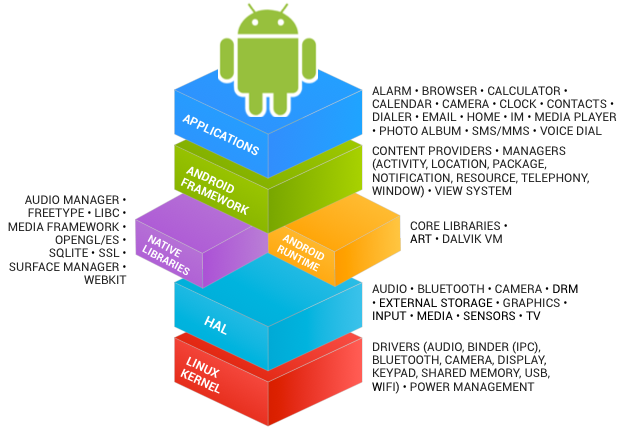
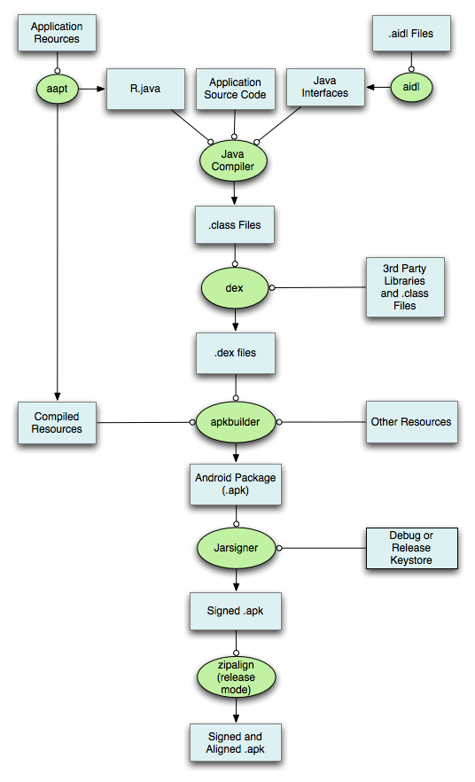
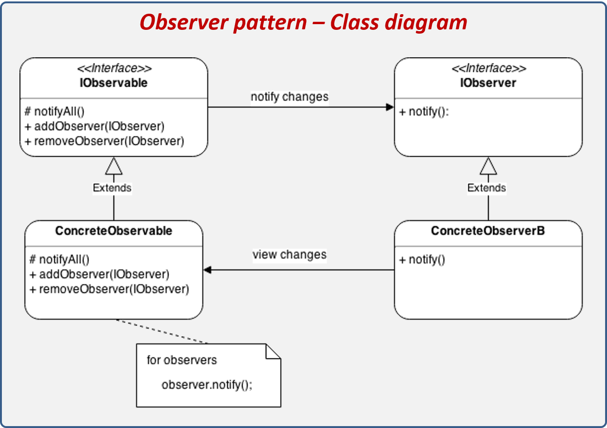
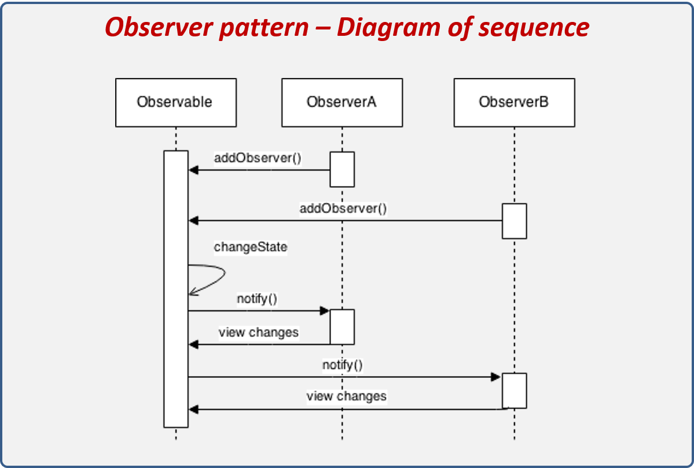
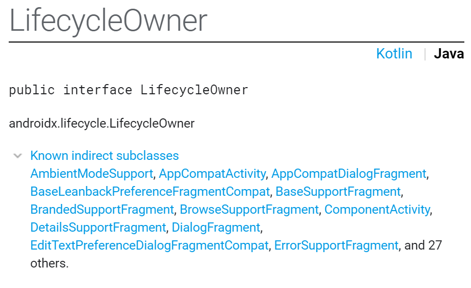

<style>
img[alt~="center"] {
  display: block;
  margin: 0 auto;
}
</style>


# Проектирование мобильных приложений
<!-- _paginate: false -->
<!-- _footer: "Creative Commons Attribution-ShareAlike 3.0" -->

## Взаимодействие приложения и пользователя
Lifecycle Components, ViewModel, ViewBinding, DataBinding

---
# В предыдущих лекциях ...


<!-- _footer: https://developer.android.com/docs -->

---

# В предыдущих лекциях ...




<!-- _footer: https://source.android.com/source/index.html -->

---

# В предыдущих лекциях ...

- Android Studio
  - http://developer.android.com/sdk/index.html
- IntelliJ Idea (Bundled Android Plugin)
- Android SDK
  - http://developer.android.com/sdk/index.html
- Kotlin || Java

---
# В предыдущих лекциях...
<!-- _footer: https://developer.android.com/guide/topics/manifest/manifest-intro -->

<style scoped>
section {
    display: flex;
    flex-direction: row;
    flex-wrap: wrap;
}

h1 {
    flex: 0 1 100%;
}

pre {
    height: 500px;
    flex-basis: 50%;
}

pre code svg {
    max-height:470px;
}
</style>

```xml
<?xml version="1.0" encoding="utf-8"?>
<manifest>

    <uses-permission />
    <permission />
    <permission-tree />
    <permission-group />
    <instrumentation />
    <uses-sdk />
    <uses-configuration />  
    <uses-feature />  
    <supports-screens />  
    <compatible-screens />  
    <supports-gl-texture />  

    <application>

        <activity>
            <intent-filter>
                <action />
                <category />
                <data />
            </intent-filter>
            <meta-data />
        </activity>
```

```xml
        <activity-alias>
            <intent-filter> . . . </intent-filter>
            <meta-data />
        </activity-alias>

        <service>
            <intent-filter> . . . </intent-filter>
            <meta-data/>
        </service>

        <receiver>
            <intent-filter> . . . </intent-filter>
            <meta-data />
        </receiver>

        <provider>
            <grant-uri-permission />
            <meta-data />
            <path-permission />
        </provider>

        <uses-library />

    </application>

</manifest>
```

---

# В предыдущих лекциях ...

- Activities
- Services
- Content Providers
- Broadcast Receivers

As a developer we need only to call and extend these already defined classes to use in our application.

---

# В предыдущих лекциях...


---

# В предыдущих лекциях...



---

# В предыдущих лекциях...
- `./animator/*`
- `./anim/*`
- `./xml/*`
- `./drawable/*`
  - Bitmap files (`png`, `9.png`, `jpg`, `gif`)
  - State lists
  - Shapes
  - Other drawables


---

# В предыдущих лекциях...
- `./layout/*`
- `./menu/*`
- `./raw/*`
- `./values/*`
  - arrays.xml
  - colors.xml
  - dimens.xml
  - strings.xml
  - styles.xml

---

# В предыдущих лекциях...

- `<resources_name>`-`<config_qualifier>`
  - `resources_name := anim, drawable, layout, menu, raw, value, xml`
  - `config_qualifier := qualifier1[-qualifier2[…]]`

- Примеры:
  - drawable-ldpi
  - drawable-en-notouch-12key
  - values-land-mdpi-v11
---

# В предыдущих лекциях...


<!-- _footer: http://developer.android.com/guide/topics/resources/providing-resources.html -->

---
  
<style scoped>


section.split p:nth-of-type(1) {
    grid-area: leftpanel;
}

section.split p:nth-of-type(2) {
    grid-area: rightpanel1;
}

section.split p:nth-of-type(3) {
    grid-area: rightpanel2;
}

section.split h1 {
    grid-area: slideheading;
}

section.split {
    overflow: visible;
    display: grid;
    grid-template-columns: 50% 50%;
    grid-template-areas: 
        "slideheading slideheading"
        "leftpanel rightpanel1"
        "leftpanel rightpanel2";
}

</style>

<!-- _class: split -->

# В предыдущих лекциях...


---

# 3 добровольца
> по одному из каждой группы

---

# Взаимодействие с пользователем

---

# Взаимодействие с пользователем
## Поиск виджета

---

# Native API, Способ 1
```xml
<Button
    android:id="@+id/button_send"
    android:text="@string/button_send“ />
```

```kotlin
findViewById<Button>(R.id.button_send).setOnClickListener {
    // Do something in response to button click
}
```

---

# Native API, Способ 2

```xml
<Button
    android:id="@+id/button_send"
    android:text="@string/button_send"
    android:onClick="myButtonClicked" /> <!-- <=== -->
```

```kotlin
class MainActivity : Activity() {
    fun myButtonClicked(view: View) {
        // Do something in response to button click
    }
}
```

---

# Обсудим
`findViewById<Button>(R.id.button_send).setOnClickListener `
`android:onClick="myButtonClicked"`

---

# Проблемы Native API

- `findViewById`
  - Не null-safe, не type-safe
- `android:onClick`
  - Что произойдёт, если указанного метода нет?

---

# Альтернатива 1: kotlin-android-extensions
```xml
<Button xmlns:android="http://schemas.android.com/apk/res/android"
    android:id="@+id/button_send"
    android:text="@string/button_send" /> 
```

```kotlin
import kotlinx.android.synthetic.com.example.*

button_send.setOnClickListener{view -> 
    // Do something in response to button click
}
```

```groovy
apply plugin: 'com.android.application'
apply plugin: 'kotlin-android'
apply plugin: 'kotlin-android-extensions'
```

---

# Альтернатива 2: ButterKnife

https://github.com/JakeWharton/butterknife

---

# Альтернатива 3: ViewBinding
<!-- _footer: https://developer.android.com/topic/libraries/view-binding -->

<!-- решает обе проблемы: если виджета нет в одной из конфигураций - тип будет nullable -->

```xml
<Button
    android:id="@+id/button_send"
    android:text="@string/button_send“ /> 
```

```kotlin
import com.example.myapplication.databinding.ActivityMainBinding

val binding = ActivityMainBinding.inflate(layoutInflater)
binding.button.setOnClickListener { }
setContentView(binding.root)
```

```groovy
buildFeatures {
    viewBinding true
}
```

---

# Взаимодействие с пользователем
## Обработка событий

---

# Примеры callback интерфейсов
CheckBox, ToggleButton, RadioButton, ...:
```java
public void setOnCheckedChangeListener (CompoundButton.OnCheckedChangeListener listener)
```

GestureOverlayView:
```java
public void addOnGestureListener (GestureOverlayView.OnGestureListener listener)
```
---

# Обработка событий от разных виджетов в одном callback

```java
public void onCheckboxClicked(View view) {
    // Is the view now checked?
    boolean checked = ((CheckBox) view).isChecked();
    
    // Check which checkbox was clicked
    switch(view.getId()) {
        case R.id.checkbox_meat:
            if (checked)
                // Put some meat on the sandwich
            else
                // Remove the meat
            break;
        case R.id.checkbox_cheese:
            if (checked)
                // Cheese me
            else
                // I'm lactose intolerant
            break;
        // TODO: Veggie sandwich
    }
} 
```


---

# Взаимодействие с пользователем
## Обновление UI

---

# Тривиальный пример

```xml
<Button
    android:id="@+id/button_send"
    android:text="@string/button_send“ />
```

```kotlin
findViewById<Button>(R.id.button_send).setText(R.string.updatedText)
```

---

# Взаимодействие с пользователем
## DataBinding library
https://developer.android.com/topic/libraries/data-binding

> The Data Binding Library is a support library that allows you to bind UI components in your layouts to data sources in your app using a declarative format rather than programmatically.

---

# Enable databinding (build.gradle)

`build.gradle`
```groovy
android {
    ...
    buildFeatures {
        dataBinding true
    }
}
```

---

# Layouts and binding expressions

```xml
<?xml version="1.0" encoding="utf-8"?>
<layout xmlns:android="http://schemas.android.com/apk/res/android">
   <data>
       <variable name="user" type="com.example.User"/>
   </data>
   <LinearLayout
       android:orientation="vertical"
       android:layout_width="match_parent"
       android:layout_height="match_parent">
       <TextView android:layout_width="wrap_content"
           android:layout_height="wrap_content"
           android:text="@{user.firstName}"/>
       <TextView android:layout_width="wrap_content"
           android:layout_height="wrap_content"
           android:text="@{user.lastName}"/>
   </LinearLayout>
</layout> 
```

---

# Layouts and binding expressions

```kotlin
data class User(val firstName: String, val lastName: String) 
```

---

# Expression language: common features
<!-- _footer: https://developer.android.com/topic/libraries/data-binding/expressions#common_features -->

<style scoped>
p:nth-of-type(0n+1) {
    column-count: 2;
}
p:nth-of-type(0n+2) {
    color: red;
}
</style>

Mathematical `+` `-` `/` `*` `%`
String concatenation `+`
Logical `&&` `||`
Binary `&` `|` `^`
Unary `+` `-` `!` `~`
Shift* `>>` `>>>` `<<`
Comparison* `==` `>` `<` `>=` `<=`
`instanceof`
Grouping `()`
Literals - `character`, `String`, `numeric`, `null`
Cast
Method calls
Field access
Array access `[]`
Ternary operator `?:`


*(Note that `<` needs to be escaped as `&lt;`)

---


# Expression language: common features (пример)

<!-- _footer: https://developer.android.com/topic/libraries/data-binding/expressions#common_features -->

```xml
<TextView
    android:text="@{String.valueOf(index + 1)}"
    android:visibility="@{age > 13 ? View.GONE : View.VISIBLE}"
    ...
/>
```

---

# Expression language: Missing operations

`this`
`super`
`new`
Explicit generic invocation

<!-- _footer: https://developer.android.com/topic/libraries/data-binding/expressions#missing_operations -->

---

# Expression language: некоторые примеры
`android:text="@{user.lastName}" `
`android:text="@{user.displayName ?? user.lastName}" `
`android:padding="@{large? @dimen/largePadding : @dimen/smallPadding}"`
`android:text="@{@string/nameFormat(firstName, lastName)}"`
`android:text="@{@plurals/banana(bananaCount)}"`

---

# Expression language: обработка событий

<!-- _footer: https://developer.android.com/topic/libraries/data-binding/expressions#event_handling -->

```xml
<CheckBox
  android:onCheckedChanged=
    "@{(cb, isChecked) -> presenter.completeChanged(task, isChecked)}" /> 
```

```xml
<Button
  android:onClick="@{() -> presenter.onSaveClick(task)}" />
```

---

# Create a binding object

```kotlin
override fun onCreate(savedInstanceState: Bundle?) {
    super.onCreate(savedInstanceState)

    val binding: MyLayoutBinding = MyLayoutBinding.inflate(layoutInflater)
    binding.user = User("Andrei N.", "Kuznetsov")
    // ...
    setContentView(binding.root)
}
```

<!-- _footer: https://developer.android.com/topic/libraries/data-binding/generated-binding#create -->

---

# Обсудим

```kotlin 
data class User(val firstName: String, val lastName: String)
```

`var` vs `val`

```kotlin 
data class User(var firstName: String, var lastName: String)
```

---

# Observable pattern
<style scoped>
section {
display:flex;
flex-direction: row;
flex-wrap: wrap;
}

section h1 {
    flex: 0 1 100%;
}

section p {
    flex: 1 0 50%;
}
</style>





<!-- _footer: https://reactiveprogramming.io/blog/en/design-patterns/observer -->

---

# Observable объекты и DataBinding

<!-- _footer: https://developer.android.com/topic/libraries/data-binding/observability -->

```kotlin
import androidx.databinding.ObservableField

data class User(
    val firstName: ObservableField<String>,
    val lastName: ObservableField<String>
)
```

---

# Особенности Observable

Рассмотрим следующую ситуацию:

* Если наблюдатель обновляет UI на основе наблюдаемого состояния (e.g. DataBinding)
* обновление может прийти в момент, когда Activity в состоянии STOPPED, и обновление UI будет утеряно (либо возникнет исключение)

<!-- _footer: https://developer.android.com/topic/libraries/architecture/livedata#the_advantages_of_using_livedata -->
---

# Обсудим
Другими словами, UI "трогать" нельзя, когда Activity в состоянии STOPPED.

Представьте, что Вы разработчик Framework'а. Как можно решать проблему?

<!-- каждый клиент реализует логику vs один раз реализована в observable -->

---

# androidx.lifecycle.LiveData
LiveData = Observable, учитывающий состояние наблюдателя
```java
public void observe(@NonNull LifecycleOwner owner, @NonNull Observer<? super T> observer)
```

- Не уведомляет `observer`, когда `owner` в состоянии STOPPED
- При переходе `owner` в состояние STARTED, `observer` получает текущее состояние (значение)
- При переходе `owner` в состояние DESTROYED, освобождаются ссылки на наблюдателя

<!-- _footer: https://developer.android.com/topic/libraries/architecture/livedata -->

---

# androidx.lifecycle.LifecycleOwner



<!-- _footer: https://developer.android.com/reference/androidx/lifecycle/LifecycleOwner.html -->

---

# androidx.lifecycle.LifecycleOwner

```java
package android.arch.lifecycle;

import android.support.annotation.NonNull;

/**
 * A class that has an Android lifecycle. These events can be used by custom components to
 * handle lifecycle changes without implementing any code inside the Activity or the Fragment.
 *
 * @see Lifecycle
 */
@SuppressWarnings({"WeakerAccess", "unused"})
public interface LifecycleOwner {
    /**
     * Returns the Lifecycle of the provider.
     *
     * @return The lifecycle of the provider.
     */
    @NonNull
    Lifecycle getLifecycle();
}
```
<!-- _footer: https://developer.android.com/reference/androidx/lifecycle/LifecycleOwner.html -->

---

# androidx.lifecycle.Lifecycle


<!-- _footer: https://developer.android.com/topic/libraries/architecture/lifecycle -->

---

# androidx.lifecycle.LifecycleObserver

Marks a class as a `LifecycleObserver`. It does not have any methods, instead, relies on `OnLifecycleEvent` annotated methods.

```java
class TestObserver implements LifecycleObserver {
    @OnLifecycleEvent(ON_CREATE)
    void onCreated(LifecycleOwner source) {} 

    @OnLifecycleEvent(ON_ANY) 
    void onAny(LifecycleOwner source, Event event) {}
 } 
```

<!-- _footer: https://developer.android.com/reference/androidx/lifecycle/LifecycleObserver.html -->

---

# Типичное использование LifecycleObserver
- https://developer.android.com/topic/libraries/architecture/lifecycle#use-cases
- https://codelabs.developers.google.com/codelabs/android-lifecycles/index.html?index=..%2F..%2Findex#4

---

# Обсудим

Что принципиально изменилось по сравнению с `ObservableField`?
```kotlin
data class User(val firstName: LiveData<String>, val lastName: LiveData<String>)
```

---
<!-- https://developer.android.com/topic/libraries/data-binding/two-way -->

# Two-way data binding

One way:
```xml
<CheckBox
    android:id="@+id/rememberMeCheckBox"
    android:checked="@{viewmodel.rememberMe}"
    android:onCheckedChanged="@{viewmodel.rememberMeChanged}"
/>

```
Two-way:
```xml
<CheckBox
    android:id="@+id/rememberMeCheckBox"
    android:checked="@={viewmodel.rememberMe}"
/>
```

---

# Summary

* LifeсycleOwner
  * Тот, кто может дать ссылку на Lifecycle
* Lifeсycle
  * Абстрактное представление жизненного цикла
* Observer
  * Паттерн проектирования
* LifecycleObserver
  * Тот, кто хочет получать уведомления об изменении Lifeсycle
* LiveData
  * Объект с состоянием, который можно безопасно наблюдать (`Observe`) из объекта с `Lifecycle`

---

# Обсудим

Где хранить экземпляр класса `User` при Configuration Changed?

---

# ViewModel 
https://developer.android.com/topic/libraries/architecture/viewmodel

---

# ViewModel Overview

- The `ViewModel` class is designed to store and manage UI-related data in a lifecycle conscious way. 
- `ViewModel` позволяет данным переживать Configuration Change.

<!-- _footer: https://developer.android.com/topic/libraries/architecture/viewmodel -->

---

# The lifecycle of a ViewModel


<!-- _footer: https://developer.android.com/topic/libraries/architecture/viewmodel#lifecycle -->

---

# Получение экземпляра ViewModel

```kotlin
class MyActivity : AppCompatActivity() {

    override fun onCreate(savedInstanceState: Bundle?) {
        // Create a ViewModel the first time the system calls an activity's onCreate() method.
        // Re-created activities receive the same MyViewModel instance created by the first activity.

        val model = ViewModelProviders.of(this)[MyViewModel::class.java]
        …
    }
} 
```

---

# Options for preserving UI state
<style scoped>
table { font-size: 60%; overflow:unset; }
</style>

| |ViewModel | Saved instance state | Persistent storage |
|-|-|-|-|
|Storage location | 	in memory | 	serialized to disk | 	on disk or network |
|Survives configuration change | 	Yes | 	Yes | 	Yes
|Survives system-initiated process death | 	No | 	Yes | 	Yes
|Survives user complete activity dismissal/onFinish() | 	No | 	No | 	Yes
|Data limitations | 	complex objects are fine, but space is limited by available memory | 	only for primitive types and simple, small objects such as String | 	only limited by disk space or cost / time of retrieval from the network resource
|Read/write time | 	quick (memory access only) | 	slow (requires serialization/deserialization and disk access) | 	slow (requires disk access or network transaction)

<!-- _footer: https://developer.android.com/topic/libraries/architecture/saving-states#options_for_preserving_ui_state -->

---

# Preserving complex UI state
- Local persistence
  - Сохранять все данные, которые должны пережить закрытие/открытие Activity (приложения)
- ViewModel
  - Данные для отображения текущего UI
- onSaveInstanceState()
  - Небольшой фрагмент данных, который поможет восстановить состояние Activity (инициализировать ViewModel) в случае остановки процесса

---

# Restoring complex UI state
- The activity is recreated after having been stopped by the system. The activity has the query saved in an onSaveInstanceState() bundle, and should pass the query to the ViewModel. The ViewModel sees that it has no search results cached, and delegates loading the search results, using the given search query.
- The activity is created after a configuration change. The activity has the query saved in an onSaveInstanceState() bundle, and the ViewModel already has the search results cached. You pass the query from the onSaveInstanceState() bundle to the ViewModel, which determines that it already has loaded the necessary data and that it does not need to re-query the database.

<!-- _footer: https://developer.android.com/topic/libraries/architecture/saving-states#managing_ui_state_divide_and_conquer -->

---

# Вопрос
Какой предпочтительный язык для текста?
- Английский
- Русский
- Любой, но не вперемешку
- Любой, в т.ч. вперемешку

