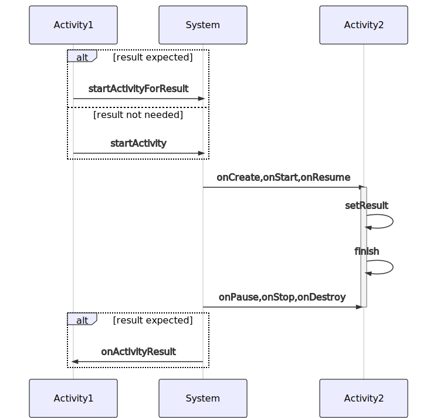
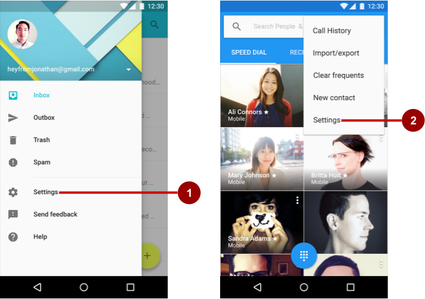
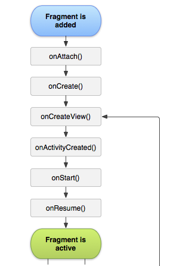
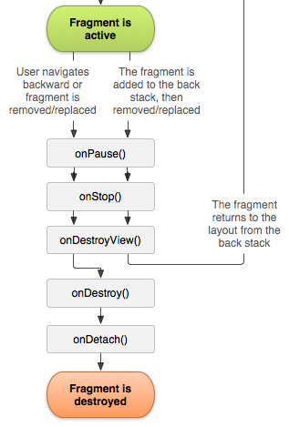

<style>
img[alt~="center"] {
  display: block;
  margin: 0 auto;
}

section.split h1 {
    grid-area: slideheading;
    height: 0;
}

section.split h3:nth-of-type(1) {
    grid-area: leftheader;
}

section.split h3:nth-of-type(2) {
    grid-area: rightheader;
}

section.split {
    overflow: visible;
    display: grid;
    grid-template-columns: 50% 50%;
    grid-template-areas: 
        "slideheading slideheading"
        "leftheader rightheader"
        "lefttext righttext"
}

section.flexrow {
display:flex;
flex-flow: row wrap;
}

section.flexrow h1 {
    flex: 0 1 100%;
}
</style>


# Проектирование мобильных приложений
<!-- _paginate: false -->
<!-- _footer: "Creative Commons Attribution-ShareAlike 3.0" -->

## Навигация внутри приложения
Explicit Intent, Navigation Graph

---
# В предыдущих лекциях ...


<!-- _footer: https://developer.android.com/docs -->

---

# В предыдущих лекциях ...

- Activities
- Services
- Content Providers
- Broadcast Receivers

As a developer we need only to call and extend these already defined classes to use in our application.

---

# В предыдущих лекциях...


---

# В предыдущих лекциях...
- `./drawable/*`
- `./layout/*`
- `./values/*`

- `./animator/*`, `./anim/*`, `./xml/*`, `./menu/*`, `./raw/*`

- `<resources_name>`-`<config_qualifier>`
  - `values-land-mdpi-v11`

---

# В предыдущих лекциях...


<!-- _footer: http://developer.android.com/guide/topics/resources/providing-resources.html -->

---
  
<style scoped>


section.split p:nth-of-type(1) {
    grid-area: leftpanel;
    padding-top: 50px;
    padding-left: 50px;
}

section.split p:nth-of-type(2) {
    grid-area: rightpanel1;
}

section.split p:nth-of-type(3) {
    grid-area: rightpanel2;
}

section.split h1 {
    grid-area: slideheading;
    z-index: 10;
}

section.split {
    overflow: visible;
    display: grid;
    grid-template-columns: 50% 50%;
    grid-template-areas: 
        "slideheading slideheading"
        "leftpanel rightpanel1"
        "leftpanel rightpanel2";
}

</style>

<!-- _class: split -->

# В предыдущих лекциях...


---

# В предыдущих лекциях...
- kotlin-android-extensions
  - Позволяет не писать findViewById, type-safe
- View Binding
  - Позволяет не писать findViewById, null-safe, type-safe
- Data Binding
  - android:text="@{user.firstName}"
- ViewModel
  - Позволяет данным переживать Configuration Change
- LiveData
  - Объект с состоянием, который можно безопасно наблюдать (Observe) из объекта с Lifecycle

---

# В предыдущих лекциях...
- LifeсycleOwner
  - Тот, кто может дать ссылку на Lifecycle
- Lifeсycle
  - Абстрактное представление жизненного цикла
- Observer
  - Паттерн проектирования
- LifecycleObserver
  - Тот, кто хочет получать уведомления об изменении Lifeсycle

---

# Навигация внутри приложения

---

# Навигация внутри приложения
## Переходы между activity

---

# Intent
<!-- _footer: https://developer.android.com/guide/components/intents-filters.html -->

3 основных элемента приложения: activities, services и broadcast receivers – активируются сообщениями, называемыми `intent`
- Context.startActivity() 
- Context.startService()
- Context.sendBroadcast()

---

# Что такое Intent

<!-- _footer: https://developer.android.com/guide/components/intents-filters.html -->

[Java] класс, описывающий сообщение (приложению или ОС) :
- Component
- Action
- Data (URI+MIME)
- Category
- Extras
- Flags

---

# Типы Intent

<!-- _footer: https://developer.android.com/guide/components/intents-filters.html -->

<!-- _class: split -->

### Explicit Intent
Component (Package + Class Name)
\
Action
Data
Category [1..*]
\
Extras
Flags

### Implicit intent 
\
\
Action
Data
Category [1..*]
\
Extras
Flags

---

# DEMO
`startActivity`, `finish`

---

# Intent: Component Name
Имя компонента, который должен обработать intent.
- Имя приложения (package)
- Имя класса (e.g `com.example.helloworld.SecondActivity`)

Если указан – будет запущен новый экземпляр указанного класса.

Если не указан – Intent Resolution Process (implicit intent)
- (рассмотрим на следующей лекции)

---

# Intent: Extras (не обязательно)
Дополнительная информация в виде «key:value» (Bundle).


`public Intent getIntent()`

---

# Результат из Activity 

<!-- 
sequenceDiagram
    alt result expected
    Activity1->>System: startActivityForResult
    else result not needed
    Activity1->>System: startActivity
    end
    System->>+Activity2: onCreate,onStart,onResume

    Activity2->>Activity2: setResult
    Activity2->>Activity2: finish
    System->>Activity2: onPause,onStop,onDestroy
    deactivate Activity2

    alt result expected
    System->>Activity1: onActivityResult
    end
-->



---

# Intent: Flags (не обязательно)
Указания операционной системе как запускать компонент
- Если вас устраивает поведение компонента, флаги вам не нужны

---

... а если не устраивает
# Tasks and Back Stack

---

# Recents Screen
<!-- _footer: https://developer.android.com/guide/components/activities/recents -->

<!-- _class: flexrow -->

<style scoped>
section > p:nth-of-type(2) {
    flex: 1;
    margin-left:20px;
}
</style>


Task – это набор Activities, с которыми пользователь взаимодействует для выполнения задачи. Activities организуют стек (back stack), порядок соответствует порядку запуска.

---

# Back Stack
<!-- _footer: https://developer.android.com/guide/components/activities/tasks-and-back-stack -->


---

# Tasks

<!-- _footer: https://developer.android.com/guide/components/activities/tasks-and-back-stack -->


---

# Back Stack

<!-- _footer: https://developer.android.com/guide/components/activities/tasks-and-back-stack -->


---

<!-- _class: split -->


# Управление Task’ами

<!-- _footer: https://developer.android.com/guide/components/activities/tasks-and-back-stack -->

### Атрибуты [<activity>](https://developer.android.com/guide/topics/manifest/activity-element.html) в AndroidManifest
- [launchMode](https://developer.android.com/guide/topics/manifest/activity-element.html#lmode)
- [taskAffinity](https://developer.android.com/guide/topics/manifest/activity-element.html#aff)
- [allowTaskReparenting](https://developer.android.com/guide/topics/manifest/activity-element.html#reparent)
- [clearTaskOnLaunch](https://developer.android.com/guide/topics/manifest/activity-element.html#clear)
- [alwaysRetainTaskState](https://developer.android.com/guide/topics/manifest/activity-element.html#always)
- [finishOnTaskLaunch](https://developer.android.com/guide/topics/manifest/activity-element.html#finish)

### Флаги в Intent
- [FLAG_ACTIVITY_NEW_TASK](https://developer.android.com/reference/android/content/Intent.html#FLAG_ACTIVITY_NEW_TASK)
- [FLAG_ACTIVITY_CLEAR_TOP](https://developer.android.com/reference/android/content/Intent.html#FLAG_ACTIVITY_CLEAR_TOP)
- [FLAG_ACTIVITY_SINGLE_TOP](https://developer.android.com/reference/android/content/Intent.html#FLAG_ACTIVITY_SINGLE_TOP)

---

# launchMode (standard)

standard (по умолчанию)
- Создать новую Activity (всегда).
- Отношение Task-Activity=Many-to-Many

singleTop (=[FLAG_ACTIVITY_SINGLE_TOP](https://developer.android.com/reference/android/content/Intent.html#FLAG_ACTIVITY_SINGLE_TOP))
singleTask (=[FLAG_ACTIVITY_NEW_TASK](https://developer.android.com/reference/android/content/Intent.html#FLAG_ACTIVITY_NEW_TASK))
singleInstance

---

# launchMode (singleTop)

standard (по умолчанию)
singleTop (=[FLAG_ACTIVITY_SINGLE_TOP](https://developer.android.com/reference/android/content/Intent.html#FLAG_ACTIVITY_SINGLE_TOP))
- Создать новую Activity, только если такая активити уже не на вершине стека. В противном случае вызвать `onNewIntent()`.
- Отношение Task-Activity=Many-to-Many

singleTask (=[FLAG_ACTIVITY_NEW_TASK](https://developer.android.com/reference/android/content/Intent.html#FLAG_ACTIVITY_NEW_TASK))
singleInstance


---

# launchMode (singleTask)

standard (по умолчанию)
singleTop (=[FLAG_ACTIVITY_SINGLE_TOP](https://developer.android.com/reference/android/content/Intent.html#FLAG_ACTIVITY_SINGLE_TOP))
singleTask (=[FLAG_ACTIVITY_NEW_TASK](https://developer.android.com/reference/android/content/Intent.html#FLAG_ACTIVITY_NEW_TASK))
- Activity существует в единственном экземпляре
- Activity будет создана в своём task (определяется `taskAffinity`), если такой activity ещё нет
- Если activity уже есть - Android переключит task на task с activity, и вызовет `onNewIntent()`

singleInstance

---

# launchMode (singleInstance)

standard (по умолчанию)
singleTop (=[FLAG_ACTIVITY_SINGLE_TOP](https://developer.android.com/reference/android/content/Intent.html#FLAG_ACTIVITY_SINGLE_TOP))
singleTask (=[FLAG_ACTIVITY_NEW_TASK](https://developer.android.com/reference/android/content/Intent.html#FLAG_ACTIVITY_NEW_TASK))
singleInstance
- То же, что “singleTask”, но Activity является единственным элементом back stack (новые activity всегда запускаются в новом Task)
- Создать Activity в отдельном task, либо открыть существующую Activity (`onNewIntent()`).
- Activity существует в единственном экземпляре в собственном Task

---

# Нетривиальный Пример `launchMode=singleTask`

<!-- _footer: https://developer.android.com/guide/components/activities/tasks-and-back-stack#TaskLaunchModes -->


---

# FLAG_ACTIVITY_CLEAR_TOP

Уничтожить все Activity сверху в стеке и вызвать `onNewIntent()`
- Обычно используется с `FLAG_ACTIVITY_NEW_TASK`
- При использовании с `launchMode=standard`, сама Activity тоже удаляется и создается новая.
  - `launchMode=standard` *всегда* создает новую Activity

<!-- _footer: https://developer.android.com/reference/android/content/Intent.html#FLAG_ACTIVITY_CLEAR_TOP -->

---

# taskAffinity (AndroidManifest)

Просто строка. По умолчанию = `app package name`
=> Все activity в одном `taskAffinity`

Имеет эффект в 2х случаях
- Intent содержит флаг FLAG_ACTIVITY_NEW_TASK
Определяет Task для новой Activity
- [`allowTaskReparenting`](https://developer.android.com/guide/topics/manifest/activity-element.html#reparent) attribute set to `true`
Определяет Task, куда переместить Activity, когда Task становится активным

---

# Очистка Back Stack (AndroidManifest)

[clearTaskOnLaunch](https://developer.android.com/guide/topics/manifest/activity-element.html#clear)
Если установлен для root activity, то всегда при переключении Task будем попадать в root.

[alwaysRetainTaskState](https://developer.android.com/guide/topics/manifest/activity-element.html#always)
Всегда сохранять стек (даже после длительного background состояния)

[finishOnTaskLaunch](https://developer.android.com/guide/topics/manifest/activity-element.html#finish)
Завершить только эту Activity при переключении Task

---

# AndroidManifest vs Intent Flags

Флаги Intent имеют приоритет

---

# Навигация Внутри Приложения
## Метафоры

---

# Навигация Внутри Приложения: Top  App Bar

<!-- _footer: https://developer.android.com/guide/navigation/navigation-ui#top_app_bar -->


---

# Навигация Внутри Приложения: Top  App Bar

<!-- _footer: https://codelabs.developers.google.com/codelabs/android-training-adding-settings-to-app/index.html?index=..%2F..android-training#0 -->





---

# Навигация Внутри Приложения: Bottom Navigation

<!-- _footer: https://developer.android.com/guide/navigation/navigation-ui#bottom_navigation -->


<!-- обратим внимание, что bottom navigation дёргается -->
<!-- проблема передачи состояния между destinations -->
<!-- https://www.youtube.com/watch?v=9O1D_Ytk0xg предлагается использовать activity как скоп для состояния (вместо глобального application), и внутри activity иметь несколько destinations -->

---

# Fragments

<!-- _footer: https://developer.android.com/guide/components/fragments -->

---

# Философия Fragment


---

# Понятие Fragment
- Определяет фрагмент пользовательского интерфейса (или поведения) в Activity
  - = Sub-activity
- Имеет собственный жизненный цикл, зависящий от жизненного цикла Activity
- Имеет собственный back stack, управляемый Activity
- Управляется FragmentManager’ом

---

# Класс Fragment

<style scoped>
ul { list-style-type: "↳"; }
</style>

java.lang.Object
- androidx.fragment.app.Fragment (android.app.Fragment))
  - DialogFragment
  - ListFragment

---

<!-- _class: flexrow -->
# Жизненный Цикл Fragment






---

<style scoped>
section > p:nth-of-type(1) {
    margin-right:150px
}

section > p:nth-of-type(2){
    height: 500px;
    overflow:scroll;
}

</style>

<!-- _class: flexrow -->

# Жизненный Цикл Fragment и Activity
<!-- _footer: Упрощённая диаграмма. См. https://medium.com/androiddevelopers/the-android-lifecycle-cheat-sheet-part-iii-fragments-afc87d4f37fd -->


---

<style scoped>
section {
display:flex;
flex-flow: column wrap;
}

section > ul {
    flex:1;
    width:700px;
    overflow: scroll;
}

section p {
    overflow: scroll;
}
</style>

# Жизненный Цикл Fragment (1)

- `onCreate(Bundle)`
  - called to do initial creation of the fragment.
- `onStart()`
  - makes the fragment visible to the user (based on its containing activity being started).
- `onResume()`
  - makes the fragment interacting with the user (based on its containing activity being resumed).
- `onPause()`
  - fragment is no longer interacting with the user either because its activity is being paused or a fragment operation is modifying it in the activity.
- `onStop()`
  - fragment is no longer visible to the user either because its activity is being stopped or a fragment operation is modifying it in the activity
- `onDestroy()`
  - called to do final cleanup of the fragment's state.


---

<style scoped>
section {
display:flex;
flex-flow: column wrap;
}

section > ul {
    flex:1;
    width:700px;
    overflow: scroll;
}

section > p {
    overflow: scroll;
}
</style>

# Жизненный Цикл Fragment (2)

- `onAttach(Context)`
  - called once the fragment is associated with its activity
- `onCreateView(LayoutInflater, ViewGroup, Bundle)`
  - creates and returns the view hierarchy associated with the fragment. М.б. `null`
- `onActivityCreated(Bundle)`
  - activity has completed its own `Activity.onCreate()`.
- `onDestroyView()`
  - allows the fragment to clean up resources associated with its View.
- `onDetach()`
  - called immediately prior to the fragment no longer being associated with its activity.


---

# Navigation Graph

<!-- _footer: https://developer.android.com/guide/navigation/navigation-getting-started -->

---

# Основные компоненты

- Navigation graph
  - XML файл
- NavHost
  - Контейнер для отображения destinations из navigation graph (реализация: `NavHostFragment`)
- NavController
  - Управляет навигацией внутри NavHost

---

# Navigation Graph

<!-- _class: flexrow -->


- Destination
- Action

---

# NavHost

```xml
<androidx.fragment.app.FragmentContainerView
    android:id="@+id/nav_host_fragment"
    android:name="androidx.navigation.fragment.NavHostFragment"
    android:layout_width="0dp"
    android:layout_height="0dp"
    app:layout_constraintLeft_toLeftOf="parent"
    app:layout_constraintRight_toRightOf="parent"
    app:layout_constraintTop_toTopOf="parent"
    app:layout_constraintBottom_toBottomOf="parent"

    app:defaultNavHost="true"
    app:navGraph="@navigation/nav_graph" />

```

---

# NavController

```kotlin
viewTransactionsButton.setOnClickListener { view ->
   view.findNavController().navigate(R.id.viewTransactionsAction)
} 
```

---

# DEMO
Navigation Graph