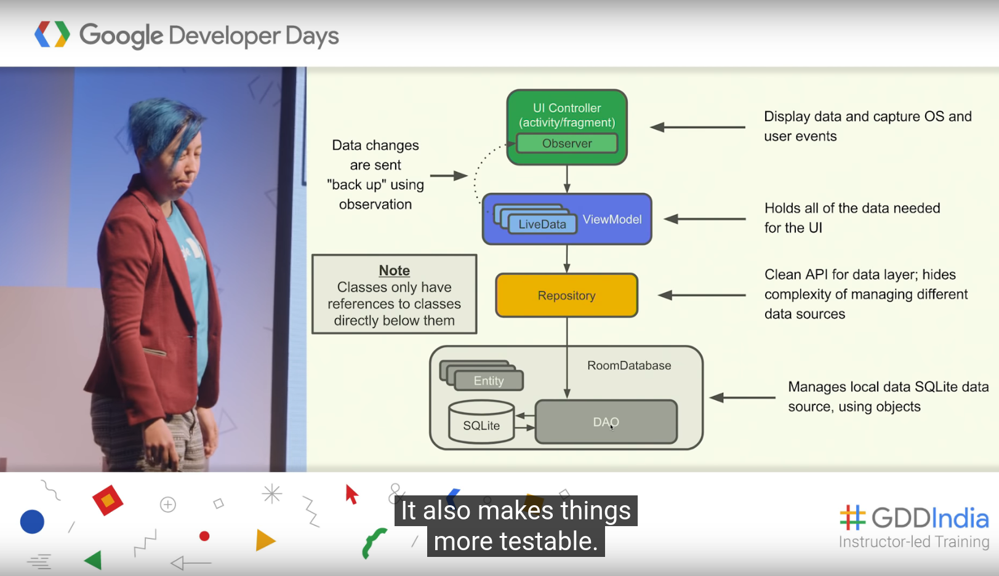

<style>
img[alt~="center"] {
  display: block;
  margin: 0 auto;
}

section.split h1 {
    grid-area: slideheading;
    height: 0;
}

section.split h3:nth-of-type(1) {
    grid-area: leftheader;
}

section.split h3:nth-of-type(2) {
    grid-area: rightheader;
}

section.split {
    overflow: visible;
    display: grid;
    grid-template-columns: 50% 50%;
    grid-template-areas: 
        "slideheading slideheading"
        "leftheader rightheader"
        "lefttext righttext"
}

section.flexrow {
display:flex;
flex-flow: row wrap;
}

section.flexrow h1 {
    flex: 0 1 100%;
}
</style>


# Проектирование мобильных приложений
<!-- _paginate: false -->
<!-- _footer: "Creative Commons Attribution-ShareAlike 3.0" -->

## Fragments
https://developer.android.com/guide/components/fragments

---
# В предыдущих лекциях ...


<!-- _footer: https://developer.android.com/docs -->

---

# В предыдущих лекциях ...

- Activities
- Services
- Content Providers
- Broadcast Receivers

As a developer we need only to call and extend these already defined classes to use in our application.

---

# В предыдущих лекциях...


---

# В предыдущих лекциях...
- `./drawable/*`
- `./layout/*`
- `./values/*`

- `./animator/*`, `./anim/*`, `./xml/*`, `./menu/*`, `./raw/*`

- `<resources_name>`-`<config_qualifier>`
  - `values-land-mdpi-v11`

---

# В предыдущих лекциях...


<!-- _footer: http://developer.android.com/guide/topics/resources/providing-resources.html -->

---
  
<style scoped>


section.split p:nth-of-type(1) {
    grid-area: leftpanel;
    padding-top: 50px;
    padding-left: 50px;
}

section.split p:nth-of-type(2) {
    grid-area: rightpanel1;
}

section.split p:nth-of-type(3) {
    grid-area: rightpanel2;
}

section.split h1 {
    grid-area: slideheading;
    z-index: 10;
}

section.split {
    overflow: visible;
    display: grid;
    grid-template-columns: 50% 50%;
    grid-template-areas: 
        "slideheading slideheading"
        "leftpanel rightpanel1"
        "leftpanel rightpanel2";
}

</style>

<!-- _class: split -->

# В предыдущих лекциях...


---

# В предыдущих лекциях...
- kotlin-android-extensions
  - Позволяет не писать findViewById, type-safe
- View Binding
  - Позволяет не писать findViewById, null-safe, type-safe
- Data Binding
  - android:text="@{user.firstName}"
- ViewModel
  - Позволяет данным переживать Configuration Change
- LiveData
  - Объект с состоянием, который можно безопасно наблюдать (Observe) из объекта с Lifecycle

---

# В предыдущих лекциях...
- LifeсycleOwner
  - Тот, кто может дать ссылку на Lifecycle
- Lifeсycle
  - Абстрактное представление жизненного цикла
- Observer
  - Паттерн проектирования
- LifecycleObserver
  - Тот, кто хочет получать уведомления об изменении Lifeсycle

---

# В предыдущих лекциях
<!-- _footer: https://developer.android.com/guide/components/activities/recents -->

<!-- _class: flexrow -->
<style scoped>
img[alt~="img2"] {
  padding-top:70px;
  padding-left:100px;
}
</style>


---

# В предыдущих лекциях

<!-- _footer: https://developer.android.com/guide/components/intents-filters.html -->

<!-- _class: split -->

### Explicit Intent
Component (Package + Class Name)
\
Action
Data
Category [1..*]
\
Extras
Flags

### Implicit intent 
\
\
Action
Data
Category [1..*]
\
Extras
Flags

---

# В предыдущих лекциях


---

<!-- _class: flexrow -->
# В предыдущих лекциях


---

# Ещё раз о фрагментах

---

# DEMO 1

Калькулятор

---

# DEMO 2

Master-detail pattern


---
<!-- _footer: https://www.youtube.com/watch?v=BofWWZE1wts -->


---

<!-- _footer: https://developer.android.com/reference/android/app/Application -->

There is normally no need to subclass Application. In most situations, static singletons can provide the same functionality in a more modular way.

---

# Фрагменты в Layout

deprecated

```xml
<?xml version="1.0" encoding="utf-8"?>
<LinearLayout xmlns:android="http://schemas.android.com/apk/res/android"
    android:orientation="horizontal"
    android:layout_width="match_parent"
    android:layout_height="match_parent">
    <fragment android:name="com.example.news.ArticleListFragment"
            android:id="@+id/list"
            android:layout_weight="1"
            android:layout_width="0dp"
            android:layout_height="match_parent" />
    <fragment android:name="com.example.news.ArticleReaderFragment"
            android:id="@+id/viewer"
            android:layout_weight="2"
            android:layout_width="0dp"
            android:layout_height="match_parent" />
</LinearLayout> 
```

---

# Фрагменты в Java

```java
// Create new fragment and transaction
Fragment newFragment = new ExampleFragment();
FragmentTransaction transaction = getFragmentManager().beginTransaction();

transaction.add(R.id.fragment_container, fragment); 
// transaction.replace(R.id.fragment_container, newFragment); 

// Commit the transaction
transaction.commit(); 
```

---

<!-- _class: split -->
# Фрагменты в Java

### FragmentManager

- `beginTransaction()`
  - returns `FragmentTransaction`
- `popBackStack()`
- `findFragmentById() `
- `findFragmentByTag()`

### FragmentTransaction

- `add()`
- `remove()`
- `replace()`
- `addToBackStack()`
- `commit()`

---

# Фрагменты в Java
Последовательность внесения изменений в  FragmentTransaction не важна, за исключением:
- Вызов метода commit() должен быть последним
- Последовательность добавления фрагментов влияет на последовательность элементов в view hierarchy

Вызов commit() планирует выполнение транзакции в UI потоке в будущем
- Не применяет все изменения сразу

---

# Fragments Interaction

Плохое решение:
- Fragment.getActivity()

Хорошее решение:
- Listeners (often in on Attach)

Еще более хорошее решение:
- ViewModel

---

# Fragments Interaction

```java
public static class FragmentA extends ListFragment {
    private OnArticleSelectedListener mListener;
    ...
    @Override
    public void onAttach(Activity activity) {
        super.onAttach(activity);
        try {
            mListener = (OnArticleSelectedListener) activity;
        } catch (ClassCastException e) {
            throw new ClassCastException(activity.toString() +
                  " must implement OnArticleSelectedListener");
        }
    }

    @Override
    public void onListItemClick(ListView l, View v, int position, long id) {
        // Append the clicked item's row ID with the content provider Uri
        Uri noteUri = ContentUris.withAppendedId(ArticleColumns.CONTENT_URI, id);
        // Send the event and Uri to the host activity
        mListener.onArticleSelected(noteUri);
    } 
    ...
} 
```