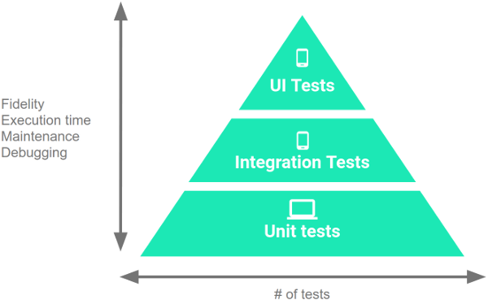
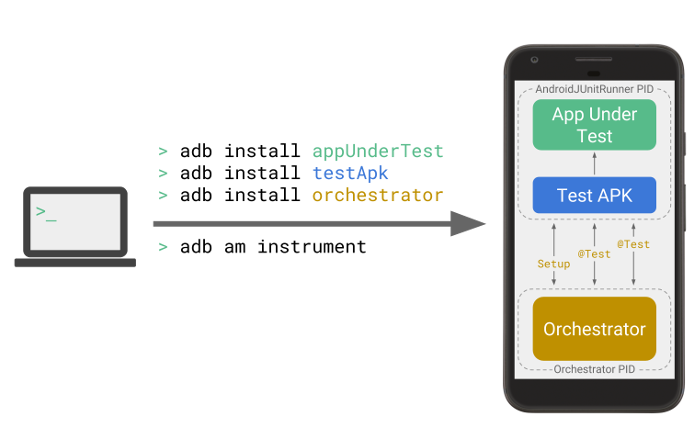
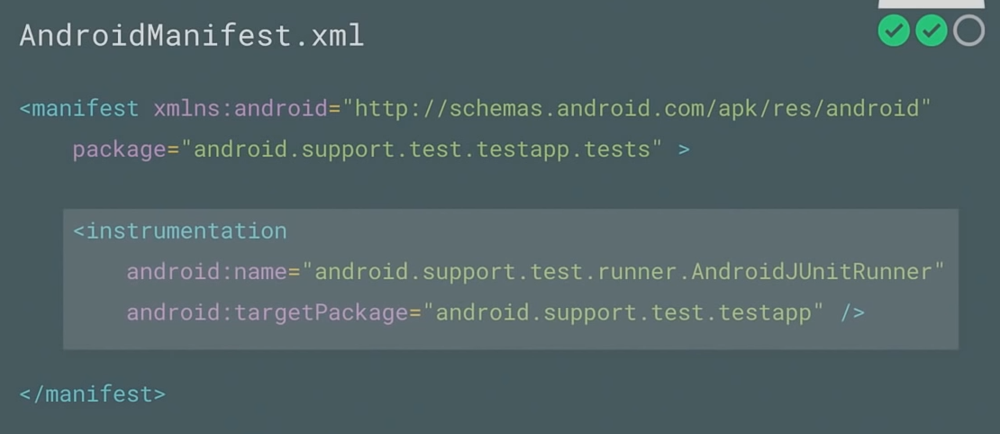
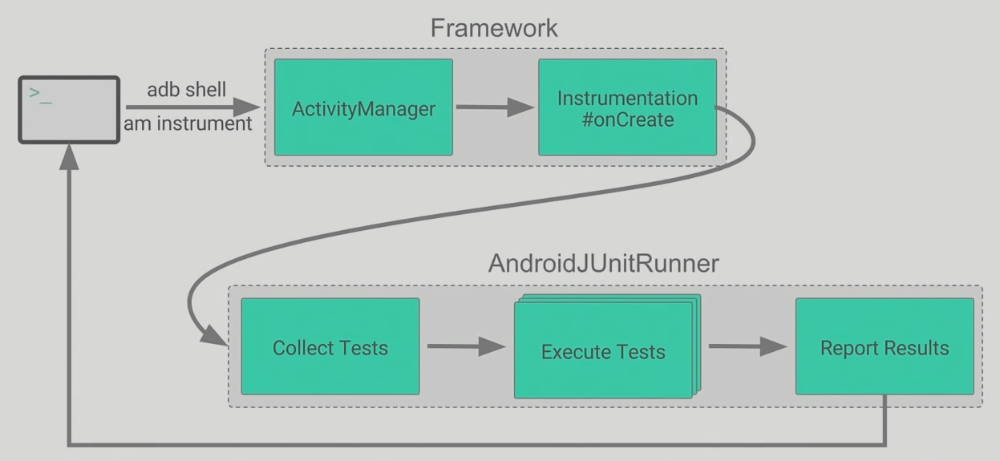
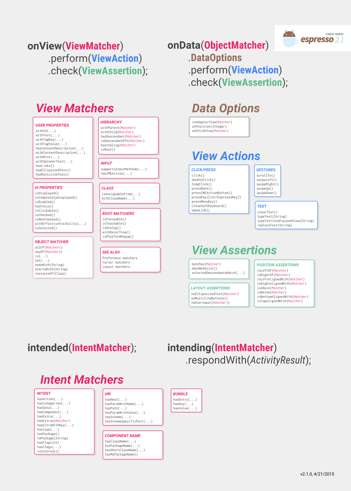
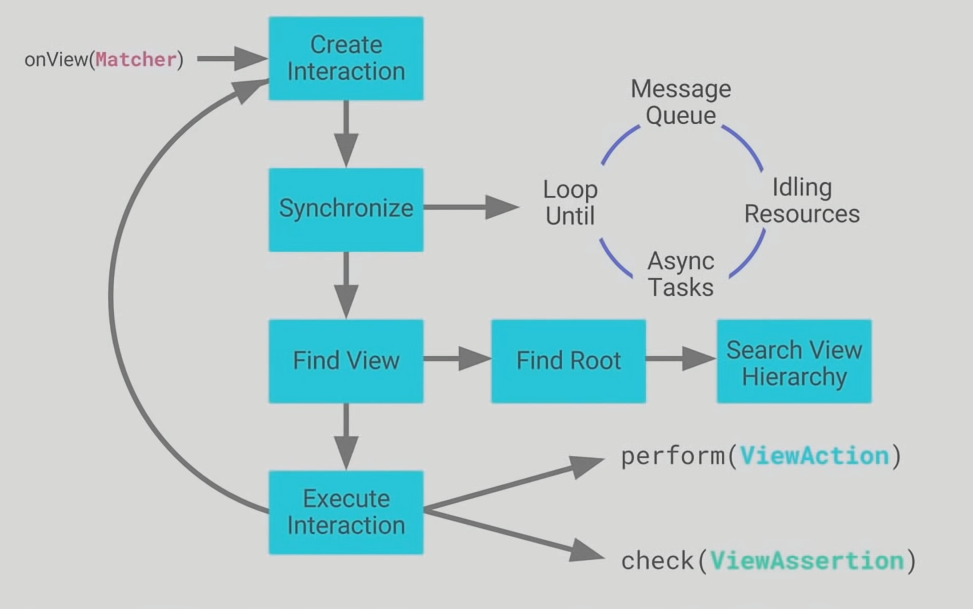

<style>
img[alt~="center"] {
  display: block;
  margin: 0 auto;
}

section.split h1 {
    grid-area: slideheading;
    height: 0;
}

section.split h3:nth-of-type(1) {
    grid-area: leftheader;
}

section.split h3:nth-of-type(2) {
    grid-area: rightheader;
}

section.split {
    overflow: visible;
    display: grid;
    grid-template-columns: 50% 50%;
    grid-template-areas: 
        "slideheading slideheading"
        "leftheader rightheader"
        "lefttext righttext"
}

section.flexrow {
display:flex;
flex-flow: row wrap;
}

section.flexrow h1 {
    flex: 0 1 100%;
}
</style>


# Проектирование мобильных приложений
<!-- _paginate: false -->
<!-- _footer: "Creative Commons Attribution-ShareAlike 3.0" -->

# Тестирование Андроид Приложений
https://developer.android.com/training/testing/fundamentals


---
# В предыдущих лекциях ...


<!-- _footer: https://developer.android.com/docs -->

---

# В предыдущих лекциях...


---

# В предыдущих лекциях...
- `./drawable/*`
- `./layout/*`
- `./values/*`

- `./animator/*`, `./anim/*`, `./xml/*`, `./menu/*`, `./raw/*`

- `<resources_name>`-`<config_qualifier>`
  - `values-land-mdpi-v11`


---

# В предыдущих лекциях ...

- Activities
- Services
- Content Providers
- Broadcast Receivers

As a developer we need only to call and extend these already defined classes to use in our application.

---
  
<style scoped>


section.split p:nth-of-type(1) {
    grid-area: leftpanel;
    padding-top: 50px;
    padding-left: 50px;
}

section.split p:nth-of-type(2) {
    grid-area: rightpanel1;
}

section.split p:nth-of-type(3) {
    grid-area: rightpanel2;
}

section.split h1 {
    grid-area: slideheading;
    z-index: 10;
}

section.split {
    overflow: visible;
    display: grid;
    grid-template-columns: 50% 50%;
    grid-template-areas: 
        "slideheading slideheading"
        "leftpanel rightpanel1"
        "leftpanel rightpanel2";
}

</style>

<!-- _class: split -->

# В предыдущих лекциях...


---

# В предыдущих лекциях...
- View Binding
  - Позволяет не писать findViewById, null-safe, type-safe
- Data Binding
  - android:text="@{user.firstName}"
- ViewModel
  - Позволяет данным переживать Configuration Change

---

# В предыдущих лекциях
<!-- _footer: https://developer.android.com/guide/components/activities/recents -->

<!-- _class: flexrow -->
<style scoped>
img[alt~="img2"] {
  padding-top:70px;
  padding-left:100px;
}
</style>


---

# В предыдущих лекциях

<!-- _footer: https://developer.android.com/guide/components/intents-filters.html -->

<!-- _class: split -->

### Explicit Intent
Component (Package + Class Name)
\
Action
Data
Category [1..*]
\
Extras
Flags

### Implicit intent 
\
\
Action
Data
Category [1..*]
\
Extras
Flags

---

# В предыдущих лекциях


---

<!-- _class: flexrow -->
# В предыдущих лекциях


---

# Тестирование Андроид Приложений
https://developer.android.com/training/testing/fundamentals

---

<!-- _footer: https://developer.android.com/training/testing/fundamentals -->

# Testing workflow (TDD, recommended by Google)


---

<!-- _class: flexrow -->

<style scoped>
ul {flex: 1;}
</style>

# Test Pyramid

<!-- _footer: https://developer.android.com/training/testing/fundamentals#testing-pyramid -->


<!-- 70/20/10 -->



- **Large tests** are end-to-end tests that validate user journeys spanning multiple modules of your app.
- **Medium tests** are integration tests that validate either interactions within a module, or interactions between related modules.
- **Small tests** are unit tests that validate your app's behavior one class at a time.

---

# JUnit4 (напоминание)

Общие сведения:
- `@Before`, `@After`, `@Test`, `@RunWith`
- org.junit.Assert
- Hamcrest (`assertThat(T actual, Matcher<? Super T>)`)

Общая структура теста:
- Дано, действие, проверка

Тест должен проверять инварианты (поведение), а не структуру кода

---

# Когда класс зависит от других классов приложения

<!-- _footer: https://developer.android.com/training/testing/fundamentals#test-doubles -->

Всегда лучше использовать реальные классы. 

Иногда использование *двойников* может быть оправдано:
- длинная операция
- негерметичная операция (сходить в Интернет)
- сложно воспроизводимые условия

Двойников можно писать руками или использовать **Mockito**

---

# Когда класс зависит от Android Framework

**Robolectric**:
- Предоставляет моки для классов из пакета android.*
- Исполняется локально в JVM

Не способен надежно моделировать сложные взаимодействия с ОС (заглушки для нативных методов ОС)

---

# Robolectric: начало работы

```groovy
android {
  testOptions {
    unitTests {
      includeAndroidResources = true
    }
  }
}

dependencies {
  testImplementation 'org.robolectric:robolectric:4.4'
}
```

---

# Локальные тесты: резюме

- Assert/Hamcrest для утверждений
- Mockito для моков собственных классов
- Robolectric для моков Андроид классов

---

# Инструментальные тесты: принцип работы

<!-- _footer: https://developer.android.com/training/testing/junit-runner#ato-architecture -->



---

# Инструментальный класс



---

# Запуск инструментального теста



---

# Инструментальные UI тесты: espresso

<!-- _footer: https://developer.android.com/training/testing/espresso/setup -->
Espresso dependencies

```groovy
apply plugin: 'com.android.application'

android {
    compileSdkVersion 28

    defaultConfig {
        applicationId "com.my.awesome.app"
        minSdkVersion 15
        targetSdkVersion 28
        versionCode 1
        versionName "1.0"

        testInstrumentationRunner "androidx.test.runner.AndroidJUnitRunner"
    }
}

dependencies {
    androidTestImplementation 'androidx.test:runner:1.1.0'
    androidTestImplementation 'androidx.test.espresso:espresso-core:3.1.0'
} 
```

---

# Инструментальные UI тесты: настройка устройства

Выключить в `Settings > Developer options`:
- Window animation scale
- Transition animation scale
- Animator duration scale

---

# Espresso: основные классы

**`Espresso`**
Entry point to interactions with views (via `onView()` and `onData()`)
Exposes APIs that are not necessarily tied to any view, such as `pressBack()`

**`ViewMatchers`**
Implement the `Matcher<? super View>` interface to locate a view within the current view hierarchy.

**`ViewActions`**
Can be passed to the `ViewInteraction/DataInteraction.perform()` method, such as `click()`.

**`ViewAssertions`**
Can be passed the `ViewInteraction/DataInteraction.check()` method to verify view state. 

---

# Espresso cheat sheet
<!-- _footer: https://developer.android.com/training/testing/espresso/cheat-sheet -->

<style scoped>
p {
  overflow: scroll;
}
</style>



---

# Espresso: синхронизация



---

# Запуск компонента перед началом теста

JUnit4 Rule
- `ActivityScenarioRule`
- `ServiceTestRule`
- `...`

```kotlin
@get:Rule
var activityScenarioRule = ActivityScenarioRule(ListActivity::class.java)
```

```kotlin
androidx.test.core.app.ActivityScenario.launch()
```

<!-- _footer: https://developer.android.com/guide/components/activities/testing -->

---

# Espresso: пример

```java
val scenario = ActivityScenario.launch(ListActivity::class.java)

onView(withId(R.id.my_view))            // withId(R.id.my_view) is a ViewMatcher
        .perform(click())               // click() is a ViewAction
        .check(matches(isDisplayed())); // matches(isDisplayed()) is a ViewAssertion

scenario.close()
```

---

# Стандартные решения стандартных задач

https://developer.android.com/training/testing/espresso/recipes

---

# Когда espresso недостаточно (UI Automator)

Нельзя написать тест, включающий взаимодействие со сторонними приложениями
- Как проверить, что иконка запускает правильную Activity?
- Как проверить взаимодействие с другим приложением (например, телефонной книгой)?

---

# UI Automator: обзор API

`UiDevice` class:
- Поиск `View`.
- Поворот устройства.
- Симуляция аппаратных кнопок (например, volume up, Back, Home, и Menu).
- Open the notification shade.
- Take a screenshot of the current window.

---

# UI Automator: обзор API

**`UiCollection`** Enumerates a container's UI elements

**`UiObject`** Represents a UI element that is visible on the device.

**`UiScrollable`** Provides support for searching for items in a scrollable UI container.

**`UiSelector`** Represents a query for one or more target UI elements on a device.

**`Configurator`** Allows you to set key parameters for running UI Automator tests.

---

# UI Automator: поиск View

```java
mDevice = UiDevice.getInstance(getInstrumentation());
UiObject allAppsButton = mDevice
        .findObject(new UiSelector().description("Apps"));
```

---

# UI Automator: пример

```java
mDevice = UiDevice.getInstance(getInstrumentation());
mDevice.pressHome();

// Bring up the default launcher by searching for a UI component
// that matches the content description for the launcher button.
UiObject allAppsButton = mDevice
        .findObject(new UiSelector().description("Apps"));

// Perform a click on the button to load the launcher.
allAppsButton.clickAndWaitForNewWindow();
```
