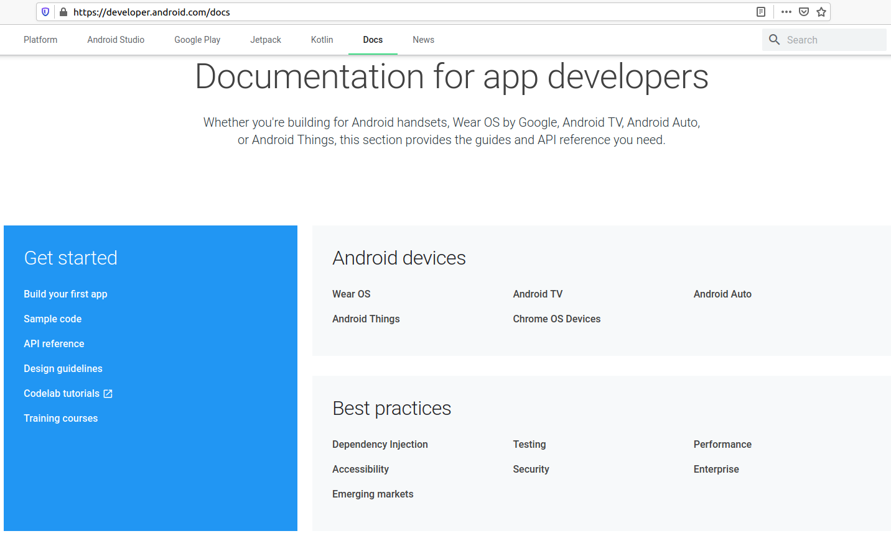
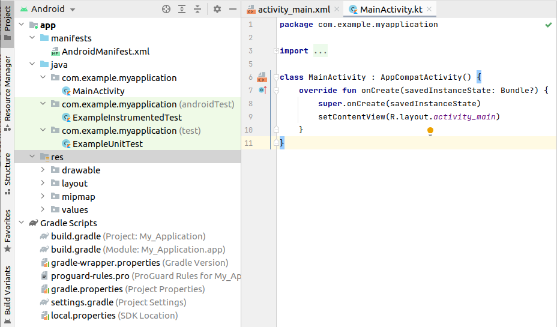
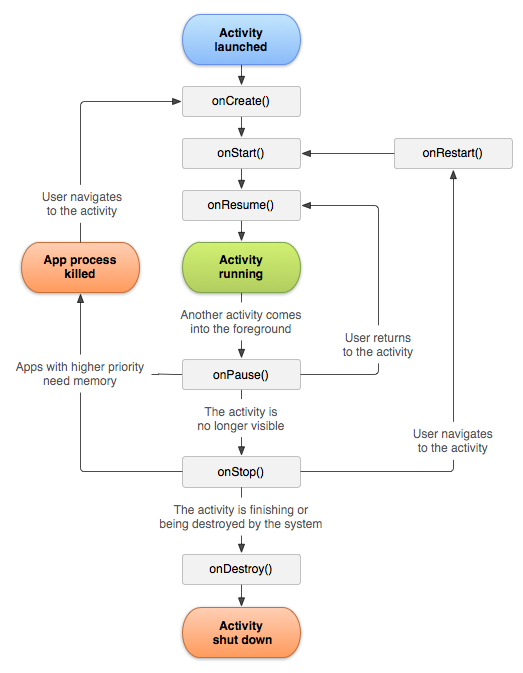
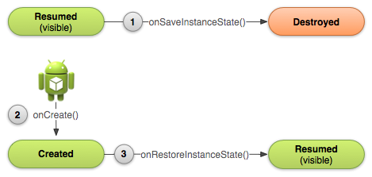
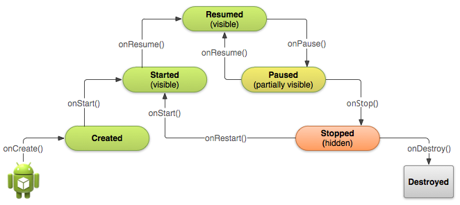
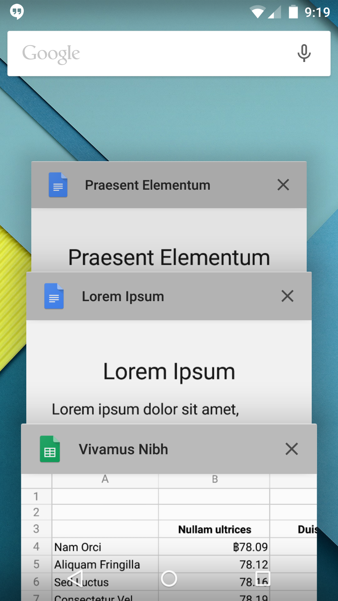
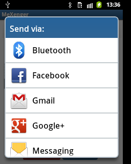
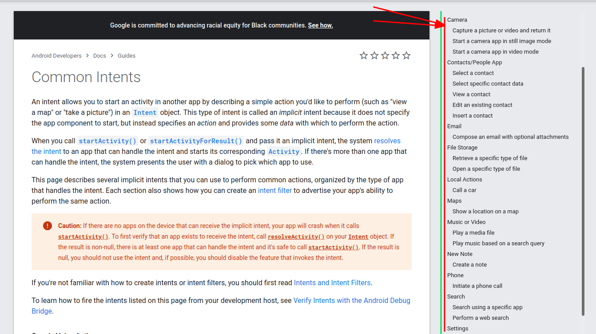
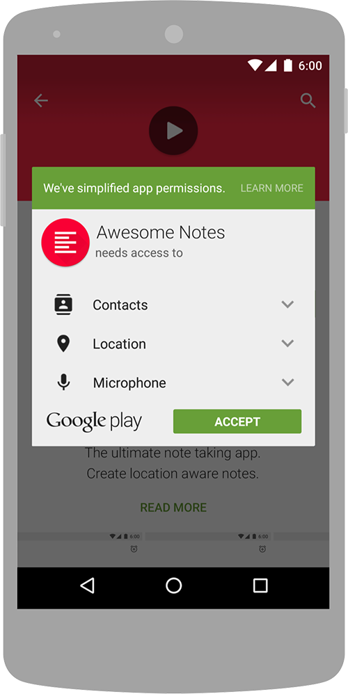
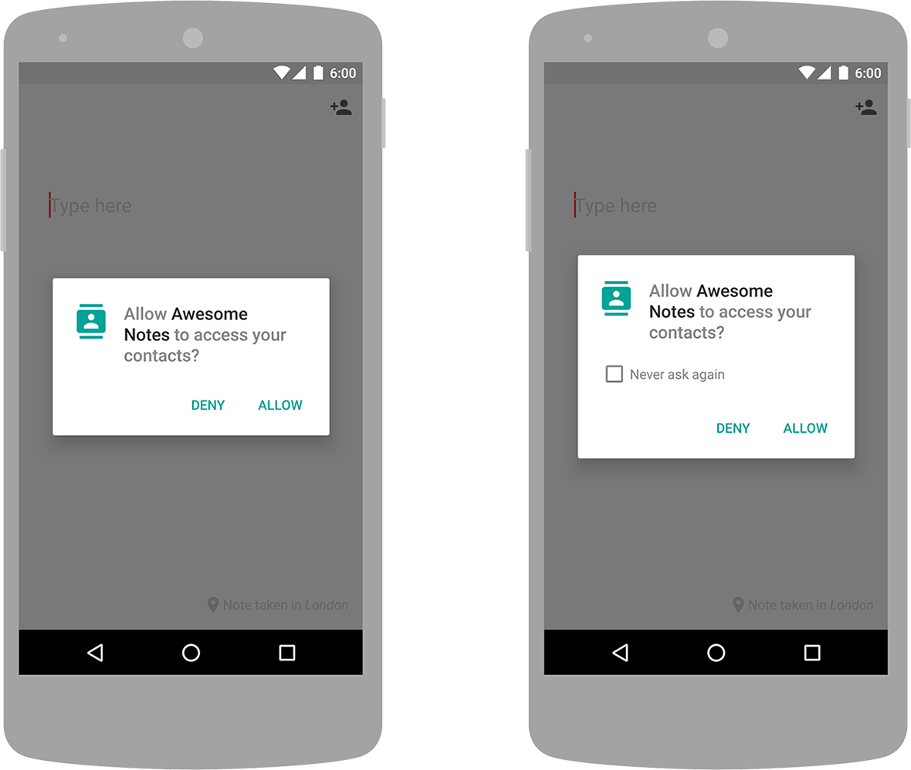

<style>
img[alt~="center"] {
  display: block;
  margin: 0 auto;
}

section.split h1 {
    grid-area: slideheading;
    height: 0;
}

section.split h3:nth-of-type(1) {
    grid-area: leftheader;
}

section.split h3:nth-of-type(2) {
    grid-area: rightheader;
}

section.split {
    overflow: visible;
    display: grid;
    grid-template-columns: 50% 50%;
    grid-template-areas: 
        "slideheading slideheading"
        "leftheader rightheader"
        "lefttext righttext"
}

section.flexrow {
display:flex;
flex-flow: row wrap;
}

section.flexrow h1 {
    flex: 0 1 100%;
}
</style>


# Проектирование мобильных приложений
<!-- _paginate: false -->
<!-- _footer: "Creative Commons Attribution-ShareAlike 3.0" -->

---
# В предыдущих лекциях ...




<!-- _footer: https://developer.android.com/docs -->

---

# В предыдущих лекциях...



---

# В предыдущих лекциях...
- `./drawable/*`
- `./layout/*`
- `./values/*`

- `./animator/*`, `./anim/*`, `./xml/*`, `./menu/*`, `./raw/*`

- `<resources_name>`-`<config_qualifier>`
  - `values-land-mdpi-v11`


---

# В предыдущих лекциях ...

- Activities
- Services
- Content Providers
- Broadcast Receivers

As a developer we need only to call and extend these already defined classes to use in our application.

---
  
<style scoped>


section.split p:nth-of-type(1) {
    grid-area: leftpanel;
    padding-top: 50px;
    padding-left: 50px;
}

section.split p:nth-of-type(2) {
    grid-area: rightpanel1;
}

section.split p:nth-of-type(3) {
    grid-area: rightpanel2;
}

section.split h1 {
    grid-area: slideheading;
    z-index: 10;
}

section.split {
    overflow: visible;
    display: grid;
    grid-template-columns: 50% 50%;
    grid-template-areas: 
        "slideheading slideheading"
        "leftpanel rightpanel1"
        "leftpanel rightpanel2";
}

</style>

<!-- _class: split -->

# В предыдущих лекциях...







---

# В предыдущих лекциях...
- View Binding
  - Позволяет не писать findViewById, null-safe, type-safe
- Data Binding
  - android:text="@{user.firstName}"
- ViewModel
  - Позволяет данным переживать Configuration Change

---

# В предыдущих лекциях
<!-- _footer: https://developer.android.com/guide/components/activities/recents -->

<!-- _class: flexrow -->
<style scoped>
img[alt~="img2"] {
  padding-top:70px;
  padding-left:100px;
}
</style>




---

# В предыдущих лекциях

<!-- _footer: https://developer.android.com/guide/components/intents-filters.html -->

<!-- _class: split -->

### Explicit Intent
Component (Package + Class Name)
\
Action
Data
Category [1..*]
\
Extras
Flags

### Implicit intent 
\
\
Action
Data
Category [1..*]
\
Extras
Flags

---

# Implicit Intents
<!-- _footer: http://developer.android.com/guide/components/intents-filters.html  -->

---

# Зачем нужен Intent

3 основных элемента приложения: **activities**, **services** и **broadcast receivers** – активируются сообщениями, называемыми **intent**
- `Context.startActivity()`
- `Context.startService()`
- `Context.sendBroadcast()`

---

# Типы Intent

<!-- _footer: https://developer.android.com/guide/components/intents-filters.html -->

<!-- _class: split -->

### Explicit Intent
Component (Package + Class Name)
\
Action
Data
Category [1..*]
\
Extras
Flags

### Implicit intent 
\
\
Action
Data
Category [1..*]
\
Extras
Flags

---

# Intent: Component Name

Имя компонента, который должен обработать интент.
- Имя приложения (package)
- Имя класса com.example.helloworld .SecondActivity (extends Activity)

Если указан – будет запущен новый экземпляр указанного класса.

Если не указан – **Intent Resolution Process** (implicit intent)

---

# Вопрос

Что будет, если в качестве `Component Name` указать компонент из "чужого" приложения?

---

# One More *Explicit Intent* DEMO
Запустим Activity из "чужого" приложения

```kotlin
val i = Intent()
i.setComponent(
    ComponentName.createRelative(
        "com.google.android.youtube",
        "com.google.android.apps.youtube.app.application.Shell\$UploadActivity"
    )
)
```
See also: https://developers.google.com/youtube/android/player/reference/com/google/android/youtube/player/YouTubeIntents

---

# Implicit Intents. Назначение

<!-- _class: flexrow -->
<style scoped>
ul {flex:1;}
</style>

Имя компонента не известно, но известно намерение пользователя, например:
- Открыть URL в браузере
- Отправить письмо



---

# Implicit Intent: Философия

Action определяет остальную структуру `Intent` -- содержимое полей `data` и `extras`. 
* Можно провести аналогию с именем метода класса, определяющим набор аргументов и возвращаемое значение.
* Если определяете свой `Action`, нужно продумать семантику остальных полей `Intent`.

---

# Стандартные ситуации



<!-- _footer: https://developer.android.com/guide/components/intents-common -->

---

# DEMO: ACTION_PICK
```kotlin
val i = Intent(Intent.ACTION_PICK)
(1) i.type = ContactsContract.Contacts.CONTENT_TYPE
(2) i.type = "video/*"
```

---

# Intent Resolution: Implicit Intent

Используются только 3 поля:
- action
- category
- data

---

# Intent Resolution: Intent Filter

Компоненты, которые активируются `Intent`'ом, могут объявлять один или более `intent-filter` в `AndroidManifest.xml`

```xml
<activity android:name=".MainActivity">
    <intent-filter>
        <action android:name="android.intent.action.MAIN"/>
        <category android:name="android.intent.category.LAUNCHER"/>
    </intent-filter>
</activity>
```

---

# AndroidManifest.xml (Напоминание)

<!-- _footer: https://developer.android.com/guide/topics/manifest/manifest-intro -->

<style scoped>
section {
    display: flex;
    flex-direction: row;
    flex-wrap: wrap;
}

h1 {
    flex: 0 1 100%;
}

pre {
    height: 500px;
    flex-basis: 50%;
}

pre code svg {
    max-height:470px;
}
</style>

```xml
<?xml version="1.0" encoding="utf-8"?>
<manifest>

    <uses-permission />
    <permission />
    <permission-tree />
    <permission-group />
    <instrumentation />
    <uses-sdk />
    <uses-configuration />  
    <uses-feature />  
    <supports-screens />  
    <compatible-screens />  
    <supports-gl-texture />  

    <application>

        <activity>
            <intent-filter>
                <action />
                <category />
                <data />
            </intent-filter>
            <meta-data />
        </activity>
```

```xml
        <activity-alias>
            <intent-filter> . . . </intent-filter>
            <meta-data />
        </activity-alias>

        <service>
            <intent-filter> . . . </intent-filter>
            <meta-data/>
        </service>

        <receiver>
            <intent-filter> . . . </intent-filter>
            <meta-data />
        </receiver>

        <provider>
            <grant-uri-permission />
            <meta-data />
            <path-permission />
        </provider>

        <uses-library />

    </application>

</manifest>
```

---

# Intent: `action`

Строка (`String`)
- Имя действия (или имя события для Broadcast Receivers)

Значение
- Одно из стандартных
- Можно объявить собственное (просто строка)
  - Пример: `"com.example.project.SHOW_COLOR"`

---

# Some Standard Actions

| Constant | Target component | Action |
|-|-|-|
|ACTION_CALL|activity|Initiate a phone call.|
|ACTION_EDIT|activity|Display data for the user to edit.|
|ACTION_MAIN|activity|Start up as the initial activity of a task, with no data input and no returned output.|
|ACTION_SYNC|activity|Synchronize data on a server with data on the mobile device.|
ACTION_BATTERY_LOW|broadcast receiver|A warning that the battery is low.|
|ACTION_HEADSET_PLUG|broadcast receiver|A headset has been plugged into the device, or unplugged from it.|
|ACTION_SCREEN_ON|broadcast receiver|The screen has been turned on.|
|ACTION_TIMEZONE_CHANGED|broadcast receiver|The setting for the time zone has changed.|

<!-- _footer: https://developer.android.com/reference/android/content/Intent#standard-activity-actions -->

---

# Intent: `categories`

Строки (`String[]`)
- Доп. информация о типе компонента, на который направлено действие

Значение
- Одно из стандартных
- Можно объявить собственное (просто строка)
  - Пример: `"com.example.project.MY_CATEGORY"`

---

# Some Standard Categories

|Constant|Meaning|
|-|-|
|CATEGORY_BROWSABLE|The target activity can be safely invoked by the browser to display data referenced by a link —for example, an image or an e-mail message.|
|CATEGORY_GADGET|The activity can be embedded inside of another activity that hosts gadgets.|
|CATEGORY_LAUNCHER|The activity can be the initial activity of a task and is listed in the top-level application launcher.|
|CATEGORY_PREFERENCE|The target activity is a preference panel.|

<!-- _footer: https://developer.android.com/reference/android/content/Intent#standard-categories -->

---

# Intent Filters. Пример фильтра Action

```xml
<intent-filter ... >
    <action android:name="com.example.project.SHOW_CURRENT" />
    <action android:name="com.example.project.SHOW_RECENT" />
    <action android:name="com.example.project.SHOW_PENDING" />
    ...
</intent-filter> 
```

- Список не может быть пустым
- Чтобы фильтр сработал в Intent должен быть указан один из Actions, объявленных в манифесте

---

# Intent Filters. Пример фильтра Category

```xml
<intent-filter . . . >
    <category android:name="android.intent.category.DEFAULT" />
    <category android:name="android.intent.category.BROWSABLE" />
    . . .
</intent-filter> 
```

- Чтобы фильтр сработал в манифесте должны быть перечислены, как минимум, все категории, указанные в `Intent`
- Все Implicit Intents, как минимум, имеют категорию
`android.intent.category.DEFAULT`

---

# Intent: `data+type`

URI данных, над которыми производится действие и MIME этих данных
- Например, контакт в телефонной книжке

---

# Intent: `data+type`

**Data** = `URI + MIME`
**URI** (=`data`) = `scheme://host:port/path`
- `content://com.example.project:200/folder/subfolder/etc`

**URI authority** = `host:port`

**MIME** (=`type`) (Multipurpose Internet Mail Extensions)
- `text/plain`
- `audio/mpeg`

---

# Intent Filters. Синтаксис фильтра `data`

```xml
<intent-filter ... >
<data android:scheme="string"
      android:host="string"
      android:port="string"
      android:path="string"
      android:pathPattern="string"
      android:pathPrefix="string"
      android:mimeType="string" />
    ...
</intent-filter> 
```

`<scheme>://<host>:<port>/[<path>|<pathPrefix>|<pathPattern>]`

---

# Intent Filters. Data Test

| Intent | Filter |
| - | - |
| Нет URI, нет MIME | Нет URI, нет MIME |
| Есть URI, нет MIME | URI совпадает, нет MIME |
| Нет URI, есть MIME | Нет URI, MIME совпадает |
| Есть URI, есть MIME | MIME совпадает и (одно из двух):<br>1) URI совпадает, или <br> 2) нет URI и в запросе схема `content:` или `file:` |

---

# Intent Filters. Data Test. Уточнения

MIME
- В фильтре может использоваться маска (`image/*`)

URI
- В сравнении участвуют только части URI, указанные в **фильтре**
  - Если в фильтре не указан путь, URI из Intent считается совпадающим, если совпала схема и authority.

---

# Using Intent Matching

**`PackageManager`** has a set of `query...()` to list all the components that can accept a particular intent
- `queryIntentActivities()`
- `queryIntentServices()`
- ...

**`PackageManager`** has a set of `resolve...()` to find the best component to respond to an intent
- `resolveActivity()`
- `resolveServices()`
- ...

---

# Важное замечание

Если нет компонента, который может обработать `Intent` -- возникнет ошибка на вызывающей стороне.

```kotlin
fun selectContact() {
    val intent = Intent(Intent.ACTION_PICK).apply {
        type = ContactsContract.Contacts.CONTENT_TYPE
    }
    if (intent.resolveActivity(packageManager) != null) {
        startActivityForResult(intent, REQUEST_SELECT_CONTACT)
    }
}
```

---

# Вопрос
Кто угодно может запустить любой компонент из моего приложения?

---

# DEMO

```kotlin
val i = Intent()
i.setComponent(
    ComponentName.createRelative(
        "com.google.android.youtube",
        "com.google.android.apps.youtube.app.MainLiveCreationActivity"
    )
)
```

---

# Android Permissions

https://developer.android.com/guide/topics/permissions/overview

---

# Ограничение Доступа к Компоненту

AndroidManifest.xml
- `android:exported="false"`
  - Код в том же процессе* может запускать компонент
- `android:permission="string"`
  - `<uses-permission>`, `ActivityCompat.requestPermissions` (aka Dynamic Permissions API 23+)

(*) `Application>android:process`+`manifest>android:sharedUserId`
`android:sharedUserId` is deprecated in API level 29

---

# Protection Levels
**Normal permissions** — Автоматически разрешены при установке
- FOREGROUND_SERVICE
- SET_WALLPAPER

**Signature permissions** — Разрешены, если приложения подписаны одинаковыми сертификатами
- CLEAR_APP_CACHE

---

# Protection Levels
**Dangerous permissions** — Могут раскрывать информацию о пользователе
- Должны быть разрешены пользователем явно
  - При установке (до Android 6.0, API 23)
  - Во время исполнения (Android 6.0, API 23 и больше)

**Special permissions** — :-)
- SYSTEM_ALERT_WINDOW
- WRITE_SETTINGS

---

# Install Time Permissions Request 



---

# Runtime Permissions Request



У пользователя спрашивается разрешение на **группу**

---

# Permission Group

| Group | Permissions |
|-|-|
| CAMERA | CAMERA
| CONTACTS | READ_CONTACTS, WRITE_CONTACTS, GET_ACCOUNTS
| LOCATION | ACCESS_FINE_LOCATION, ACCESS_COARSE_LOCATION
| MICROPHONE | RECORD_AUDIO
| SMS | SEND_SMS, RECEIVE_SMS, READ_SMS, RECEIVE_WAP_PUSH, RECEIVE_MMS
| STORAGE | READ_EXTERNAL_STORAGE, WRITE_EXTERNAL_STORAGE
| ... | ... 

Don't base your app's logic on the structure of these permission groups.

<!-- _footer: https://developer.android.com/guide/topics/permissions/overview#perm-groups -->

---

# Permission Group: Protected APIs


---

# Ограничения на Dangerous Permissions (API 23+)
Все Dangerous Permissions должны быть запрошены явно во время исполнения приложения (объявления `<uses-permissions>` в AndroidManifest не достаточно)

<!-- _footer: https://developer.android.com/training/permissions/requesting -->

---

# Запрос Dangerous Permissions (API 23+) 

```java
// Here, thisActivity is the current activity
if (ContextCompat.checkSelfPermission(thisActivity,
        Manifest.permission.READ_CONTACTS)
        != PackageManager.PERMISSION_GRANTED) {

    // Permission is not granted
    // Should we show an explanation?
    if (ActivityCompat.shouldShowRequestPermissionRationale(thisActivity,
            Manifest.permission.READ_CONTACTS)) {
        // Show an explanation to the user *asynchronously* -- don't block
        // this thread waiting for the user's response! After the user
        // sees the explanation, try again to request the permission.
    } else {
        // No explanation needed; request the permission
        ActivityCompat.requestPermissions(thisActivity,
                new String[]{Manifest.permission.READ_CONTACTS},
                MY_PERMISSIONS_REQUEST_READ_CONTACTS);

        // MY_PERMISSIONS_REQUEST_READ_CONTACTS is an
        // app-defined int constant. The callback method gets the
        // result of the request.
    }
} else {
    // Permission has already been granted
} 
```

---

# Обработка Разрешения Dangerous Permissions (API 23+)

```java
@Override
public void onRequestPermissionsResult(int requestCode,
        String permissions[], int[] grantResults) {
    switch (requestCode) {
        case MY_PERMISSIONS_REQUEST_READ_CONTACTS: {
            // If request is cancelled, the result arrays are empty.
            if (grantResults.length > 0
                && grantResults[0] == PackageManager.PERMISSION_GRANTED) {
                // permission was granted, yay! Do the
                // contacts-related task you need to do.
            } else {
                // permission denied, boo! Disable the
                // functionality that depends on this permission.
            }
            return;
        }

        // other 'case' lines to check for other
        // permissions this app might request.
    }
} 
```

---

# То же самое, более новый API (обработка)

```kotlin
// Register the permissions callback, which handles the user's response to the
// system permissions dialog. Save the return value, an instance of
// ActivityResultLauncher. You can use either a val, as shown in this snippet,
// or a lateinit var in your onAttach() or onCreate() method.
val requestPermissionLauncher =
    registerForActivityResult(RequestPermission()
    ) { isGranted: Boolean ->
        if (isGranted) {
            // Permission is granted. Continue the action or workflow in your
            // app.
        } else {
            // Explain to the user that the feature is unavailable because the
            // features requires a permission that the user has denied. At the
            // same time, respect the user's decision. Don't link to system
            // settings in an effort to convince the user to change their
            // decision.
        }
    }

```

---

# То же самое, более новый API (запрос)

```kotlin
when {
    ContextCompat.checkSelfPermission(
            CONTEXT,
            Manifest.permission.REQUESTED_PERMISSION
            ) == PackageManager.PERMISSION_GRANTED -> {
        // You can use the API that requires the permission.
    }
    shouldShowRequestPermissionRationale(...) -> {
        // In an educational UI, explain to the user why your app requires this
        // permission for a specific feature to behave as expected. In this UI,
        // include a "cancel" or "no thanks" button that allows the user to
        // continue using your app without granting the permission.
        showInContextUI(...)
    }
    else -> {
        // You can directly ask for the permission.
        // The registered ActivityResultCallback gets the result of this request.
        requestPermissionLauncher.launch(
                Manifest.permission.REQUESTED_PERMISSION)
    }
}
```

---

# Объявление Новых Permission и Permission Group

https://developer.android.com/guide/topics/permissions/defining 

---

# Permissions: Basic Principles

- **Ask for permissions in context**, when the user starts to interact with the feature that requires it.
- **Don't block the user.** Always provide the option to cancel an educational UI flow related to permissions.
- If the user denies or revokes a permission that a feature needs, **gracefully degrade** your app so that the user can continue using your app, possibly by disabling the feature that requires the permission.
- **Don't assume any system behavior.**

<!-- _footer: https://developer.android.com/training/permissions/requesting#principles -->

---

# Permissions: Best Practices (1)

#1: Only use the permissions necessary for your app to work. 
 - Depending on how you are using the permissions, there may be another way to do what you need (system intents, identifiers, backgrounding for phone calls) without relying on access to sensitive information.

#2: Pay attention to permissions required by libraries. 
 - When you include a library, you also inherit its permission requirements. You should be aware of what you're including, the permissions they require, and what those permissions are used for.

<!-- _footer: https://developer.android.com/training/permissions/usage-notes#tenets_of_working_with_android_permissions -->

---

# Permissions: Best Practices (2)

#3: Be transparent. 
 - When you make a permissions request, be clear about what you’re accessing, and why, so users can make informed decisions.

#4: Make system accesses explicit. 
 - Providing continuous indications when you access sensitive capabilities (for example, the camera or microphone) makes it clear to users when you’re collecting data and avoids the perception that you're collecting data surreptitiously. 

<!-- _footer: https://developer.android.com/training/permissions/usage-notes#tenets_of_working_with_android_permissions -->