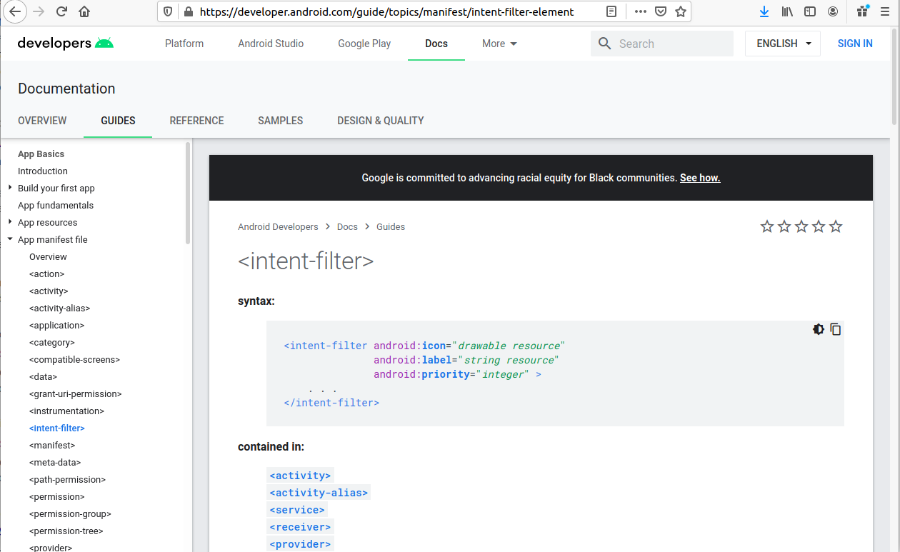

<style>
img[alt~="center"] {
  display: block;
  margin: 0 auto;
}

section.split h1 {
    grid-area: slideheading;
    height: 0;
}

section.split h3:nth-of-type(1) {
    grid-area: leftheader;
}

section.split h3:nth-of-type(2) {
    grid-area: rightheader;
}

section.split {
    overflow: visible;
    display: grid;
    grid-template-columns: 50% 50%;
    grid-template-areas: 
        "slideheading slideheading"
        "leftheader rightheader"
        "lefttext righttext"
}

section.flexrow {
display:flex;
flex-flow: row wrap;
}

section.flexrow h1 {
    flex: 0 1 100%;
}
</style>


# Проектирование мобильных приложений
<!-- _paginate: false -->
<!-- _footer: "Creative Commons Attribution-ShareAlike 3.0" -->

## Fragments
https://developer.android.com/guide/components/fragments

---
# В предыдущих лекциях ...


<!-- _footer: https://developer.android.com/docs -->

---

# В предыдущих лекциях...


---

# В предыдущих лекциях...
- `./drawable/*`
- `./layout/*`
- `./values/*`

- `./animator/*`, `./anim/*`, `./xml/*`, `./menu/*`, `./raw/*`

- `<resources_name>`-`<config_qualifier>`
  - `values-land-mdpi-v11`


---

# В предыдущих лекциях ...

- Activities
- Services
- Content Providers
- Broadcast Receivers

As a developer we need only to call and extend these already defined classes to use in our application.

---
  
<style scoped>


section.split p:nth-of-type(1) {
    grid-area: leftpanel;
    padding-top: 50px;
    padding-left: 50px;
}

section.split p:nth-of-type(2) {
    grid-area: rightpanel1;
}

section.split p:nth-of-type(3) {
    grid-area: rightpanel2;
}

section.split h1 {
    grid-area: slideheading;
    z-index: 10;
}

section.split {
    overflow: visible;
    display: grid;
    grid-template-columns: 50% 50%;
    grid-template-areas: 
        "slideheading slideheading"
        "leftpanel rightpanel1"
        "leftpanel rightpanel2";
}

</style>

<!-- _class: split -->

# В предыдущих лекциях...


---

# В предыдущих лекциях...
- View Binding
  - Позволяет не писать findViewById, null-safe, type-safe
- Data Binding
  - android:text="@{user.firstName}"
- ViewModel
  - Позволяет данным переживать Configuration Change

---

# В предыдущих лекциях
<!-- _footer: https://developer.android.com/guide/components/activities/recents -->

<!-- _class: flexrow -->
<style scoped>
img[alt~="img2"] {
  padding-top:70px;
  padding-left:100px;
}
</style>


---

# В предыдущих лекциях

<!-- _footer: https://developer.android.com/guide/components/intents-filters.html -->

<!-- _class: split -->

### Explicit Intent
Component (Package + Class Name)
\
Action
Data
Category [1..*]
\
Extras
Flags

### Implicit intent 
\
\
Action
Data
Category [1..*]
\
Extras
Flags

---

# Implicit Intents
<!-- _footer: http://developer.android.com/guide/components/intents-filters.html  -->

---

# Зачем нужен Intent

3 основных элемента приложения: **activities**, **services** и **broadcast receivers** – активируются сообщениями, называемыми **intent**
- `Context.startActivity()`
- `Context.startService()`
- `Context.sendBroadcast()`

---

# Типы Intent

<!-- _footer: https://developer.android.com/guide/components/intents-filters.html -->

<!-- _class: split -->

### Explicit Intent
Component (Package + Class Name)
\
Action
Data
Category [1..*]
\
Extras
Flags

### Implicit intent 
\
\
Action
Data
Category [1..*]
\
Extras
Flags

---

# Intent: Component Name

Имя компонента, который должен обработать интент.
- Имя приложения (package)
- Имя класса com.example.helloworld .SecondActivity (extends Activity)

Если указан – будет запущен новый экземпляр указанного класса.

Если не указан – **Intent Resolution Process** (implicit intent)

---

# Implicit Intent Resolution

---

# Implicit Intents. Назначение

<!-- _class: flexrow -->
<style scoped>
ul {flex:1;}
</style>

Имя компонента не известно, но известно намерение пользователя, например:
- Открыть URL в браузере
- Отправить письмо


---

# Intent Resolution: Implicit Intent

Используются только 3 поля:
- action
- category
- data

---

# Intent: Action. Философия

Action во многом определяет остальную структуру `Intent`, в частности содержимое полей `data` и `extras`. 

Можно провести аналогию с именем метода класса, определяющим набор аргументов и возвращаемое значение.

Рекомендуется определять не только `Action`, а полностью протокол взаимодействия с компонентом.

---

# Intent: Action

Строка (`String`)
- Имя действия (или имя события для Broadcast Receivers)

Значение
- Одно из стандартных
- Можно объявить собственное (просто строка!)
  - Пример: `"com.example.project.SHOW_COLOR"`

---

# Some Standard Actions

| Constant | Target component | Action |
|-|-|-|
|ACTION_CALL|activity|Initiate a phone call.|
|ACTION_EDIT|activity|Display data for the user to edit.|
|ACTION_MAIN|activity|Start up as the initial activity of a task, with no data input and no returned output.|
|ACTION_SYNC|activity|Synchronize data on a server with data on the mobile device.|
ACTION_BATTERY_LOW|broadcast receiver|A warning that the battery is low.|
|ACTION_HEADSET_PLUG|broadcast receiver|A headset has been plugged into the device, or unplugged from it.|
|ACTION_SCREEN_ON|broadcast receiver|The screen has been turned on.|
|ACTION_TIMEZONE_CHANGED|broadcast receiver|The setting for the time zone has changed.|

---

# Intent: Category

Строка (`String`)
- Доп. информация о типе компонента, на который направлено действие

Значение
- Одно из стандартных
- Можно объявить собственное (просто строка!)
  - Пример: `"com.example.project.MY_CATEGORY"`

---

# Some Standard Categories

|Constant|Meaning|
|-|-|
|CATEGORY_BROWSABLE|The target activity can be safely invoked by the browser to display data referenced by a link —for example, an image or an e-mail message.|
|CATEGORY_GADGET|The activity can be embedded inside of another activity that hosts gadgets.|
|CATEGORY_LAUNCHER|The activity can be the initial activity of a task and is listed in the top-level application launcher.|
|CATEGORY_PREFERENCE|The target activity is a preference panel.|

---

# AndroidManifest.xml (Напоминание)

<!-- _footer: https://developer.android.com/guide/topics/manifest/manifest-intro -->

<style scoped>
section {
    display: flex;
    flex-direction: row;
    flex-wrap: wrap;
}

h1 {
    flex: 0 1 100%;
}

pre {
    height: 500px;
    flex-basis: 50%;
}

pre code svg {
    max-height:470px;
}
</style>

```xml
<?xml version="1.0" encoding="utf-8"?>
<manifest>

    <uses-permission />
    <permission />
    <permission-tree />
    <permission-group />
    <instrumentation />
    <uses-sdk />
    <uses-configuration />  
    <uses-feature />  
    <supports-screens />  
    <compatible-screens />  
    <supports-gl-texture />  

    <application>

        <activity>
            <intent-filter>
                <action />
                <category />
                <data />
            </intent-filter>
            <meta-data />
        </activity>
```

```xml
        <activity-alias>
            <intent-filter> . . . </intent-filter>
            <meta-data />
        </activity-alias>

        <service>
            <intent-filter> . . . </intent-filter>
            <meta-data/>
        </service>

        <receiver>
            <intent-filter> . . . </intent-filter>
            <meta-data />
        </receiver>

        <provider>
            <grant-uri-permission />
            <meta-data />
            <path-permission />
        </provider>

        <uses-library />

    </application>

</manifest>
```

---

<!-- _footer: https://developer.android.com/guide/topics/manifest/intent-filter-element -->



---

# Intent Filter

Сообщает ОС какие неявные intent может обрабатывать компонент.

Подумаем ещё раз о `startActivity` и **implicit intent**

---

# Intent Filters. Пример фильтра Action

```xml
<intent-filter ... >
    <action android:name="com.example.project.SHOW_CURRENT" />
    <action android:name="com.example.project.SHOW_RECENT" />
    <action android:name="com.example.project.SHOW_PENDING" />
    ...
</intent-filter> 
```

- Список не может быть пустым
- Чтобы фильтр сработал в Intent должен быть указан один из Actions, объявленных в манифесте

---

# Intent Filters. Пример фильтра Category

```xml
<intent-filter . . . >
    <category android:name="android.intent.category.DEFAULT" />
    <category android:name="android.intent.category.BROWSABLE" />
    . . .
</intent-filter> 
```

- Чтобы фильтр сработал в манифесте должны быть перечислены, как минимум, все категории, указанные в `Intent`
- Все Implicit Intents, как минимум, имеют категорию
`android.intent.category.DEFAULT`

---

# Intent: Data

URI данных, над которыми производится действие и MIME этих данных
- Например, контакт в телефонной книжке

---

# Intent: Data

**Data** = `URI + MIME`
**URI** = `scheme://host:port/path`
- `content://com.example.project:200/folder/subfolder/etc`

**URI authority** = `host:port`

**MIME** (Multipurpose Internet Mail Extensions)
- `text/plain`
- `audio/mpeg`

---

# Intent Filters. Синтаксис фильтра Data

```xml
<intent-filter ... >
<data android:scheme="string"
      android:host="string"
      android:port="string"
      android:path="string"
      android:pathPattern="string"
      android:pathPrefix="string"
      android:mimeType="string" />
    ...
</intent-filter> 
```

`<scheme>://<host>:<port>/[<path>|<pathPrefix>|<pathPattern>]`

---

# Intent Filters. Data Test

| Intent | Filter |
| - | - |
| Нет URI, нет MIME | Нет URI, нет MIME |
| Есть URI, нет MIME. MIME не вычисляем из URI | URI совпадает, нет MIME |
| Нет URI, есть MIME | Нет URI, MIME совпадает |
| Есть URI, есть MIME | MIME совпадает и (одно из двух):<br>1) URI совпадает, или <br> 2) нет URI и в запросе схема `content:` или `file:` |

---

# Intent Filters. Data Test. Уточнения

MIME
- В фильтре может использоваться маска (`image/*`)

URI
- В сравнении участвуют только части URI, указанные в **фильтре**
  - Если в фильтре не указан путь, URI из Intent считается совпадающим, если совпала схема и authority.

---

# Примеры комбинаций Action/Data 

**ACTION_VIEW** `content://contacts/people/1` -- Display information about the person whose identifier is "1".

**ACTION_DIAL** `content://contacts/people/1` -- Display the phone dialer with the person filled in.

**ACTION_VIEW** `tel:123` -- Display the phone dialer with the given number filled in. Note how the VIEW action does what is considered the most reasonable thing for a particular URI.

**ACTION_DIAL** `tel:123` -- Display the phone dialer with the given number filled in.

---


# Примеры комбинаций Action/Data 

**ACTION_EDIT** `content://contacts/people/1` -- Edit information about the person whose identifier is "1".

**ACTION_VIEW** `content://contacts/people/` -- Display a list of people, which the user can browse through. This example is a typical top-level entry into the Contacts application, showing you the list of people. Selecting a particular person to view would result in a new intent { ACTION_VIEW content://contacts/N } being used to start an activity to display that person.

---

# Using Intent Matching

**`PackageManager`** has a set of `query...()` to list all the components that can accept a particular intent
- `queryIntentActivities()`
- `queryIntentServices()`
- …

**`PackageManager`** has a set of `resolve...()` to find the best component to respond to an intent
- `resolveActivity()`
- `resolveServices()`
- …
