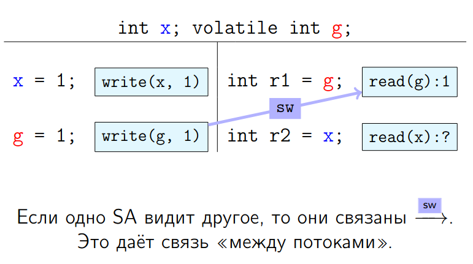
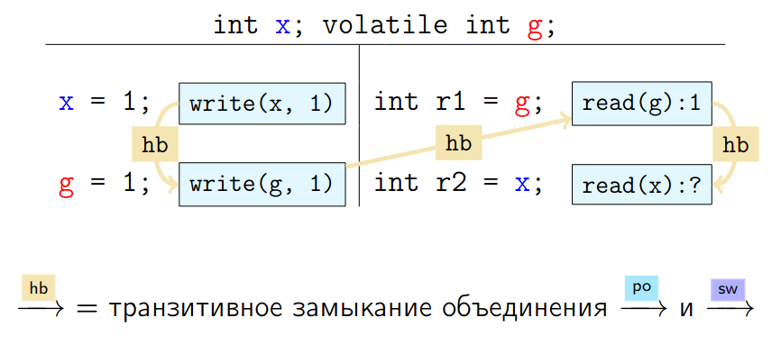

<style>
img[alt~="center"] {
  display: block;
  margin: 0 auto;
}

section.split h1 {
    grid-area: slideheading;
    height: 0;
}

section.split h3:nth-of-type(1) {
    grid-area: leftheader;
}

section.split h3:nth-of-type(2) {
    grid-area: rightheader;
}

section.split {
    overflow: visible;
    display: grid;
    grid-template-columns: 50% 50%;
    grid-template-areas: 
        "slideheading slideheading"
        "leftheader rightheader"
        "lefttext righttext"
}

section.flexrow {
display:flex;
flex-flow: row wrap;
}

section.flexrow h1 {
    flex: 0 1 100%;
}
</style>


# Проектирование мобильных приложений
<!-- _paginate: false -->
<!-- _footer: "Creative Commons Attribution-ShareAlike 3.0" -->

---

# Потоки и Android UI Toolkit (1)

UI toolkit
- `android.widget.*`, `android.view.*`
- НЕ thread-safe (все взаимодействия с UI только из UI Thread)
- Все callback происходят в UI Thread

---

# ANR and `CalledFromWrongThreadException`
Do not block the UI thread
- "application not responding" (ANR) dialog


---

# ANR and `CalledFromWrongThreadException`
Do not block the UI thread
- "application not responding" (ANR) dialog

Do not access the Android UI toolkit from outside the UI thread
- `CalledFromWrongThreadException`


https://stackoverflow.com/questions/11062818/app-crashing-with-called-from-wrong-thread-exception

---

# Процессы и Потоки

По умолчанию все компоненты одного приложения работают в одном процессе
- М.б. изменено с помощью AndroidManifest.xml: `android:process`

По умолчанию все компоненты одного приложения работают в одном потоке 
- UI-Thread = Main-Thread
- М.б. изменено с помощью Worker Threads/Coroutines

---

# Поведение Многопоточных Программ (Java)
## Java Memory Model (JMM)

Отвечает на один вопрос:
> Какие значения может прочитать конкретный read в программе.

JMM — это компромисс между сложностью языка, сложностью его реализации и ограничениями железа.

https://shipilev.net/#jmm

<!-- _footer: https://docs.oracle.com/javase/specs/jls/se8/html/jls-17.html#jls-17.4 -->

---

# В последовательных программах

> Чтения, следующие за записями в программе, должны видеть ранее записанные значения

(C99: ISO/IEC 9899:1999, «5.1.2.3 Program execution»)

<!-- _footer: https://shipilev.net/#jmm -->

---

# В многопоточных программах

Мечта: SC-DRF

```
                          _________________
                          opA();  |   opD();
                          opB();  |   opE();
                          opC();  |   opF();
```

Удобно думать, что операции исполняются по порядку, иногда переключаясь на другой поток.

<!-- _footer: https://shipilev.net/#jmm -->

---

# Sequential Consistency (SC)

Компиляторы вынуждены переставлять инструкции в целях оптимизации.
SC слишком сильная модель (устанавливает отношения между всеми операциями), запрещающая множество оптимизаций. Например,

```
           int a = 0, b = 0;           int a = 0, b = 0;
          -------------------         -------------------
           r1 = a;               =>    r2 = b;
           r2 = b;                     r1 = a;
```

<!-- _footer: https://shipilev.net/#jmm -->

---

# Sequential Consistency (SC)

Компиляторы и процессоры вынуждены переставляют инструкции в целях оптимизации (большую часть времени процессор не считает, а ожидает память).
SC слишком сильное требование, запрещающее множество оптимизаций. Например,

```
           int a = 0, b = 0;           int a = 0, b = 0;
          --------------------        -------------------
           r1 = a;  |  b = 2;    =>    r2 = b;  |
           r2 = b;  |  a = 1;                   | b = 2;
                                                | a = 1;
                                       r1 = a;  |
```
- В исходной программе при SC обязательно либо `r2 = b`,
либо `a = 1` должно быть последним, а значит, (r1, r2)
либо `(*, 2)`, либо `(0, *)`.
- Новая программа приводит к `(r1, r2) = (1, 0)`

<!-- _footer: https://shipilev.net/#jmm -->

---

# JMM Пример

```
                          int x; volatile int g;
                         ------------------------
                          x = 1;  |  int r1 = g;
                          g = 1;  |  int r2 = x;
```

Какие результаты исполнения допустимы?

---

# JMM: формализмы
JMM — слабая модель, устанавливающая связи между некоторыми операциями
- Program Order — связывает действия внутри одного потока.
- Synchronization Actions (SA)
  - volatile read, volatile write
  - lock monitor, unlock monitor
  - (синтетические) первое и последнее действие в потоке
  - действия, запускающие поток
  - действия, обнаруживающие останов потока (`Thread.join()`, `Thread.isInterrupted()` и т.п.)

<!-- _footer: https://shipilev.net/#jmm -->

---

# JMM: формализмы
JMM — слабая модель, устанавливающая связи между некоторыми операциями
- Program Order — связывает действия внутри одного потока.
- Synchronization Actions образуют Synchronization Order (SO)
  - Каждый поток видит SA в одном и том же порядке
  - Порядок действий в SO совместен с PO
  - SO удовлетворяет требованию Sequential Consistency

<!-- _footer: https://shipilev.net/#jmm -->

---

# JMM: формализмы
JMM — слабая модель, устанавливающая связи между некоторыми операциями
- Program Order — связывает действия внутри одного потока.
- Synchronization Actions образуют Synchronization Order (SO)
- Synchronizes-With Order (SW)
  - Подпорядок SO, ограниченный конкретными reads/writes, locks/unlocks, etc.



<!-- _footer: https://shipilev.net/#jmm -->

---

# JMM: формализмы
JMM — слабая модель, устанавливающая связи между некоторыми операциями
- Program Order — связывает действия внутри одного потока.
- Synchronization Actions образуют Synchronization Order (SO)
- Synchronizes-With Order (SW)
- Happens-before (HB)



<!-- _footer: https://shipilev.net/#jmm -->

---

# JMM Пример

```
                          int x; volatile int g;
                         ------------------------
                          x = 1;  |  int r1 = g;
                          g = 1;  |  int r2 = x;
```

Какие результаты исполнения допустимы?

`(r1, r2) = {(0, 0), (0, 1)}` — можем увидеть `x=0`, `x=1` через гонку
`(r1, r2) = (1, 1)` — обязаны увидеть `x=1`, если увидели `g=1` через SW
`(r1, r2) = (1, 0)` в JMM получиться не может

<!-- _footer: https://shipilev.net/#jmm -->

---

# SC-DRF (SequentialConsistency-DataRaceFree)

> Correctly synchronized programs have sequentially consistent semantics

Перевод: В программе нет гонок ⇒ все чтения видят упорядоченные записи ⇒ результат исполнения программы можно объяснить каким-нибудь SC-исполнением

<!-- _footer: https://shipilev.net/#jmm -->

---


Больше объяснений с шутками и прибаутками в 2х часовом видео от Алексея Шипилёва

https://shipilev.net/#jmm

---

# Running Android tasks in background threads 

https://developer.android.com/guide/background/threading

---

# Background Threads

3 группы API:
- Threads — базовый API
- ExecutorService — более удобный и безопасный API, рекомендованный для Java
- Kotlin Coroutines — kotlin language feature, более удобный и безопасный API, рекомендованный для Kotlin. В JVM реализации так или иначе все равно использует Threads API.
- Deprecated ~~`AsyncTask`~~. Существующий код должен быть переписан с использованием `ExecutorService`

---

# Чем именно плох `Thread`?

- Очень легко потерять ссылку на `Thread`
- Создание нового `Thread` — тяжеловесная операция, т.к. требуется создавать ОС `Thread`
- Легко потерять контроль над количеством тредов
  - 4 vCPU x 1000 Thread = медленное исполнение

Пункты 1 и 3 легко наблюдать в приложении из ЛР №2 (Continue Watch)

---

# DEMO

Пронаблюдаем пункты 1 и 3 в приложении из ЛР №2 (Continue Watch) с помощью Sampling Java Profiler

---

# Операции с `Thread`

- Запуск: `Thread.start()`
- Остановка:
  - ~~`Thread.stop`~~ — приносит на практике много ошибок, т.к. сложно предсказать конечное состояние объектов, изменяемых в Thread Runnable.
  - `Thread.interrupt` — миф, который часто оказывается правдой. Убедимся в этом.
  - `isWorking`, `isInterrupted` — т.е. тред должен сам себя остановить.
- Передача результатов вычисления — `callback`, "callforward" (вызвать метод, который должен что-то сделать с результатами) 

---

# Способы Доступа к UI Thread из Background

- `Activity.runOnUiThread(Runnable)`
- `View.post(Runnable)`
- `View.postDelayed(Runnable, long)`

---

# ExecutorService

Удобно рассматривать как комбинацию: `ThreadPool`, `TaskQueue`, стратегия управления `ThreadPool`, стратегия распределения `Task` по `Threads`

- Обычно в программе мало экземпляров `ExecutorService`, каждый из которых бережно хранится (где? — в классе `Application`).
- Легко контролировать общее количество тредов
- Все остальное — так же сложно, как и в `Thread` API

---

# Операции с `ExecutorService`

- Запуск: `ExecutorService.submit()`
- Остановка:
  - каждая задача должна сама следить за необходимостью продолжения работы
  - `ExecutorService` в административно-принудительном порядке может завершить все потоки и/или очистить очередь
- Передача результатов вычисления — `callback`, "callforward" (так же, как у `Threads`)

---

```java
public class MyApplication extends Application {
    /*
     * Gets the number of available cores
     * (not always the same as the maximum number of cores)
     */
    private static int NUMBER_OF_CORES = Runtime.getRuntime().availableProcessors();

    // Instantiates the queue of Runnables as a LinkedBlockingQueue
    private final BlockingQueue<Runnable> workQueue = new LinkedBlockingQueue<Runnable>();

    private static final int KEEP_ALIVE_TIME = 1;
    private static final TimeUnit KEEP_ALIVE_TIME_UNIT = TimeUnit.SECONDS;

    ThreadPoolExecutor threadPoolExecutor = new ThreadPoolExecutor(
            NUMBER_OF_CORES,       // Initial pool size
            NUMBER_OF_CORES,       // Max pool size
            KEEP_ALIVE_TIME,
            KEEP_ALIVE_TIME_UNIT,
            workQueue
    );
    ...
}
```

<!-- _footer: https://developer.android.com/guide/background/threading#configuring-a-thread-pool -->

---

# Kotlin Coroutines
https://github.com/Kotlin/KEEP/blob/master/proposals/coroutines.md
https://developer.android.com/kotlin/coroutines

---

[Structured concurrency](https://medium.com/@elizarov/structured-concurrency-722d765aa952) (Roman Elizarov)
> You rarely launch coroutines “globally”, like you do with threads. Coroutines are always related to some local scope in your application, which is an entity with a limited life-time, like a UI element.

---

# Основные Концепции

A **coroutine** — is an instance of suspendable computation.

A **suspending function** — a function that is marked with suspend modifier.

A **suspending lambda** — a block of code that have to run in a coroutine.

A **coroutine builder** — a function that takes some *suspending lambda* as an argument, creates a *coroutine*, and, optionally, gives access to its result in some form.

<!-- _footer: https://github.com/Kotlin/KEEP/blob/master/proposals/coroutines.md#terminology -->

---

# Основные Концепции (продолжение)

A **suspension point** — is a point during coroutine execution where the execution of the *coroutine* may be suspended. Syntactically, a suspension point is an invocation of *suspending function*

A **continuation** — is a state of the suspended *coroutine* at *suspension point*. It conceptually represents the rest of its execution after the *suspension point*. For example:

```kotlin
sequence {
    for (i in 1..10) yield(i * i)
    println("over")
}
```

---

# Continuation
```kotlin
sequence {
    for (i in 1..10) yield(i * i)
    println("over")
}
```

Here, every time the coroutine is suspended at a call to suspending function `yield()`, the rest of its execution is represented as a continuation, so we have **10 continuations**: first runs the loop with i = 2 and suspends, second runs the loop with i = 3 and suspends, etc, the last one prints "over" and completes the coroutine.

The coroutine that is created, but is not started yet, is represented by its initial continuation of type Continuation<Unit> that consists of its whole execution.

---

# Dispatchers

**Dispatchers.Main** — Use this dispatcher to run a coroutine on the main Android thread. 

**Dispatchers.IO** — This dispatcher is optimized to perform disk or network I/O outside of the main thread.

**Dispatchers.Default** — This dispatcher is optimized to perform CPU-intensive work outside of the main thread.

<!-- _footer: https://developer.android.com/kotlin/coroutines#main-safety  -->

---

# Создание coroutine (coroutine builder)

`launch` starts a new coroutine and doesn't return the result to the caller. Any work that is considered "fire and forget" can be started using launch.

`async` starts a new coroutine and allows you to return a result with a suspend function called await.

`runBlocking` - mostly for tests

<!-- https://developer.android.com/kotlin/coroutines-adv#start -->

---

# Создание coroutine. CoroutineScope.

```kotlin
private val coroutineJob = Job()
private val uiScope = CoroutineScope(Dispatchers.Main + coroutineJob)

uiScope.launch {
    ...
}
...
uiScope.cancel()
```

<!-- _footer: https://codelabs.developers.google.com/codelabs/kotlin-coroutines -->

---
# Готовые для использования coroutine scopes:

- [ViewModelScope](https://developer.android.com/topic/libraries/architecture/coroutines#viewmodelscope)

- [LifecycleScope](https://developer.android.com/topic/libraries/architecture/coroutines#lifecyclescope)
  - Suspend Lifecycle-aware coroutines:
```kotlin
lifecycleScope.launch { whenStarted { ... } }
```

https://developer.android.com/topic/libraries/architecture/coroutines

---

> So, with structured concurrency we now require that launch is invoked in a CoroutineScope, which is an interface implemented by your life-time limited objects (like UI elements or their corresponding view models). 

---

# Переключение Контекстов (потоков)

```kotlin
suspend fun fetchDocs() {                    // Dispatchers.Main
  val result = get("developer.android.com")  // Dispatchers.Main
  show(result)                               // Dispatchers.Main
}

suspend fun get(url: String) =               // Dispatchers.Main
  withContext(Dispatchers.IO) {              // Dispatchers.IO (main-safety block)
    /* perform network IO here */            // Dispatchers.IO (main-safety block)
  }                                          // Dispatchers.Main
} 
```

---

# Основные сценарии при Android разработке
- Manage long-running tasks that might otherwise block the main thread and cause your app to freeze.
- Providing main-safety, or safely calling network or disk operations from the main thread.

<!-- _footer: https://developer.android.com/kotlin/coroutines -->

---

# Structured Concurrency

Об отмене целых деревьев задач и распространении ошибок (вверх и вниз по дереву подзадач)


<!-- _footer: https://www.youtube.com/watch?v=Mj5P47F6nJg -->

---

# Structured Programming


\


<!-- _footer: https://vorpus.org/blog/notes-on-structured-concurrency-or-go-statement-considered-harmful -->

---

# Structured Concurrency


<!-- _footer: https://vorpus.org/blog/notes-on-structured-concurrency-or-go-statement-considered-harmful -->

---

# Structured Concurrency Example

```kotlin
runBlocking {
  val jobs: List<Job> = (1..2).map { parentNumber ->
    // This coroutine is joined on inside [runBlocking] to allow the last [println]
    launch(context = Dispatchers.Default) {
      // The [coroutineScope] block cannot be left until the 2 corountines launched inside have finished
      coroutineScope {
        println("[${Thread.currentThread().name}] Launched parent: $parentNumber")
        (1..2).map { childNumber ->
          launch {
            println("[${Thread.currentThread().name}] Launched child: $parentNumber - $childNumber")
            delay(100)
            println("[${Thread.currentThread().name}] Finished child: $parentNumber - $childNumber")
          }
        }
      }
      println("[${Thread.currentThread().name}] Finished parent: $parentNumber")
    }
  }
  println("[${Thread.currentThread().name}] Created all coroutines")
  jobs.joinAll()
  println("[${Thread.currentThread().name}] Finished all coroutines")
}
```

<!-- _footer: https://dzone.com/articles/waiting-for-coroutines -->
