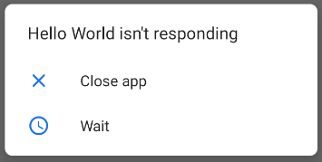
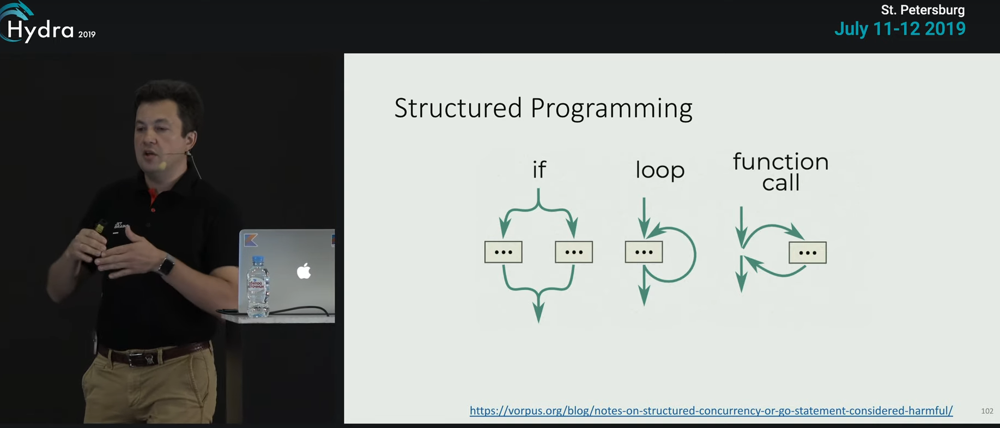
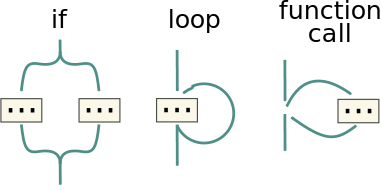
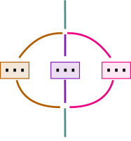

<style>
img[alt~="center"] {
  display: block;
  margin: 0 auto;
}

section.split h1 {
    grid-area: slideheading;
    height: 0;
}

section.split h3:nth-of-type(1) {
    grid-area: leftheader;
}

section.split h3:nth-of-type(2) {
    grid-area: rightheader;
}

section.split {
    overflow: visible;
    display: grid;
    grid-template-columns: 50% 50%;
    grid-template-areas: 
        "slideheading slideheading"
        "leftheader rightheader"
        "lefttext righttext"
}

section.flexrow {
display:flex;
flex-flow: row wrap;
}

section.flexrow h1 {
    flex: 0 1 100%;
}
</style>


# Проектирование мобильных приложений
<!-- _paginate: false -->
<!-- _footer: "Creative Commons Attribution-ShareAlike 3.0" -->

---

# DEMO
Калькулятор

https://stackoverflow.com/questions/11062818/app-crashing-with-called-from-wrong-thread-exception

---

# Потоки и Android UI Toolkit (1)

UI toolkit
- android.widget.*, android.view.*
- НЕ thread-safe (все взаимодействия с UI только из UI Thread)
- Все callback происходят в UI Thread

---

# ANR and `CalledFromWrongThreadException`
Do not block the UI thread
- "application not responding" (ANR) dialog


---

# ANR and `CalledFromWrongThreadException`
Do not block the UI thread
- "application not responding" (ANR) dialog

Do not access the Android UI toolkit from outside the UI thread
- `CalledFromWrongThreadException`


---

# Процессы и Потоки

По умолчанию все компоненты одного приложения работают в одном процессе
- М.б. изменено с помощью AndroidManifest.xml: `android:process`

По умолчанию все компоненты одного приложения работают в одном потоке 
- UI-Thread = Main-Thread
- М.б. изменено с помощью Worker Threads/Coroutines

---

# Способы Доступа к UI Thread из Background

- `Activity.runOnUiThread(Runnable)`
- `View.post(Runnable)`
- `View.postDelayed(Runnable, long)`

---

# AsyncTask (deprecated)

```java
private class MyTask extends AsyncTask<Params, Progress, Result> {
    ... 
}
```

`Params` — parameters sent to the task upon execution.
`Progress` — progress units published during the background computation.
`Result` — result of the background computation.

<!-- _footer: http://developer.android.com/reference/android/os/AsyncTask.html -->

---

# AsyncTask: 4 Шага исполнения
1. `void onPreExecute()` — invoked on the UI thread
1. `Result doInBackground(Params...)` — invoked on the background
    - `void publishProgress(Progress...)`
1. `void onProgressUpdate(Progress...)` — invoked on the UI thread
1. `void onPostExecute(Result)` — invoked on the UI thread

---

# Некоторые полезные методы AsyncTask

`final AsyncTask<Params, Progress, Result> execute(Params... params)`
`final boolean cancel (boolean mayInterruptIfRunning)`
`final Result get (long timeout, TimeUnit unit)`
`final Result get ()`
`final AsyncTask.Status getStatus ()`

---

# Общие правила использования AsyncTask
- Экземпляр объекта должен быть создан в UI потоке.
- `execute(Params...)` должен быть вызван в UI потоке.
- Не вызывать вручную `onPreExecute()`, `onPostExecute(Result)`, `doInBackground(Params...)`, `onProgressUpdate(Progress...)`.
- AsyncTask может быть запущен только один раз (при повторном использовании возникнет исключение)

---

# ExecutorService
- Keep instance
- Callbacks

---

# Kotlin Coroutines
https://github.com/Kotlin/KEEP/blob/master/proposals/coroutines.md
https://developer.android.com/kotlin/coroutines

---

[Structured concurrency](https://medium.com/@elizarov/structured-concurrency-722d765aa952) (Roman Elizarov)
> You rarely launch coroutines “globally”, like you do with threads. Coroutines are always related to some local scope in your application, which is an entity with a limited life-time, like a UI element.

---

# Основные Концепции

A **coroutine** — is an instance of suspendable computation.

A **suspending function** — a function that is marked with suspend modifier.

A **suspending lambda** — a block of code that have to run in a coroutine.

A **coroutine builder** — a function that takes some *suspending lambda* as an argument, creates a *coroutine*, and, optionally, gives access to its result in some form.

<!-- _footer: https://github.com/Kotlin/KEEP/blob/master/proposals/coroutines.md#terminology -->

---

# Основные Концепции (продолжение)

A **suspension point** — is a point during coroutine execution where the execution of the *coroutine* may be suspended. Syntactically, a suspension point is an invocation of *suspending function*

A **continuation** — is a state of the suspended *coroutine* at *suspension point*. It conceptually represents the rest of its execution after the *suspension point*. For example:

```kotlin
sequence {
    for (i in 1..10) yield(i * i)
    println("over")
}
```

---

# Continuation
```kotlin
sequence {
    for (i in 1..10) yield(i * i)
    println("over")
}
```

Here, every time the coroutine is suspended at a call to suspending function `yield()`, the rest of its execution is represented as a continuation, so we have **10 continuations**: first runs the loop with i = 2 and suspends, second runs the loop with i = 3 and suspends, etc, the last one prints "over" and completes the coroutine.

The coroutine that is created, but is not started yet, is represented by its initial continuation of type Continuation<Unit> that consists of its whole execution.

---

# Dispatchers

**Dispatchers.Main** — Use this dispatcher to run a coroutine on the main Android thread. 

**Dispatchers.IO** — This dispatcher is optimized to perform disk or network I/O outside of the main thread.

**Dispatchers.Default** — This dispatcher is optimized to perform CPU-intensive work outside of the main thread.

<!-- _footer: https://developer.android.com/kotlin/coroutines#main-safety  -->

---

# Создание coroutine (coroutine builder)

`launch` starts a new coroutine and doesn't return the result to the caller. Any work that is considered "fire and forget" can be started using launch.

`async` starts a new coroutine and allows you to return a result with a suspend function called await.

`runBlocking` - mostly for tests

<!-- https://developer.android.com/kotlin/coroutines-adv#start -->

---

# Создание coroutine. CoroutineScope.

```kotlin
private val coroutineJob = Job()
private val uiScope = CoroutineScope(Dispatchers.Main + coroutineJob)

uiScope.launch {
    ...
}
...
uiScope.cancel()
```

<!-- _footer: https://codelabs.developers.google.com/codelabs/kotlin-coroutines -->

---
# Готовые для использования coroutine scopes:

- [ViewModelScope](https://developer.android.com/topic/libraries/architecture/coroutines#viewmodelscope)

- [LifecycleScope](https://developer.android.com/topic/libraries/architecture/coroutines#lifecyclescope)
  - Suspend Lifecycle-aware coroutines:
```kotlin
lifecycleScope.launch { whenStarted { ... } }
```

https://developer.android.com/topic/libraries/architecture/coroutines

---

> So, with structured concurrency we now require that launch is invoked in a CoroutineScope, which is an interface implemented by your life-time limited objects (like UI elements or their corresponding view models). 

---

# Переключение Контекстов (потоков)

```kotlin
suspend fun fetchDocs() {                    // Dispatchers.Main
  val result = get("developer.android.com")  // Dispatchers.Main
  show(result)                               // Dispatchers.Main
}

suspend fun get(url: String) =               // Dispatchers.Main
  withContext(Dispatchers.IO) {              // Dispatchers.IO (main-safety block)
    /* perform network IO here */            // Dispatchers.IO (main-safety block)
  }                                          // Dispatchers.Main
} 
```

---

# Основные сценарии при Android разработке
- Manage long-running tasks that might otherwise block the main thread and cause your app to freeze.
- Providing main-safety, or safely calling network or disk operations from the main thread.

<!-- _footer: https://developer.android.com/kotlin/coroutines -->

---

# Structured Concurrency

Об отмене целых деревьев задач и распространении ошибок (вверх и вниз по дереву подзадач)


<!-- _footer: https://www.youtube.com/watch?v=Mj5P47F6nJg -->

---

# Structured Programming


\


<!-- _footer: https://vorpus.org/blog/notes-on-structured-concurrency-or-go-statement-considered-harmful -->

---

# Structured Concurrency



<!-- _footer: https://vorpus.org/blog/notes-on-structured-concurrency-or-go-statement-considered-harmful -->

---

# Structured Concurrency Example

```kotlin
runBlocking {
  val jobs: List<Job> = (1..2).map { parentNumber ->
    // This coroutine is joined on inside [runBlocking] to allow the last [println]
    launch(context = Dispatchers.Default) {
      // The [coroutineScope] block cannot be left until the 2 corountines launched inside have finished
      coroutineScope {
        println("[${Thread.currentThread().name}] Launched parent: $parentNumber")
        (1..2).map { childNumber ->
          launch {
            println("[${Thread.currentThread().name}] Launched child: $parentNumber - $childNumber")
            delay(100)
            println("[${Thread.currentThread().name}] Finished child: $parentNumber - $childNumber")
          }
        }
      }
      println("[${Thread.currentThread().name}] Finished parent: $parentNumber")
    }
  }
  println("[${Thread.currentThread().name}] Created all coroutines")
  jobs.joinAll()
  println("[${Thread.currentThread().name}] Finished all coroutines")
}
```

<!-- _footer: https://dzone.com/articles/waiting-for-coroutines -->
