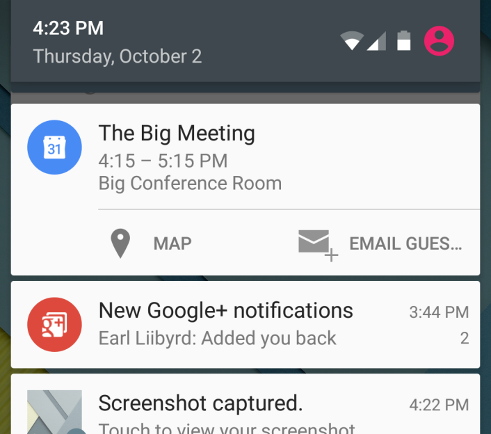
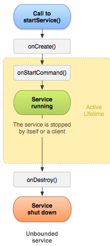
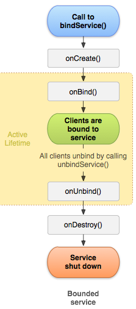

<style>
img[alt~="center"] {
  display: block;
  margin: 0 auto;
}

section.split h1 {
    grid-area: slideheading;
    height: 0;
}

section.split h3:nth-of-type(1) {
    grid-area: leftheader;
}

section.split h3:nth-of-type(2) {
    grid-area: rightheader;
}

section.split {
    overflow: visible;
    display: grid;
    grid-template-columns: 50% 50%;
    grid-template-areas: 
        "slideheading slideheading"
        "leftheader rightheader"
        "lefttext righttext"
}

section.flexrow {
display:flex;
flex-flow: row wrap;
}

section.flexrow h1 {
    flex: 0 1 100%;
}
</style>


# Проектирование мобильных приложений
<!-- _paginate: false -->
<!-- _footer: "Creative Commons Attribution-ShareAlike 3.0" -->

---

# DEMO
## LifecycleScope vs CoroutineScope(Dispatchers.MAIN)

---

# Оно работает (–нет)

Созданные из Activity потоки нельзя использовать для выполнения background операций, когда Activity не отображается пользователю.

<!-- _footer: https://developer.android.com/guide/components/services.html#Choosing-service-thread -->

---

# Жизненный Цикл Процесса

Android создает 1 процесс с 1 потоком при первом запуске любого из компонентов приложения

Android выстраивает "importance hierarchy" процессов

В случае нехватки ресурсов (памяти) Android убивает наименее важные процессы

<!-- _footer: https://developer.android.com/guide/components/activities/process-lifecycle -->

---

# Типы Процессов (importance hierarchy)

1. **Foreground process** – A process that is required for what the user is currently doing.
1. **Visible process** – A process that doesn't have any foreground components, but still can affect what the user sees on screen.
1. **Service process** – A service process is one holding a Service that has been started with the startService() method.
1. **Cached process** – Not currently needed, so the system is free to kill it as desired

---

# Типы Процессов: Foreground

Foreground process – A process that is required for what the user is currently doing.
- It hosts an Activity that the user is interacting with (the Activity's `onResume()` method has been called).
- It hosts a Service that's bound to the activity that the user is interacting with.
- It hosts a Service that's running "in the foreground" — the service has called `startForeground()`.
- It hosts a Service that's executing one of its lifecycle callbacks (`onCreate()`, `onStart()`, or `onDestroy()`).
- It hosts a BroadcastReceiver that's executing its `onReceive()` method.

<!-- _footer: https://developer.android.com/guide/components/activities/process-lifecycle -->

---

# Типы Процессов: Visible

Visible process – A process that doesn't have any foreground components, but still can affect what the user sees on screen. A process is considered to be visible if either of the following conditions are true:
- It hosts an Activity that is not in the foreground, but is still visible to the user (its `onPause()` method has been called). This might occur, for example, if the foreground activity started a dialog, which allows the previous activity to be seen behind it.
- It hosts a Service that's bound to a visible (or foreground) activity.

<!-- _footer: https://developer.android.com/guide/components/activities/process-lifecycle -->

---

# Типы Процессов: Service

A service process is one holding a Service that has been started with the startService() method. Though these processes are not directly visible to the user, they are generally doing things that the user cares about (such as background network data upload or download), so the system will always keep such processes running unless there is not enough memory to retain all foreground and visible processes.

Services that have been running for a long time (such as 30 minutes or more) may be demoted in importance to allow their process to drop to the cached list described next. This helps avoid situations where long running services that use excessive resources (for example, by leaking memory) prevent the system from delivering a good user experience.

<!-- _footer: https://developer.android.com/guide/components/activities/process-lifecycle -->

---

# Типы Процессов: Cached

A cached process is one that is not currently needed, so the system is free to kill it as desired when resources like memory are needed elsewhere. In a normally behaving system, these are the only processes involved in resource management: a well running system will have multiple cached processes always available (for more efficient switching between applications) and regularly kill the oldest ones as needed. Only in very critical (and undesireable) situations will the system get to a point where all cached processes are killed and it must start killing service processes.

These processes often hold one or more Activity instances that are not currently visible to the user (the onStop() method has been called and returned).

<!-- _footer: https://developer.android.com/guide/components/activities/process-lifecycle -->

---

# Вопрос

**Почему** созданные из Activity потоки нельзя использовать для выполнения background операций, когда Activity не отображается пользователю?

* Foreground process
* Visible process
* Service process
* Cached process

---

# Services
http://developer.android.com/guide/components/services.html 

---

# Что такое Service

Services – компонент приложения, который может выполнять длительные операции в фоновом режиме и **не предоставляет пользовательского интерфейса**.
- Сервис – не отдельное приложение!
- Сервис – не background поток!

---

# Типы Сервисов

<style scoped>
section img {position: absolute; right:10px; top: 10px;}
</style>



**Started**
- Non-IPC, не возвращает значения
- Сервис должен сам себя остановить
- Может быть:
  - Foreground (пользователь "знает"). Обязан иметь [Notification](https://developer.android.com/guide/topics/ui/notifiers/notifications).
  - Background (пользователь "не знает")

**Bound**
- RPC, предоставляет интерфейс для взаимодействия
- Будет остановлен, когда больше нет клиентов

<!-- _footer: https://developer.android.com/guide/components/services.html#Types-of-services -->

---

# Базовый класс: android.app.Service

```log
java.lang.Object
   ↳android.content.Context
      ↳android.content.ContextWrapper
         ↳android.app.Service
```

Базовый класс для любого сервиса

Необходимо создать поток для обработки задач (иначе код будет исполненяться в UI потоке)

---

# Объявление в AndroidManifest.xml

```xml
<manifest ... >
  ...
  <application ... >
      <service android:name=".ExampleService" />
      ...
  </application>
</manifest> 
```

---

# Service. Жизненный Цикл

<!-- _class: flexrow -->

<style scoped>
section ul {
    flex: 1 0;
}

</style>

- `onCreate` – Вызывается сразу после создания сервиса
- `onDestroy` – Вызывается непосредственно перед удалением сервиса


<!-- _footer: https://developer.android.com/guide/components/services#Basics -->

---

# Started (aka unbound) Service
`onBind() -> null`

---

# Started Service. Запуск Сервиса.

```java
Intent intent = new Intent(this, HelloService.class);
startService(intent);
```
(Например, из Activity)

---

<style scoped>
section {
  display:flex;
  flex-flow: column wrap;
}
section h1  {width:850px;}
section pre {width:850px;}
section ul  {width:850px;}
</style>

# Started Service. Запуск Сервиса.

```java
Intent intent = new Intent(this, HelloService.class);
startService(intent);
```

- Метод `startService()` возвращает управление сразу 
- Android вызывает метод сервиса `onStartCommand()`
  - Если сервис еще не создан, сначала вызывается метод `onCreate()`
- Сервис должен кто-то остановить:
  - обычно – сам себя: `stopSelf`
  - иногда – снаружи: `stopService`



<!-- _footer: https://developer.android.com/guide/components/services#Basics -->

---

# Started Service. Пример
```java
public class HelloService extends Service {

  @Override
  public void onCreate() {
      ...
  }

  @Override
  public int onStartCommand(Intent intent, int flags, int startId) {
      ...
      return START_STICKY;
  }
  
  @Override
  public void onDestroy() {...}
} 
```

`onStartCommand`, как и все остальные callbacks, вызываются в UI потоке

---

# `onStartCommand`: Возвращаемое Значение
```java
public int onStartCommand(Intent intent, int flags, int startId)
```

Как должна вести себя ОС в случае неожиданной остановки сервиса
Например, если сервис бросил uncaught exception

`START_NOT_STICKY`
- do not recreate the service

`START_STICKY `
- recreate the service but do not redeliver the last intent (deliver `null`, if no more undelivered intents)

`START_REDELIVER_INTENT `
- recreate the service and redeliver last intent

<!-- _footer: https://developer.android.com/reference/android/app/Service#onStartCommand(android.content.Intent,%20int,%20int) -->

---

# `onStartCommand`: Параметры
```java
public int onStartCommand(Intent intent, int flags, int startId)
```

`intent` – intent, который передали в `startService`

`flags` – битовое поле `{START_FLAG_REDELIVERY, START_FLAG_RETRY}`

`startId` – уникальный идентификатор запроса. 
  - Используется совместно с `void stopSelf(int)` и \
  `boolean stopSelfResult(int)`

<!-- _footer: https://developer.android.com/reference/android/app/Service#onStartCommand(android.content.Intent,%20int,%20int) -->

---

# Started Service. Остановка Сервиса.

"Изнутри"
- `public final void stopSelf ()`
- `public final void stopSelf (int startId)`
  - Не полностью защищает от преждевременной остановки сервиса
- `public final boolean stopSelfResult (int startId)`
  - Не полностью защищает от преждевременной остановки сервиса

"Снаружи"
- `public abstract boolean stopService (Intent service)`

Android не останавливает и не удаляет сервисы, пока хватает ресурсов

Сервис продолжает работать после завершения метода `onStartCommand()`

---

# Однопоточный Intent Сервис


```pre
...  
   ↳android.app.Service
      ↳android.app.IntentService 
       (Deprecated in API level 30 (Android 11) > `JobIntentService`)
```

```pre
...  
   ↳android.app.Service
      ↳androidx.core.app.JobIntentService
```

Все запросы обрабатываются в одном background потоке по очереди

Нужно перегрузить только метод `onHandleIntent()`

Можно перегрузить `onBind(Intent intent)`

---

```java
public class HelloIntentService extends IntentService {

  public HelloIntentService() {
      super("HelloIntentService");
  }

  /**
   * The IntentService calls this method from the default worker thread with
   * the intent that started the service. When this method returns, IntentService
   * stops the service, as appropriate.
   */
  @Override
  protected void onHandleIntent(Intent intent) {
      // Normally we would do some work here, like download a file.
      // For our sample, we just sleep for 5 seconds.
      long endTime = System.currentTimeMillis() + 5*1000;
      while (System.currentTimeMillis() < endTime) {
          synchronized (this) {
              try {
                  wait(endTime - System.currentTimeMillis());
              } catch (Exception e) {}
          }
      }
  }
} 
```

---

# Foreground Сервисы

Сервис сам себя заявляет foreground
- `startForeground`, `stopForeground`
```xml
<uses-permission android:name="android.permission.FOREGROUND_SERVICE"/>
```

Пользователь знает о сервисе (например, плеер, fitness app)

Увеличивает приоритет процесса

Имеет [Status Bar Notification](https://developer.android.com/guide/topics/ui/notifiers/notifications)

---

# Foreground Service Type (API 29+)

Design time:
```xml
<manifest>
    ...
    <service ... android:foregroundServiceType="location|camera|microphone" />
</manifest>
```

Runtime:
```kotlin
val notification: Notification = ...;
Service.startForeground(notification,
        FOREGROUND_SERVICE_TYPE_LOCATION or FOREGROUND_SERVICE_TYPE_CAMERA)

```

<!-- _footer: https://developer.android.com/guide/components/foreground-services#types -->

---

# Bound Service

---

# Bound Service. Запуск Сервиса.

```java
/** Defines callbacks for service binding, passed to bindService() */
private ServiceConnection mConnection = new ServiceConnection() {
    @Override
    public void onServiceConnected(ComponentName className,
            IBinder service) {
        // ...
    }

    @Override
    public void onServiceDisconnected(ComponentName arg0) {
        // ...
    }
}; 

// ...

Intent intent = new Intent(this, MyService.class);
bindService(intent, mConnection, Context.BIND_AUTO_CREATE);
```
(Например, из Activity)

---

# Подключение к Bound Сервису. Context::bindService

```java
public abstract boolean bindService (Intent service, ServiceConnection conn, int flags)
```

Вернёт `false` if the system couldn't find the service or if your client doesn't have permission to bind to it. 

`service` – сервис к которому подключаться
`conn` – объект обратного вызова для получения состояния о подключении
`flags` – опции привязки: `{ 0, BIND_AUTO_CREATE,  ...}`
- `BIND_AUTO_CREATE` – автоматически создать сервис, если нужно

---

<style scoped>
section {
  display:flex;
  flex-flow: column wrap;
}
section h1  {width:850px;}
section pre {width:850px;}
section ul  {width:850px;}
</style>

# Bound Service. Запуск Сервиса.

```java
bindService(intent, mConnection, Context.BIND_AUTO_CREATE);
```

- Метод `bindService()` возвращает управление сразу 
- Создается сервис, если еще не создан
  - Вызывается метод сервиса `onCreate()`
- **Только для первого клиента** вызывается метод сервиса `onBind()`
  - Всем клиентам возвращается копия единственного объекта `IBinder` через метод клиента `onServiceConnected()`



<!-- _footer: https://developer.android.com/guide/components/services#Basics -->

---

# Отключение от Bound Сервиса
```java
/** Defines callbacks for service binding, passed to bindService() */
private ServiceConnection mConnection = new ServiceConnection() {
    @Override
    public void onServiceConnected(ComponentName className,
            IBinder service) {
        // ...
    }

    @Override
    public void onServiceDisconnected(ComponentName arg0) {
        // ...
    }
}; 

// ...

unbindService(mConnection);
```

---

<style scoped>
section {
  display:flex;
  flex-flow: column wrap;
}
section h1  {width:850px;}
section pre {width:850px;}
section ul  {width:850px;}
</style>

# Bound Service. Запуск Сервиса.

```java
bindService(intent, mConnection, Context.BIND_AUTO_CREATE);
```

- Метод `unbindService()` возвращает управление сразу 
- Клиент информируется об отключении через метод `onServiceDisconnected()`
- После отключения **последнего** клиента ОС вызывает метод сервиса `onUnbind()`
  - Далее вызывается `onDestroy()` или `onRebind()`


<!-- _footer: https://developer.android.com/guide/components/services#Basics -->

---

<style scoped>
section pre {overflow: scroll;}
section pre code svg {max-height: 2000px;}
</style>

# Bound Service: Пример Клиента (Activity)

```kotlin
class BindingActivity : Activity() {
    private lateinit var mService: MyService
    private var mBound: Boolean = false

    private val connection = object : ServiceConnection {

        override fun onServiceConnected(className: ComponentName, service: IBinder) {
            mService = ??? // binder.getService()
            mBound = true
        }

        override fun onServiceDisconnected(arg0: ComponentName) {
            mBound = false
        }
    }

    override fun onCreate(savedInstanceState: Bundle?) {...}

    override fun onStart() {
        super.onStart()
        // Bind to MyService
        Intent(this, MyService::class.java).also { intent ->
            bindService(intent, connection, Context.BIND_AUTO_CREATE)
        }
    }

    override fun onStop() {
        super.onStop()
        unbindService(connection)
        mBound = false
    }

    fun onButtonClick(v: View) {
        if (mBound) useNumber(mService.randomNumber) // use the service
    }
}
```

---

# Bound Service: Пример Сервиса

```java
public class ExampleService extends Service {
    @Override
    public void onCreate() {
        // The service is being created
    } 
    @Override
    public IBinder onBind(Intent intent) {
        // A client is binding to the service with bindService()
        return mBinder;
    }
    @Override
    public boolean onUnbind(Intent intent) {
        // All clients have unbound with unbindService()
        return mAllowRebind;
    }
    @Override
    public void onRebind(Intent intent) {
        // A client is binding to the service with bindService(),
        // after onUnbind() has already been called
    }
    @Override
    public void onDestroy() {
        // The service is no longer used and is being destroyed
    }
} 
```

---

# IBinder Интерфейс
http://developer.android.com/reference/android/os/IBinder.html

> Base interface for a remotable object, the core part of a lightweight remote procedure call mechanism designed for high performance when performing in-process and cross-process calls. **This interface describes the abstract protocol for interacting with a remotable object. Do not implement this interface directly**, ....

---

# IBinder Интерфейс

3 способа предоставить интерфейс
- Расширить базовый класс `Binder`
  - Подходит для non-IPC сценариев (все в одном процессе)
- Использовать `Messenger`
  - Сообщения обрабатываются последовательно в одном потоке сервиса. Клиент тоже может использовать `Messenger` для получения результатов.
- Использовать AIDL (Android Interface Definition Language)
  - Настоящий многопоточный RPC сервис. Рассматривать не будем.

<!-- _footer: https://developer.android.com/guide/components/bound-services#Creating -->

---

# Локальный сервис: `Binder` (сервис)

```kotlin
class LocalService : Service() {
    // Binder given to clients
    private val binder = LocalBinder()

    // Random number generator
    private val mGenerator = Random()

    /** method for clients  */
    val randomNumber: Int
        get() = mGenerator.nextInt(100)

    /**
     * Class used for the client Binder.  Because we know this service always
     * runs in the same process as its clients, we don't need to deal with IPC.
     */
    inner class LocalBinder : Binder() {
        // Return this instance of LocalService so clients can call public methods
        fun getService(): LocalService = this@LocalService
    }

    override fun onBind(intent: Intent): IBinder {
        return binder
    }
}

```

<!-- _footer: https://developer.android.com/guide/components/bound-services#Binder -->

---

# Использование `LocalBinder: Binder()`

```kotlin
  private lateinit var mService: LocalService
  private var mBound: Boolean = false

  private val connection = object : ServiceConnection {

      override fun onServiceConnected(className: ComponentName, service: IBinder) {
          LocalService instance
          val binder = service as LocalService.LocalBinder
          mService = binder.getService()
          mBound = true
      }

      override fun onServiceDisconnected(arg0: ComponentName) { mBound = false }
  }
  ...
  fun onButtonClick(v: View) {
      if (mBound) {
          // Will be executed in current thread
          val num: Int = mService.randomNumber
          Toast.makeText(this, "number: $num", Toast.LENGTH_SHORT).show()
      }
  }
```

<!-- _footer: https://developer.android.com/guide/components/bound-services#Binder -->

---

# Вопрос

Зачем делать Service, если можно просто вызвать

```kotlin
LocalService().randomNumber
```
?

---

# Messenger (сервис)

```kotlin
private const val MSG_SAY_HELLO = 1 // Command to the service to display a message

class MessengerService : Service() {

    /** Target we publish for clients to send messages to IncomingHandler. */
    private lateinit var mMessenger: Messenger

    /** Handler of incoming messages from clients. */
    internal class IncomingHandler: Handler() {
        override fun handleMessage(msg: Message) {
            when (msg.what) {
                MSG_SAY_HELLO -> Log.info("MessengerService", "hello!"
                else -> super.handleMessage(msg)
            }
        }
    }

    /**
     * When binding to the service, we return an interface to our messenger
     * for sending messages to the service.
     */
    override fun onBind(intent: Intent): IBinder? {
        mMessenger = Messenger(IncomingHandler())
        return mMessenger.binder
    }
}
```

<!-- _footer: https://developer.android.com/guide/components/bound-services#Messenger -->

---

# Использование Messenger Сервиса

```kotlin
private var mService: Messenger? = null
private var bound: Boolean = false

private val mConnection = object : ServiceConnection {

    override fun onServiceConnected(className: ComponentName, service: IBinder) {
        mService = Messenger(service)
        bound = true
    }

    override fun onServiceDisconnected(className: ComponentName) { bound = false }
}

fun sayHello(v: View) {
    if (!bound) return
    // Create and send a message to the service, using a supported 'what' value
    val msg: Message = Message.obtain(null, MSG_SAY_HELLO, 0, 0)
    try {
        mService?.send(msg)
    } catch (e: RemoteException) {
        e.printStackTrace()
    }
}
```

---

# AIDL IBinder

Нужен только в случае, когда сервис используется из других приложений и должен обслуживать разных клиентов одновременно (в многопоточном режиме).

Если многопоточность не обязательна => `Messenger`

Если "разных" приложений нет => `Binder`

<!-- _footer: https://developer.android.com/guide/components/aidl -->

---

# Started + Bound Сервис


<!-- footer: https://developer.android.com/guide/components/bound-services#Lifecycle -->