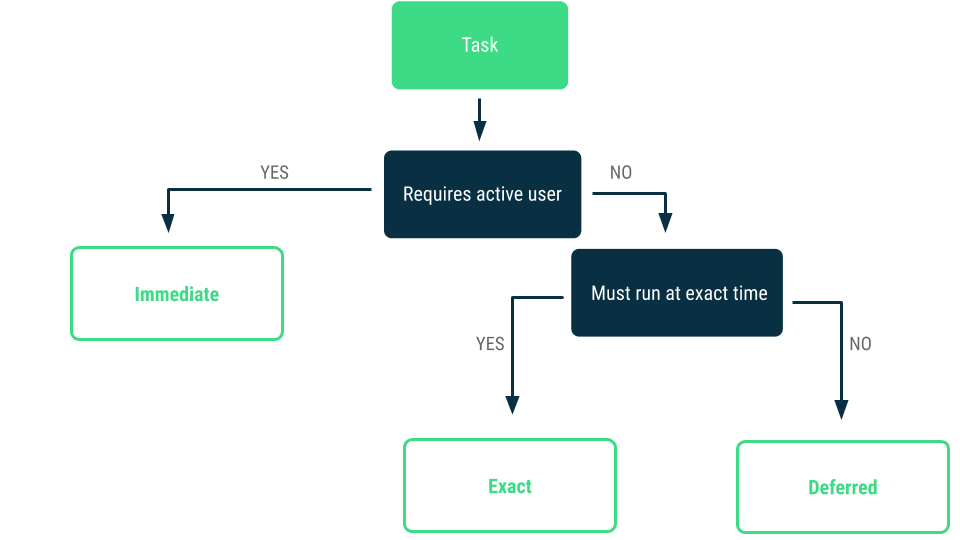
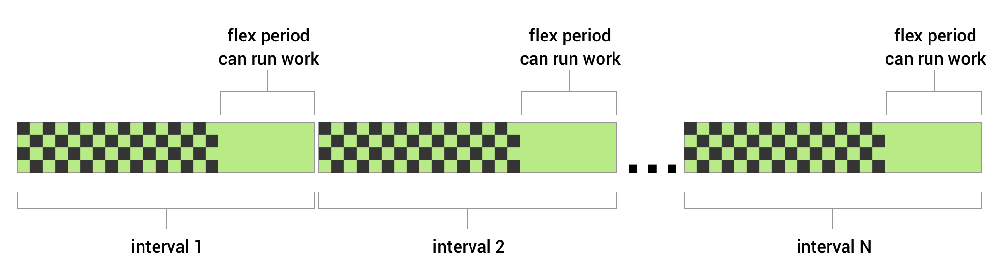

<style>
img[alt~="center"] {
  display: block;
  margin: 0 auto;
}

section.split h1 {
    grid-area: slideheading;
    height: 0;
}

section.split h3:nth-of-type(1) {
    grid-area: leftheader;
}

section.split h3:nth-of-type(2) {
    grid-area: rightheader;
}

section.split {
    overflow: visible;
    display: grid;
    grid-template-columns: 50% 50%;
    grid-template-areas: 
        "slideheading slideheading"
        "leftheader rightheader"
        "lefttext righttext"
}

section.flexrow {
display:flex;
flex-flow: row wrap;
}

section.flexrow h1 {
    flex: 0 1 100%;
}
</style>


# Проектирование мобильных приложений
<!-- _paginate: false -->
<!-- _footer: "Creative Commons Attribution-ShareAlike 3.0" -->

---

* Хотим в фоне отправить данные (статистика использования приложения). Какой компонент нужно разработать?
  * (not-bounded) сервис
* Как запустить (not-bounded) сервис?
  * `Context#startService`
* Как запустить (not-bounded) сервис, если пользователь закрыл все activity?
  * https://developer.android.com/guide/background

---

# Categories of background tasks



<!-- _footer: https://developer.android.com/guide/background#categories_of_background_tasks -->

---

# Recommended solutions
*Immediate tasks*
- Kotlin Coroutines, Threads, ExecutorService
- Foreground service

*Deferred tasks*
- [AndroidX WorkManager](https://developer.android.com/topic/libraries/architecture/workmanager), 
- [Android JobScheduler](https://developer.android.com/reference/android/app/job/JobScheduler)

*Exact tasks*
- [AlarmManager](https://developer.android.com/reference/android/app/AlarmManager)

<!-- _footer: https://developer.android.com/guide/background#recommended-solutions -->

---

# WorkManager

WorkManager is an API that makes it easy to schedule deferrable, asynchronous tasks that are expected to run even if the app exits or the device restarts.


<!-- _footer: https://developer.android.com/topic/libraries/architecture/workmanager -->

---

# WorkManager Example: Worker

```kotlin
class UploadWorker(appContext: Context, workerParams: WorkerParameters):
       Worker(appContext, workerParams) {
   override fun doWork(): Result {

       // Do the work here--in this case, upload the images.
       uploadImages()

       // Indicate whether the work finished successfully with the Result
       return Result.success()
   }
}
```

<!-- _footer: https://developer.android.com/topic/libraries/architecture/workmanager/basics -->

---

# WorkManager Example: Work Request

```kotlin
val constraints = Constraints.Builder()
   .setRequiredNetworkType(NetworkType.UNMETERED)
   .setRequiresCharging(true)
   .build()

val uploadWorkRequest: WorkRequest =
   OneTimeWorkRequestBuilder<UploadWorker>()
// PeriodicWorkRequestBuilder<UploadWorker>(1, TimeUnit.HOURS)
// PeriodicWorkRequestBuilder<SaveImageToFileWorker>(
//     1, TimeUnit.HOURS, // repeatInterval (the period cycle)
//     15, TimeUnit.MINUTES) // flexInterval

    .setConstraints(constraints)
    .build()

WorkManager
    .getInstance(myContext)
    .beginWith(listOf(workA,workB)) // chaining
    .then(workC)                    // chaining
    .enqueue()
```

---



**NetworkType** — например, Wi-Fi (`UNMETERED`)
**BatteryNotLow** 
**RequiresCharging**
**DeviceIdle** — чтобы пользователь не увидел "подтормаживания" устройства
**StorageNotLow**

<!-- _footer: https://developer.android.com/topic/libraries/architecture/workmanager/how-to/define-work#work-constraints -->

---

# Когда Будет Запущен Worker?

Ещё несколько слов об энергосбережении
- Sleep mode — через некоторое (короткое) время после выключения экрана
  - Можно воспрепятствовать с помощью [WakeLock](https://developer.android.com/training/scheduling/wakelock)
- [Doze mode](https://developer.android.com/training/monitoring-device-state/doze-standby#understand_doze) — устройство неподвижно лежит с выключенным экраном без подключенной зарядки
- [App Standby](https://developer.android.com/training/monitoring-device-state/doze-standby#understand_app_standby) — к разным приложениям применяются разные ограничения (в зависимости от частоты использования)

см. https://developer.android.com/topic/performance/power/power-details

---

# Поведение зависит от версии Android

Несколько примеров:

- Начиная с Oreo 8.0 (API 26) Android [останавливает](https://developer.android.com/about/versions/oreo/background#services) Background Strated сервисы через несколько минут после того, как приложение становится IDLE.

- Начиная с Pie 10 (API 28) Location сервисы могут быть [отключены](https://developer.android.com/about/versions/pie/power#battery-saver), когда экран выключен

---

# AlarmManager. Типы Alarm.

`ELAPSED_REALTIME` (= время с момента загрузки устройства)

`ELAPSED_REALTIME_WAKEUP` (= разрешить в sleep режиме)

`RTC` (= в 14:21)

`RTC_WAKEUP`

<!-- _footer: https://developer.android.com/training/scheduling/alarms -->

---

# AlarmManager. Типы Расписаний.

`setExact` — в точное время
`setExactAndAllowWhileIdle` — разрешить Alarm в Doze/App IDLE режиме
`setRepeating`, `setInexactRepeating`
`setWindow`

Если не `*_WAKEUP` — то в sleep режиме alarm доставлен не будет.
Следует стараться избегать `Exact` версий, чтобы не сажать батарею.

<!-- _footer: https://developer.android.com/training/scheduling/alarms -->

---

# AlarmManager. Пример.

```kotlin
private var alarmMgr: AlarmManager? = null
private lateinit var alarmIntent: PendingIntent

alarmMgr = context.getSystemService(Context.ALARM_SERVICE) as AlarmManager
alarmIntent = Intent(context, AlarmReceiver::class.java).let { intent ->
    PendingIntent.getService(context, requestId, intent, 0)
}

// Wake up the device to fire the alarm in 30 minutes, and every 30 minutes after that
alarmMgr?.setInexactRepeating(
        AlarmManager.ELAPSED_REALTIME_WAKEUP,
        SystemClock.elapsedRealtime() + AlarmManager.INTERVAL_HALF_HOUR,
        AlarmManager.INTERVAL_HALF_HOUR,
        alarmIntent
)
```

---

# PendingIntent

A description of an Intent and target action to perform with it. 

`getActivity(...)`, `getActivities(...)`
`getBroadcast(...)`
`getService()`

By giving a PendingIntent to another application, you are granting it the right to perform the operation you have specified as if the other application was yourself (with the same permissions and identity).

<!-- _footer: https://developer.android.com/reference/android/app/PendingIntent -->

---

# Отмена Alarm

```kotlin
val pendingIntent =
    PendingIntent.getService(context, requestId, intent,
                                PendingIntent.FLAG_NO_CREATE)
if (pendingIntent != null && alarmManager != null) {
  alarmManager.cancel(pendingIntent)
}
```

<!-- _footer: https://developer.android.com/training/scheduling/alarms#set -->

---

При перезагрузке устройства все Alarm сбрасываются. 

Как установить Alarm после перезагрузки?

---

# BROADCASTS
https://developer.android.com/guide/components/broadcasts

---

# Broadcast Receivers: Basics

Publish/Subscribe (pub-sub) pattern

*Android* посылает Broadcasts:
- ACTION_POWER_CONNECTED
- ACTION_TIMEZONE_CHANGED
- и пр. (https://developer.android.com/reference/android/content/Intent#standard-broadcast-actions)

*Приложение* может:
- Получать Broadcast
- Посылать Broadcast

---

# Ordered & Normal Broadcasts
**Normal broadcasts**
- `Context.sendBroadcast`
- All receivers of the broadcast are run in an
undefined order, often at the same time.

**Ordered broadcasts**
- `Context.sendOrderedBroadcast`
- Broadcast передается по цепочке от receiver к receiver (возможно прерывать цепочку)

---

# Broadcast Receivers: Отправка

(методы класса `Context`)
```java
public abstract void sendOrderedBroadcast (Intent intent, String receiverPermission)
public abstract void sendBroadcast (Intent intent)
public abstract void sendBroadcast (Intent intent, String receiverPermission)
```

```kotlin
Intent().also { intent ->
    intent.setAction("com.example.broadcast.MY_NOTIFICATION")
    intent.putExtra("data", "Notice me senpai!")
    sendBroadcast(intent)
}
```

---

# BroadcastReceiver. Пример.

```
java.lang.Object
↳android.content.BroadcastReceiver
```

```kotlin
private const val TAG = "MyBroadcastReceiver"

class MyBroadcastReceiver : BroadcastReceiver() {

    override fun onReceive(context: Context, intent: Intent) {
        StringBuilder().apply {
            append("Action: ${intent.action}\n")
            append("URI: ${intent.toUri(Intent.URI_INTENT_SCHEME)}\n")
            toString().also { log ->
                Log.d(TAG, log)
                Toast.makeText(context, log, Toast.LENGTH_LONG).show()
            }
        }
    }
}
```

---

# Broadcast Receivers: Регистрация

**Статически** (в AndroidManifest.xml)*
```xml
<receiver android:enabled=["true" | "false"]
          android:exported=["true" | "false"]
          android:icon="drawable resource"
          android:label="string resource"
          android:name="string"
          android:permission="string"
          android:process="string" >
    ...
</receiver> 
```

**Динамически**
`Context.registerReceiver()`

---

# Пример Статической Регистрации

```xml
<receiver android:name=".MyBroadcastReceiver"  android:exported="true">
    <intent-filter>
        <action android:name="android.intent.action.BOOT_COMPLETED"/>
        <action android:name="android.intent.action.INPUT_METHOD_CHANGED" />
    </intent-filter>
</receiver>

```

Для Ordered broadcast можно указать приоритет: 
```xml
<receiver ... android:priority />
```

-1000 <= `priority` <= 1000
Чем большее значение тем больше приоритет

---

# *Ограничения на Implicit Broadcasts (API 26+, Android 8.0)

- Ограничения распространяются только на Receivers, объявленные в манифесте
- Только broadcast из списка будут работать при регистрации из AndroidManifest:
  - Список: https://developer.android.com/guide/components/broadcast-exceptions.html
- По возможности нужно предпочесть динамическую регистрацию


---

# Динамическая Регистрация

```kotlin
val br: BroadcastReceiver = MyBroadcastReceiver()

val filter = IntentFilter(ConnectivityManager.CONNECTIVITY_ACTION).apply {
    addAction(Intent.ACTION_AIRPLANE_MODE_CHANGED)
}
registerReceiver(br, filter)

///

unregisterReceiver(br)
```

---

# Права на Отправку/Приём Broadcast 

`permission`, `exported`, `uses-permission` - всё в силе

```xml
<receiver android:name=".MyBroadcastReceiver"
          android:permission="android.permission.SEND_SMS">
```

```kotlin
sendBroadcast(Intent("com.example.NOTIFY"), Manifest.permission.SEND_SMS)
```

---

# LocalBroadcastManager

Broadcast внутри приложения

Не IPC: быстрее и безопаснее 

https://developer.android.com/reference/androidx/localbroadcastmanager/content/LocalBroadcastManager

---

# Как установить Alarm после перезагрузки?

```xml
<uses-permission android:name="android.permission.RECEIVE_BOOT_COMPLETED"/>
...
<receiver android:name=".SampleBootReceiver"
        android:enabled="false">
    <intent-filter>
        <action android:name="android.intent.action.BOOT_COMPLETED"></action>
    </intent-filter>
</receiver>
```

```kotlin
class SampleBootReceiver : BroadcastReceiver() {

    override fun onReceive(context: Context, intent: Intent) {
        if (intent.action == "android.intent.action.BOOT_COMPLETED") {
            // Set the alarm here.
        }
    }
}
```

---

# Не используйте BroadcastReceiver, если есть другие альтернативы

Грустная история про `BOOT_COMPLETED`

И ещё более грустная история про `NETWORK_STATE_CHANGED_ACTION`
> Broadcast intent action indicating that the state of Wi-Fi connectivity has changed. This broadcast is not delivered to manifest receivers in applications that target API version 26 or later.

---

# Порядок Доставки Broadcast

PackageManager.queryBroadcastReceivers(Intent intent, int flags)
 - Поиск зарегистрированных BroadcastReceivers, способных обработать Intent

Для каждого совпадения 
- Запустить приложение, если не запущено*
- Выполнить код метода onReceive
- Завершить приложение, если нет других запущенных компонентов приложения
