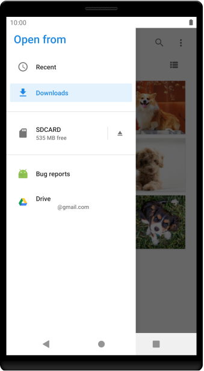
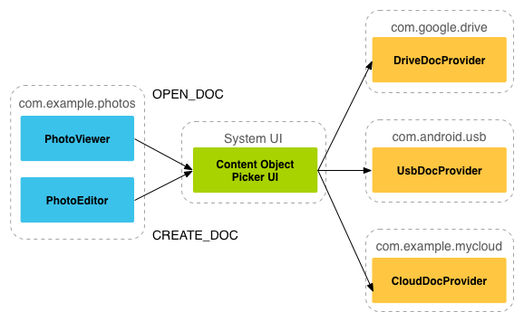

<style>

section.scrollcode pre code svg {max-height: 10000px;}
section.scrollcode pre {overflow:scroll;}


img[alt~="center"] {
  display: block;
  margin: 0 auto;
}

section.split h1 {
    grid-area: slideheading;
    height: 0;
}

section.split h3:nth-of-type(1) {
    grid-area: leftheader;
}

section.split h3:nth-of-type(2) {
    grid-area: rightheader;
}

section.split {
    overflow: visible;
    display: grid;
    grid-template-columns: 50% 50%;
    grid-template-areas: 
        "slideheading slideheading"
        "leftheader rightheader"
        "lefttext righttext"
}

section.flexrow {
display:flex;
flex-flow: row wrap;
}

section.flexrow h1 {
    flex: 0 1 100%;
}
</style>


# Проектирование мобильных приложений
<!-- _paginate: false -->
<!-- _footer: "Creative Commons Attribution-ShareAlike 3.0" -->

---

# Базы данных и SQL
https://www.w3schools.com/sql/

---

# SQLite в Android

Android предоставляет полнофункционального Java клиента для SQLite БД

[SQLite](https://www.sqlite.org/index.html) – кросс-платформенная встраиваемая реляционная БД

Предпочтительный способ взаимодействия с SQLite – ROOM

<!-- _footer: https://developer.android.com/training/data-storage/sqlite.html -->

---

# 3 основных компонента Room
**Database**: Contains the database holder and serves as the main access point for the underlying connection to your app's persisted, relational data.

**Entity**: Represents a table within the database.

**DAO**: Contains the methods used for accessing the database.

---

# Взаимодействие с основными компонентами Room


<!-- _footer: https://developer.android.com/images/training/data-storage/room_architecture.png -->

---


# Content Providers
https://developer.android.com/guide/topics/providers/content-providers

---

# Content Provider

Стандартный интерфейс для предоставления структурированных данных из одного приложения в другое

Встроенные провайдеры: Calendar, Contacts, Media Store, User Dictionary, etc.

---

# Content Provider & Resolver

Клиент работает с Content Resolver
- `android.content.ContentResolver`

Content Resolver работает с Content Provider’ом
- `class MyContentProvider extends android.content.ContentProvider`

Content Provider получает запросы от клиента, обрабатывает и возвращает результат

---

<!-- _class: split -->

# "CRUD" (create, retrieve, update, and delete)

### Content Resolver
- query
- insert
- update
- delete


### Content Provider
- query
- insert
- update
- delete

---

# Content Provider: Basics

`ContentProvider` представляет данные в виде набора таблиц 
(аналогично РБД)

 word | app id | frequency | locale | _ID
------| ------ | --------- | ------ | ---
mapreduce   | user1  | 100 | en_US  | 1
precompiler | user14 | 200 | fr_FR  | 2

---

# Content Provider & Resolver: Основные Методы

```java
Cursor query (Uri uri, String[] projection, 
              String selection, String[] selectionArgs,
              String sortOrder)

Uri insert (Uri uri, ContentValues values)

int update (Uri uri, ContentValues values,
            String selection,String[] selectionArgs)

int delete (Uri uri, String selection, String[] selectionArgs)

String getType (Uri uri) //returns the MIME type of data in the content provider
```

---

# Content Provider & Resolver (1)

По умолчанию все компоненты работают в UI-Thread процесса, в котором они определены, кроме Content Provider

Методы `ContentProvider` могут быть вызваны одновременно из разных потоков, и должны быть ThreadSafe

> query(), insert(),delete(), update(), and getType() — are called from a pool of threads in the content provider's process, not the UI thread for the process.

<!-- _footer: https://developer.android.com/guide/components/processes-and-threads#ThreadSafe -->

---

# Content Provider Query & SQL

```java
mCursor = getContentResolver().query(
    UserDictionary.Words.CONTENT_URI,   // The content URI of the words table
    mProjection,                        // The columns to return for each row
    mSelectionClause                    // Selection criteria
    mSelectionArgs,                     // Selection criteria
    mSortOrder);                        // The sort order for the returned rows 
```

query() argument | SELECT keyword/parameter | Notes
--|--|--
Uri | FROM table_name | Uri maps to the table in the provider named table_name.
projection | col,col,col,... | projection is an array of columns that should be included for each row retrieved.
selection | WHERE col = value | selection specifies the criteria for selecting rows.
selectionArgs | (No exact equivalent. Selection arguments replace ? placeholders in the selection clause.)
sortOrder | ORDER BY col,col,... | sortOrder specifies the order in which rows appear in the returned Cursor. 

---

# Content Provider. URI
`URI=scheme://host:port/path`
- URI authority = `host:port`

URI authority идентифицирует провайдера
- `content://user_dictionary/`

URI path идентифицирует
- Таблицу: `content://user_dictionary/words`
- Строку в таблице: `content://user_dictionary/words/4`

---

# Content Provider: URI. Замечание.

Для работы с URI есть вспомогательные классы:
- `Uri`
- `Uri.Builder`
- `ContentUris`

```
Uri singleUri = ContentUris.withAppendedId(UserDictionary.Words.CONTENT_URI,4);
```

---

# `query` (provider)

```java
// Implement this to handle query requests from clients
public abstract Cursor query (
  Uri uri, 
  String[] projection, 
  String selection, String[] selectionArgs, 
  String sortOrder
  [, CancellationSignal cancellationSignal]
)
```

`CancellationSignal cancellationSignal` добавлен в API 16


---

# `query` (resolver)

```java
Cursor mCursor = getContentResolver().query (
                UserDictionary.Words.CONTENT_URI 
                mProjection,             // Which columns to return.
                mSelectionClause,        // WHERE clause.
                mSelectionArgs,          // WHERE clause value substitution
                People.NAME + " ASC");   // Sort order.
```

```java
// A "projection" defines the columns that will be returned for each row
String[] mProjection =
{
    UserDictionary.Words._ID,    // Contract class constant for the _ID column name
    UserDictionary.Words.WORD,   // Contract class constant for the word column name
    UserDictionary.Words.LOCALE  // Contract class constant for the locale column name
};

// Defines a string to contain the selection clause
String mSelectionClause = UserDictionary.Words.WORD + " = ?"; 

// Initializes an array to contain selection arguments
String[] mSelectionArgs = {“Search"}; 
```

---

# `android.database.Cursor`

This interface provides random read-write access to the result set returned by a database query.

Некоторые методы:

```java
int getColumnCount ()
String[] getColumnNames ()
double getDouble (int columnIndex)
String getString (int columnIndex)
int getType (int columnIndex)
boolean moveToNext ()
boolean moveToFirst ()
boolean requery ()
void close ()
```

---

# Отображение данных с помощью адаптера

```kotlin
// Defines a list of columns to retrieve from the Cursor and load into an output row
val wordListColumns : Array<String> = arrayOf(
        UserDictionary.Words.WORD,      // Contract class constant containing the word column name
        UserDictionary.Words.LOCALE     // Contract class constant containing the locale column name
)

// Defines a list of View IDs that will receive the Cursor columns for each row
val wordListItems = intArrayOf(R.id.dictWord, R.id.locale)

// Creates a new SimpleCursorAdapter
cursorAdapter = SimpleCursorAdapter(
        applicationContext,             // The application's Context object
        R.layout.wordlistrow,           // A layout in XML for one row in the ListView
        mCursor,                        // The result from the query
        wordListColumns,                // A string array of column names in the cursor
        wordListItems,                  // An integer array of view IDs in the row layout
        0                               // Flags (usually none are needed)
)

// Sets the adapter for the ListView
wordList.setAdapter(cursorAdapter)
```

---

# `insert` (provider)

```java
// Implement this to handle requests to insert a new row
public abstract Uri insert (Uri uri, ContentValues values)
```

---

# `insert` (resolver)

```java
public final Uri insert (Uri uri, ContentValues values)
```

```kotlin
// Defines an object to contain the new values to insert
val newValues = ContentValues().apply {
    /*
     * Sets the values of each column and inserts the word. The arguments to the "put"
     * method are "column name" and "value"
     */
    put(UserDictionary.Words.APP_ID, "example.user")
    put(UserDictionary.Words.LOCALE, "en_US")
    put(UserDictionary.Words.WORD, "insert")
    put(UserDictionary.Words.FREQUENCY, "100")

}

newUri = contentResolver.insert(
        UserDictionary.Words.CONTENT_URI,   // the user dictionary content URI
        newValues                          // the values to insert
)
```

<!-- _footer: https://developer.android.com/guide/topics/providers/content-provider-basics#Inserting -->

---

# `android.content.ContentValues`
This class is used to store a set of values that the ContentResolver can process.

Некоторые методы
```java
void put (String key, Byte value)
void put (String key, Integer value)
void put (String key, Float value)
void put (String key, Short value)
...
```

---

# `update` (provider)

```java
// Implement this to handle requests to update one or more rows
public abstract int update (Uri uri, ContentValues values,
                            String selection, String[] selectionArgs)
```

The implementation should update all rows matching the selection to set the columns according to the provided values map.

---

# `update` (resolver)

```kotlin
// Defines an object to contain the updated values
val updateValues = ContentValues().apply {
    /*
     * Sets the updated value and updates the selected words.
     */
    putNull(UserDictionary.Words.LOCALE)
}

// Defines selection criteria for the rows you want to update
val selectionClause: String = UserDictionary.Words.LOCALE + "LIKE ?"
val selectionArgs: Array<String> = arrayOf("en_%")

// Defines a variable to contain the number of updated rows
var rowsUpdated: Int = 0

...

rowsUpdated = contentResolver.update(
        UserDictionary.Words.CONTENT_URI,   // the user dictionary content URI
        updateValues,                      // the columns to update
        selectionClause,                   // the column to select on
        selectionArgs                      // the value to compare to
)

```

---

# `delete` (provider)

```java
// Implement this to handle requests to delete one or more rows
public abstract int delete (Uri uri, String selection, String[] selectionArgs)
```

The implementation should apply the selection clause when performing deletion, allowing the operation to affect multiple rows in a directory.

---

# `delete` (resolver)

```kotlin
// Defines selection criteria for the rows you want to delete
val selectionClause = "${UserDictionary.Words.LOCALE} LIKE ?"
val selectionArgs: Array<String> = arrayOf("user")

// Defines a variable to contain the number of rows deleted
var rowsDeleted: Int = 0

...

// Deletes the words that match the selection criteria
rowsDeleted = contentResolver.delete(
        UserDictionary.Words.CONTENT_URI,   // the user dictionary content URI
        selectionClause,                   // the column to select on
        selectionArgs                      // the value to compare to
)
```

<!-- _footer: https://developer.android.com/guide/topics/providers/content-provider-basics#Deleting -->

---

# `getType`

```java
// Implement this to handle requests for the MIME type of the data at the given URI
public abstract String getType (Uri uri)
```

The returned MIME type should start with
- `vnd.android.cursor.item` — for a single record
- `vnd.android.cursor.dir` — for multiple items

The subtype is provider-specific.

```pre
vnd.android.cursor.item/phone_v2
vnd.android.cursor.dir/vnd.example.line1
```

Note that there are no permissions needed for an application to access this information

---

# Content Provider: Безопасность

Провайдер объявляет в AndroidManifest
- `android:readPermission="string"`
- `android:writePermission="string"`
- `android:exported=["true" | "false"]`
- `android:grantUriPermissions=["true" | "false"]`
- `<path-permission>`
- `<grant-uri-permission> `

Клиент объявляет в AndroidManifest
- `<uses-permission>`

---

# Permissions (provider)

```xml
<provider android:authorities="list"
          android:enabled=["true" | "false"]
          android:exported=["true" | "false"]
          android:grantUriPermissions=["true" | "false"]
          android:permission="string”
          android:readPermission="string”
          android:writePermission="string“
          . . . >
    <path-permission>...</path-permission>
    <grant-uri-permission android:path="string"
                      android:pathPattern="string"
                      android:pathPrefix="string" />
    . . .
</provider> 
```

<!-- _footer: https://developer.android.com/guide/topics/manifest/provider-element.html -->

---

# Permissions (provider)

“If a provider's application doesn't specify any permissions, then other applications **have no access** to the provider's data.” (https://developer.android.com/guide/topics/providers/content-provider-basics)
> “All applications **can read from or write to** your provider, even if the underlying data is private, because by default your provider does not have permissions set.” (https://developer.android.com/guide/topics/providers/content-provider-creating)

However, components in the provider's application always have **full read and write access**, regardless of the specified permissions.

---

# Permissions (client)

`<uses-permission>` в AndroidManifest

Строка. Определяется разработчиком провайдера
Например, `android.permission.READ_USER_DICTIONARY`

Имя permission надо искать в документации провайдера

---

# Напоминание

```java
void startActivityForResult (Intent intent, int requestCode)
void setResult (int resultCode)
void onActivityResult (int requestCode, int resultCode, Intent data)
```

---

# Temporary URI Permission (via Intent)

Приложение, имеющее права на доступ, предоставляет временное разрешение на определенные URI с помощью `Intent.flags`:

```pre
FLAG_GRANT_READ_URI_PERMISSION
FLAG_GRANT_WRITE_URI_PERMISSION
```

<!-- _footer: https://developer.android.com/guide/topics/providers/content-provider-basics.html#getting-access-with-temporary-permissions -->

---

# Temporary URI Permission. Пример (Contacts)

1. `startActivityForResult()` 
    - `ACTION_PICK` and `MIME=CONTENT_ITEM_TYPE`
1. Открывается приложение «контакты»
1. Пользователь выбирает контакт
    - `setResult(resultcode, intent)`
    - The intent contains the content URI and flag `FLAG_GRANT_READ_URI_PERMISSION`.
1. `OnActivityResult()`
    - Можно читать 1 (выбранный) контакт

---

# Contract class

```kotlin
// Defines selection criteria for the rows you want to delete
val selectionClause = "${UserDictionary.Words.LOCALE} LIKE ?"
val selectionArgs: Array<String> = arrayOf("user")

// Defines a variable to contain the number of rows deleted
var rowsDeleted: Int = 0

...

// Deletes the words that match the selection criteria
rowsDeleted = contentResolver.delete(
        UserDictionary.Words.CONTENT_URI,   // the user dictionary content URI
        selectionClause,                   // the column to select on
        selectionArgs                      // the value to compare to
)
```

Обратим внимание на `UserDictionary.Words`

---

# Creating a Content Provider

```pre
java.lang.Object 
↳android.content.ContentProvider
```
- `onCreate()` - called to initialize the provider
- `query(Uri, String[], String, String[], String) `which returns data to the caller
- `insert(Uri, ContentValues)` which inserts new data into the content provider
- `update(Uri, ContentValues, String, String[])` which updates existing data in the content provider
- `delete(Uri, String, String[])` which deletes data from the content provider
- `getType(Uri)` which returns the MIME type of data in the content provider

<!-- https://developer.android.com/guide/topics/providers/content-provider-creating -->

---

# Storage Access Framework
https://developer.android.com/guide/topics/providers/document-provider.html

<!-- _footer: Android 4.4 (API 19+) -->

---

# Элементы SAF

<!-- _class: flexrow -->

<style scoped>
ul {flex-grow: 1}
</style>

- Document provider (e.g. Google Drive)
- Client App
- Picker – System UI



---

SAF позволяет получить доступ, к файлам (документам, картинкам, ...), хранящимся в разных хранилищах (Google Drive, SD card, ...) 

Сетевые и локальные хранилища могут предоставить SAF доступ к своим сервисам с помощью `DocumentsProvider`.

---

# Storage Access Framework Flow



<!-- _footer: https://developer.android.com/images/providers/storage_dataflow.png -->

`ACTION_OPEN_DOCUMENT`, `ACTION_CREATE_DOCUMENT`

(не путать с `ACTION_GET_CONTENT`, который получает копию данных)

---

# Структура Документов

- Document Provider может хранить файлы как угодно и где угодно, но клиентам он должен представить файлы и каталоги в "традиционном" виде.

- Document Provider может иметь один или более Roots


<!-- _footer: https://developer.android.com/guide/topics/providers/document-provider#overview -->

---

# Пример Приложения (Выбор Документа)

<!-- _class: scrollcode -->

```java
private static final int READ_REQUEST_CODE = 42;
...
/**
 * Fires an intent to spin up the "file chooser" UI and select an image.
 */
public void performFileSearch() {

    // ACTION_OPEN_DOCUMENT is the intent to choose a file via the system's file
    // browser.
    Intent intent = new Intent(Intent.ACTION_OPEN_DOCUMENT);

    // Filter to only show results that can be "opened", such as a
    // file (as opposed to a list of contacts or timezones)
    intent.addCategory(Intent.CATEGORY_OPENABLE);

    // Filter to show only images, using the image MIME data type.
    // If one wanted to search for ogg vorbis files, the type would be "audio/ogg".
    // To search for all documents available via installed storage providers,
    // it would be "*/*".
    intent.setType("image/*");

    startActivityForResult(intent, READ_REQUEST_CODE);
} 

@Override
public void onActivityResult(int requestCode, int resultCode,
        Intent resultData) {

    // The ACTION_OPEN_DOCUMENT intent was sent with the request code
    // READ_REQUEST_CODE. If the request code seen here doesn't match, it's the
    // response to some other intent, and the code below shouldn't run at all.

    if (requestCode == READ_REQUEST_CODE && resultCode == Activity.RESULT_OK) {
        // The document selected by the user won't be returned in the intent.
        // Instead, a URI to that document will be contained in the return intent
        // provided to this method as a parameter.
        // Pull that URI using resultData.getData().
        Uri uri = null;
        if (resultData != null) {
            uri = resultData.getData();
            Log.i(TAG, "Uri: " + uri.toString());
            showImage(uri);
        }
    }
}
```

---

# Что можно сделать с полученным URI?

Всё то же самое, что с URI для ContentProvider

```pre
java.lang.Object 
  ↳android.content.ContentProvider
    ↳android.provider.DocumentsProvider
```

Built-in document providers: Downloads, Images, Videos

---

# Обработка метаданных (пример)

<!-- _class: scrollcode -->

```java
public void dumpImageMetaData(Uri uri) {

    // The query, since it only applies to a single document, will only return
    // one row. There's no need to filter, sort, or select fields, since we want
    // all fields for one document.
    Cursor cursor = getActivity().getContentResolver()
            .query(uri, null, null, null, null, null);

    try {
    // moveToFirst() returns false if the cursor has 0 rows.  Very handy for
    // "if there's anything to look at, look at it" conditionals.
        if (cursor != null && cursor.moveToFirst()) {

            // Note it's called "Display Name".  This is
            // provider-specific, and might not necessarily be the file name.
            String displayName = cursor.getString(
                           cursor.getColumnIndex(OpenableColumns.DISPLAY_NAME));
            Log.i(TAG, "Display Name: " + displayName);

            int sizeIndex = cursor.getColumnIndex(OpenableColumns.SIZE);
         
            String size = null;
            if (!cursor.isNull(sizeIndex)) {
                // Technically the column stores an int, but cursor.getString()
                // will do the conversion automatically.
                size = cursor.getString(sizeIndex);
            } else {
                size = "Unknown";
            }
            Log.i(TAG, "Size: " + size);
        }
    } finally {
        cursor.close();
    }
} 
```

---

# Доступ к содержимому (пример FileDescriptor)

```java
private Bitmap getBitmapFromUri(Uri uri) throws IOException {
    ParcelFileDescriptor parcelFileDescriptor =
            getContentResolver().openFileDescriptor(uri, "r");
    FileDescriptor fileDescriptor = parcelFileDescriptor.getFileDescriptor();
    Bitmap image = BitmapFactory.decodeFileDescriptor(fileDescriptor);
    parcelFileDescriptor.close();
    return image;
} 
```

Mode может быть "r", "rw", "rwt", etc.

---

# Доступ к содержимому (пример InputStream)

```java
private String readTextFromUri(Uri uri) throws IOException {
    InputStream inputStream = getContentResolver().openInputStream(uri);
    BufferedReader reader = new BufferedReader(new InputStreamReader(
            inputStream));
    StringBuilder stringBuilder = new StringBuilder();
    String line;
    while ((line = reader.readLine()) != null) {
        stringBuilder.append(line);
    }
    fileInputStream.close();
    return stringBuilder.toString();
}
```

Аналогично, есть [`openOutputStream`](https://developer.android.com/reference/android/content/ContentResolver#openOutputStream(android.net.Uri))

---

# Доступ к содержимому (FileDescriptor > Stream)

```java
private void alterDocument(Uri uri) {
    try {
        ParcelFileDescriptor pfd = getActivity().getContentResolver().
                openFileDescriptor(uri, "w");
        FileOutputStream fileOutputStream =
                new FileOutputStream(pfd.getFileDescriptor());
        fileOutputStream.write(("Overwritten by MyCloud at " +
                System.currentTimeMillis() + "\n").getBytes());
        // Let the document provider know you're done by closing the stream.
        fileOutputStream.close();
        pfd.close();
    } catch (FileNotFoundException e) {
        e.printStackTrace();
    } catch (IOException e) {
        e.printStackTrace();
    }
} 
```

---

# Пример `DocumentsProvider#openDocument`

<!-- _class: scrollcode -->

```kotlin
override fun openDocument(
        documentId: String,
        mode: String,
        signal: CancellationSignal
): ParcelFileDescriptor {
    Log.v(TAG, "openDocument, mode: $mode")
    // It's OK to do network operations in this method to download the document,
    // as long as you periodically check the CancellationSignal. If you have an
    // extremely large file to transfer from the network, a better solution may
    // be pipes or sockets (see ParcelFileDescriptor for helper methods).

    val file: File = getFileForDocId(documentId)
    val accessMode: Int = ParcelFileDescriptor.parseMode(mode)

    val isWrite: Boolean = mode.contains("w")
    return if (isWrite) {
        val handler = Handler(context.mainLooper)
        // Attach a close listener if the document is opened in write mode.
        try {
            ParcelFileDescriptor.open(file, accessMode, handler) {
                // Update the file with the cloud server. The client is done writing.
                Log.i(TAG, "A file with id $documentId has been closed! Time to update the server.")
            }
        } catch (e: IOException) {
            throw FileNotFoundException(
                    "Failed to open document with id $documentId and mode $mode"
            )
        }
    } else {
        ParcelFileDescriptor.open(file, accessMode)
    }
}
```

<!-- _footer: https://developer.android.com/guide/topics/providers/create-document-provider#openDocument -->