<style>
img[alt~="center"] {
  display: block;
  margin: 0 auto;
}

section.split h1 {
    grid-area: slideheading;
    height: 0;
}

section.split h3:nth-of-type(1) {
    grid-area: leftheader;
}

section.split h3:nth-of-type(2) {
    grid-area: rightheader;
}

section.split {
    overflow: visible;
    display: grid;
    grid-template-columns: 50% 50%;
    grid-template-areas: 
        "slideheading slideheading"
        "leftheader rightheader"
        "lefttext righttext"
}

section.flexrow {
display:flex;
flex-flow: row wrap;
}

section.flexrow h1 {
    flex: 0 1 100%;
}
</style>


# Проектирование мобильных приложений
<!-- _paginate: false -->
<!-- _footer: "Creative Commons Attribution-ShareAlike 3.0" -->

---

# ART & JVM

---

<!-- _class: split -->

# Java ByteCode

### BytecodeTest.java

```java
public void testIt() {
    int a = 1;
    int b = 2;
    int c = (a + b) + (a * 3);
}
```

### BytecodeTest.class
```
; javap .../BytecodeTest.class
ICONST_1
ISTORE 1

ICONST_2
ISTORE 2

ILOAD 1
ILOAD 2
IADD
ILOAD 1
ICONST_3
IMUL
IADD
ISTORE 3
...
MAXSTACK = 3
MAXLOCALS = 4
```

---

# Обратная Польская Запись

```
(8+2*5)/(1+3*2-4)
```

```
8 2 5 * + 1 3 2 * + 4 - /
```

| Шаг | Оставшаяся цепочка | Стек |
|-----|--------------------|------|
|1|8 2 5 * + 1 3 2 * + 4 - / | 
|2|2 5 * + 1 3 2 * + 4 - / | 8 
|3|5 * + 1 3 2 * + 4 - / | 8 2 
|4|* + 1 3 2 * + 4 - / | 8 2 5
|5|+ 1 3 2 * + 4 - / | 8 10
|6|1 3 2 * + 4 - / | 18
|7|3 2 * + 4 - / | 18 1
|8|2 * + 4 - / | 18 1 3
|9|* + 4 - / | 18 1 3 2
|10|+ 4 - / | 18 1 6
|11|4 - / | 18 7
|12|- / | 18 7 4
|13|/ | 18 3
|13| | 6

<!-- _footer: пример взят с https://habr.com/ru/post/100869/-->

---

# Dalvik ByteCode

<!-- _class: split -->

### .java
```java
public void testIt() {
    int a = 1;
    int b = 2;
    int c = (a + b) + (a * 3);
}
```

### .dex
```
.registers 5 ;including method params
...

const/4 v0, 0x1

const/4 v1, 0x2

add-int v2, v0, v1

mul-int/lit8 v3, v0, 0x3

add-int/2addr v2, v3
```

<!-- see also: https://github.com/JesusFreke/smali/wiki/Registers -->

<!-- _footer: https://source.android.com/devices/tech/dalvik/dalvik-bytecode -->

---

# 2008 — Первый Android Телефон

**The T-Mobile G1, also known as the HTC Dream**
Qualcomm's MSM7201A SoC, with a sole ARM11 core running at a whopping 528 MHz alongside an Adreno 130 GPU.

**192MB of RAM** and just 256MB of internal storage, 3.2-inch 320 x 480 TFT display.


<!-- _footer: https://www.androidpolice.com/2021/09/23/the-first-android-phone-was-announced-13-years-ago-today/ -->

---

# 2013 — Первый Android KitKat Телефон

**Nexus 5**: 2.26 GHz quad-core Snapdragon 800 processor

**2 GB of RAM**, either 16 or 32 GB of internal storage, 4.95-inch (marketed as 5-inch) 445 PPI 1080p IPS display.

.jpg)

<!-- _footer: https://en.wikipedia.org/wiki/Nexus_5 -->

---

# Dalvik vs ART

**Dalvik** оптимизирован на минимизацию потребления памяти

**ART** оптимизирован на высокую производительность
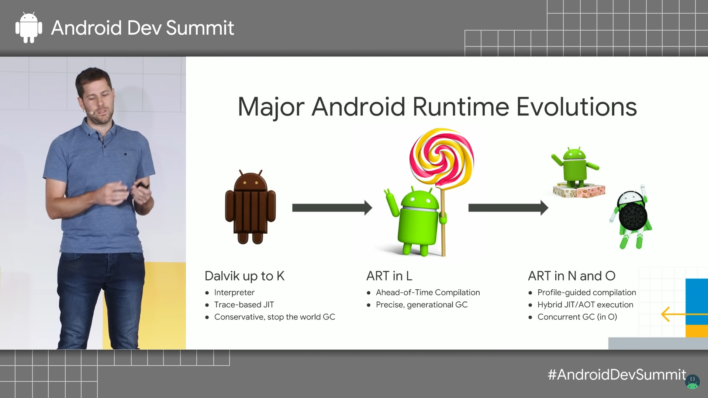

<!-- _footer: https://www.youtube.com/watch?v=vU7Rhcl9x5o -->

---

# Code Execution

Dlavik — interpretation + JIT

ART — AOT, AOT+JIT

HotSpot — Interpretation + JIT, AOT не прижился
  - [JEP 295](https://openjdk.java.net/jeps/295): Ahead-of-Time Compilation (2016) => Java 9
  - [JEP 410](https://openjdk.java.net/jeps/410): Remove the Experimental AOT and JIT Compiler => Java 17
  - Некоторые реализации ([например, GraalVM](https://www.graalvm.org/reference-manual/native-image/)) поддерживают AOT.

---

# JIT

In HotSpot:
- Level 0: Interpretation
- Level 1: C1 without profiling (optimized), terminal
- Level 2: C1 with basic profiling
- Level 3: C1 with full profiling (если C2 занят)
- Level 4: C2, terminal, expensive

de-optimization to level 0

Компилируются только горячий код

---

<!-- _class: flexrow -->

# Время до Максимальной Производительности

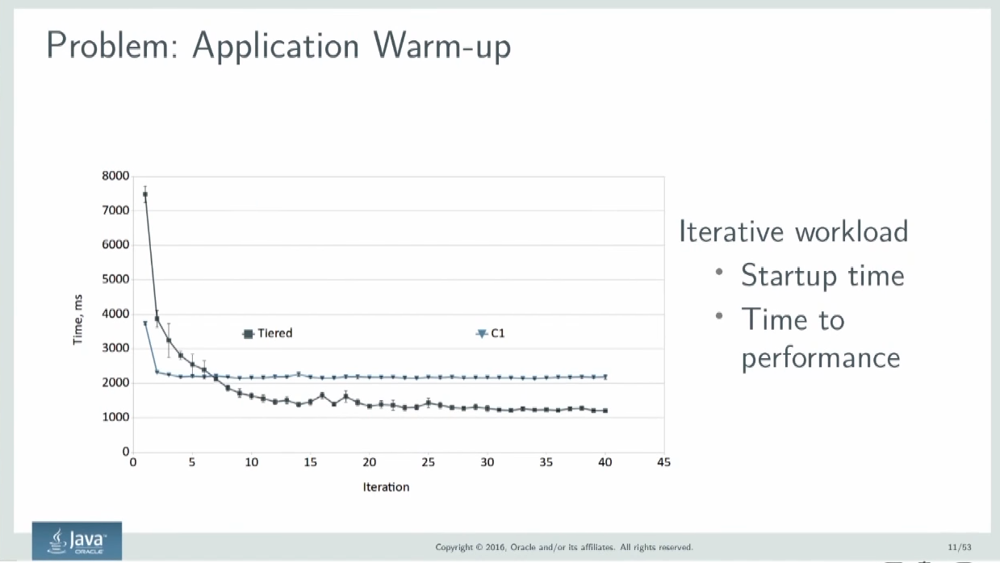

- C0 ~0 сек
- С1 ~10 сек
- Tired ~45 сек

Пример маленького приложения 

<!-- _footer: https://jug.ru/talks/meetups/jep-295-aot-hotspot/ -->

---

<style scoped>
ul {
overflow: scroll;
}
</style>

# Некоторые JIT-оптимизации

- **compiler tactics**
  - delayed compilation 
  - **tiered compilation** 
  - **on-stack replacement** 
  - delayed reoptimization 
  - program dependence graph rep. 
  - static single assignment rep. 
- **proof-based techniques**
  - exact type inference 
  - memory value inference 
  - memory value tracking 
  - constant folding 
  - reassociation 
  - operator strength reduction 
  - null check elimination 
  - type test strength reduction 
  - type test elimination 
  - algebraic simplification 
  - common subexpression elimination 
  - integer range typing 
- **flow-sensitive rewrites**
  - conditional constant propagation 
  - dominating test detection 
  - flow-carried type narrowing 
  - dead code elimination 
- **language-specific techniques**
  - class hierarchy analysis 
  - devirtualization 
  - symbolic constant propagation 
  - autobox elimination 
  - escape analysis 
  - lock elision 
  - lock fusion  
  - de-reflection 
- **speculative (profile-based) techniques**
  - optimistic nullness assertions 
  - optimistic type assertions 
  - optimistic type strengthening 
  - optimistic array length strengthening 
  - untaken branch pruning 
  - optimistic N-morphic inlining 
  - branch frequency prediction 
  - call frequency prediction 
- **memory and placement transformation**
  - expression hoisting 
  - expression sinking 
  - redundant store elimination 
  - adjacent store fusion 
  - card-mark elimination 
  - merge-point splitting 
- **loop transformations**
  - loop unrolling 
  - loop peeling 
  - safepoint elimination 
  - iteration range splitting 
  - range check elimination 
  - loop vectorization 
- **global code shaping**
  - **inlining (graph integration)**
  - global code motion 
  - heat-based code layout 
  - switch balancing 
  - throw inlining 
- **control flow graph transformation**
  - local code scheduling 
  - local code bundling 
  - delay slot filling 
  - graph-coloring register allocation 
  - linear scan register allocation 
  - live range splitting 
  - copy coalescing 
  - constant splitting 
  - copy removal 
  - address mode matching 
  - instruction peepholing 
  - DFA-based code generator 

<!-- _footer: https://cr.openjdk.java.net/~vlivanov/talks/2015_JIT_Overview.pdf -->

---

# Пример JIT-оптимизации (JRockit JVM)

<!-- _class: split -->

### Class A before optimization
```java
class A {
  B b;
  public void foo() {
    y = b.get();
    ...do stuff...
    z = b.get();
    sum = y + z;
  }
}

class B {
  int value;
  final int get() {
    return value;
  }
}
```
### Class A after optimization
```java
class A {
  B b;
  public void foo() {
    y = b.value;
    ...do stuff...
    sum = y + y;
  }
}

class B {
  int value;
  final int get() {
    return value;
  }
}
```

<!-- _footer: https://docs.oracle.com/cd/E13150_01/jrockit_jvm/jrockit/geninfo/diagnos/underst_jit.html -->

---

<!-- _class: flexrow -->
<style scoped>
pre {
    height: 200px;
    width: 350px;
}
</style>

# Пример JIT-оптимизации (объяснение)

```java
// Starting point
public void foo() {
    y = b.get();
    ...do stuff...
    z = b.get();
    sum = y + z;
}
```

```java
// 1. Inline final method
public void foo() {
    y = b.value;
    ...do stuff...
    z = b.value;
    sum = y + z;
}
```

```java
// 2. Remove redundant loads
public  void foo() {
    y = b.value;
    ...do stuff...
    z = y;
    sum = y + z;
}
```

```java
// 3. Copy propagation
public  void foo() {
    y = b.value;
    ...do stuff...
    y = y;
    sum = y + y;
}
```

```java
// 4. Eliminate dead code
public  void foo() {
    y = b.value;
    ...do stuff...
    sum = y + y;
}
```

---

# Пример: Null checks in the C2 tier

С2 может сэкономить время на uncommon ветках

```java
if (object == null) {
  throw new NullPointerException();
}
val = object.field;
```

```java
if (object == null) {
  deoptimize();
}
val = object.field;
```

<!-- _footer: https://developers.redhat.com/articles/2021/06/23/how-jit-compiler-boosts-java-performance-openjdk#how_a_jit_compiler_works -->

---

# Пример: Devirtualization

Большинство виртуальных вызовов происходят на одном и том же типе. Есть специальная оптимизация для monomorphic и bi-morphic вызовов (call-sites).

```java
class C {
  void virtualMethod() {}
}

void compiledMethod(C c) {
  c.virtualMethod();
}
```

```java
void compiledMethod(C c) {
  if (c.getClass() != Expected) deoptimize();
  c.ExactType::virtualMethod(); // No virtual method lookup
}
```

---

# Пример JIT в ART

```kotlin
fun len(arg: String) : Int {
    return arg.length
}
```

```dex
0000: const-string v0, "arg" // Parameter name
0002: invoke-static {v1, v0}, checkParameterIsNotNull
0005: invoke-virtual {v1}, length:()I
0008: move-result v0
0009: return v0

kotlin.jvm.internal.Intrinsiscs.checkParameterIsNotNull:
0000: if-nez v0, 0005
0002: invoke-static {v1}, throwParameterIsNullException
0005: return-void
```

<!-- _footer: https://www.youtube.com/watch?v=vU7Rhcl9x5o -->

---

# Пример JIT в ART (Inline)

```kotlin
fun len(arg: String) : Int {
    return arg.length
}
```

```dex
const-string v0, "arg" // Parameter name

if-nez v1, :continue
invoke-static {v0}, throwParameterIsNullException ;always throws

:continue
invoke-virtual {v1}, length:()I
move-result v0
return v0
```

---

# Пример JIT в ART (Code Layout)

Последовательно исполняющийся код должен лежать последовательно в памяти

```kotlin
fun len(arg: String) : Int {
    return arg.length
}
```

```dex
const-string v0, "arg" // Parameter name
if-eqz v1, :exit
invoke-virtual {v1}, length:()I
move-result v0
return v0

:exit
invoke-static {v0}, throwParameterIsNullException
```

---

# Пример JIT в ART (Code Layout)

Уберем код, не участвующий в primary execution flow

```kotlin
fun len(arg: String) : Int {
    return arg.length
}
```

```dex
if-eqz v1, :exit
invoke-virtual {v1}, length:()I
move-result v0
return v0

:exit
const-string v0, "arg" // Parameter name
invoke-static {v0}, throwParameterIsNullException
```

---

# Несколько Слов о OoTA

Спекуляции не должны приводить к "самоподтверждающимся пророчествам". Out-of-thin-air (out-of-blue) запрещены JLS.

```
                            int a = 0, b = 0
                __________________________________________
                                    |
                r1 = a;             | r2 = b;
                if (r1 != 0) b = 42 | if (r2 != 0) a = 42;
                                    |
```

Программа корректно синхронизирована. Все Sequential Consistency исполнения не содержат гонок. Возможно только `(r1, r2) = (0, 0)`

<!-- _footer: https://www.youtube.com/watch?v=iB2N8aqwtxc -->

---

# Несколько Слов о OoTA

Рассмотрим спекулятивную оптимизацию:

```
                        |                        |
r1 = a;               =>| r1 = a;              =>| b = 42
if (r1 != 0) b = 42   =>| b = 42;              =>| r1 = a
                        | if (r1 == 0) b = 0   =>| if (r1 == 0) b = 0
                        |                        |
```

---

# Несколько Слов о OoTA

```
                            int a = 0, b = 0
                __________________________________________
                                    |
                b = 42;             | 
                                    | r2 = b;
                                    | if (r2 != 0) a = 42;
                r1 = a;             |
                if (r1 == 0) b = 0  |
                                    |
```
`(r1, r2) = (42, 42)`

"В присутствии гонок спекуляция превращается в самоподтверждающееся пророчество." (С) Алексей Шипилёв

Подробнее: https://www.youtube.com/watch?v=iB2N8aqwtxc

---

# Profilers

В Android Studio:

1. CPU
1. Memory
1. Network
1. Energy

---

# Profilers / CPU

Java:
- Sampling, Sampling Async
- Tracing

Android:
- Sample Java
- Trace Java
- Sample C/C++
- Trace System Calls

---

# Profilers / CPU / Android

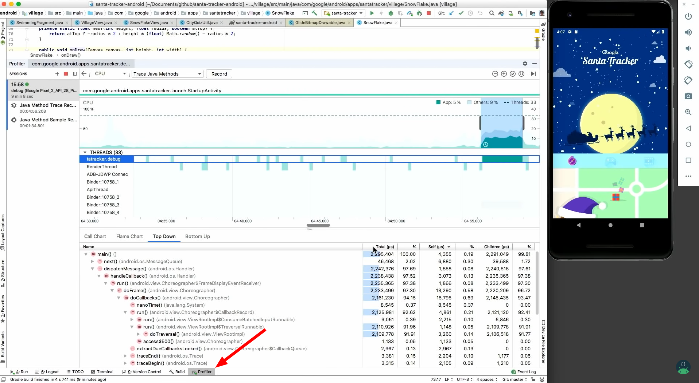

<!-- _footer: https://www.youtube.com/watch?v=LGVbpobV-Yg -->

---

# Sampling vs Tracing

**Sampling:** сохраняем stacktrace программы каждые `n`мс (~`10`мс)
  - легковесная оценка

**Tracing:** инструментируем method enter/exit и считаем, сколько времени провели в каждом методе
  - большой overhead для быстрых методов (e.g. `getId`).
  - точное число вызовов каждого метода
  - точная трасса исполнения программы
  - обычно есть система фильтров имен классов/методов

---

# Sampling vs Sampling Async

**Sampling:**
  - Java API: `Thread.getAllStackTraces()`
  - Native JVM TI: `GetAllStackTraces()`

**Sampling Async:**
  - itimer() + SIGPROF
  - HotSpot API: `AsyncGetCallTrace()` 

<!-- _footer: https://jug.ru/talks/meetups/the-art-of-the-java-profiling/ -->

---

# Safe Points / Программа

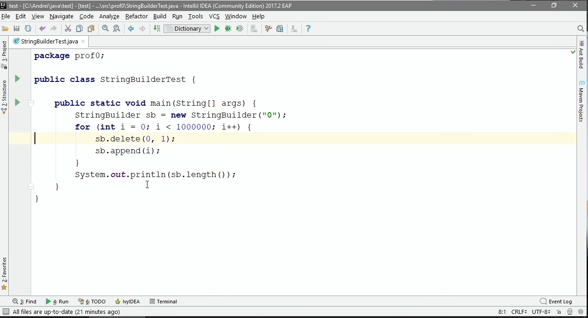

<!-- _footer: https://jug.ru/talks/meetups/the-art-of-the-java-profiling/ -->

---

# Safe Points / Sampling Profiler Trace

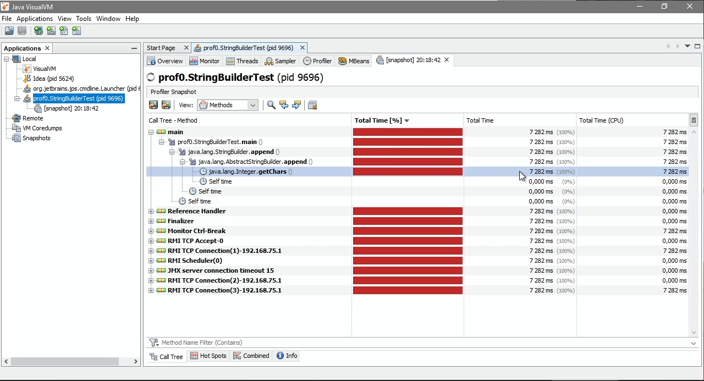

<!-- _footer: https://jug.ru/talks/meetups/the-art-of-the-java-profiling/ -->

---

# Safe Points / Async Profiler Trace

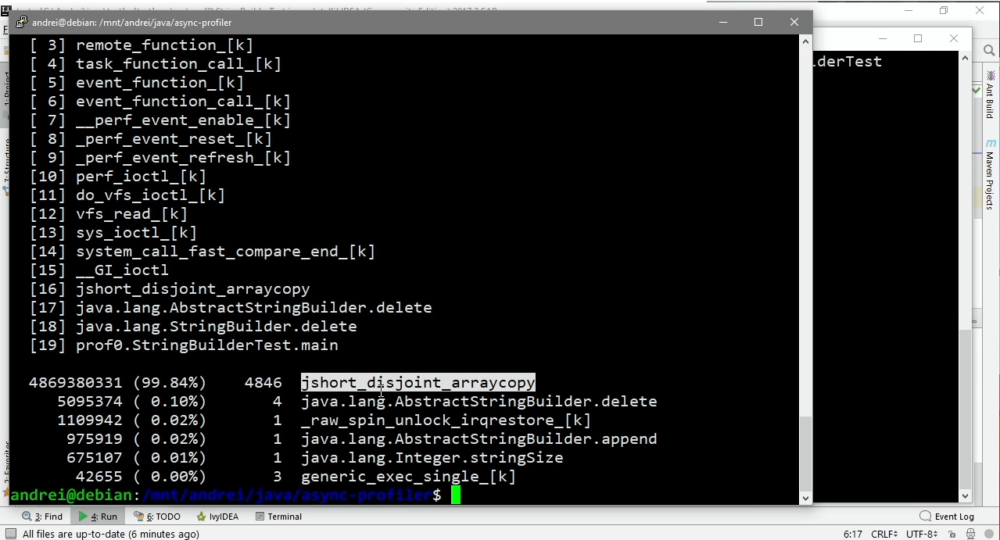

<!-- _footer: https://jug.ru/talks/meetups/the-art-of-the-java-profiling/ -->

---

# Safe Points / Safe Points

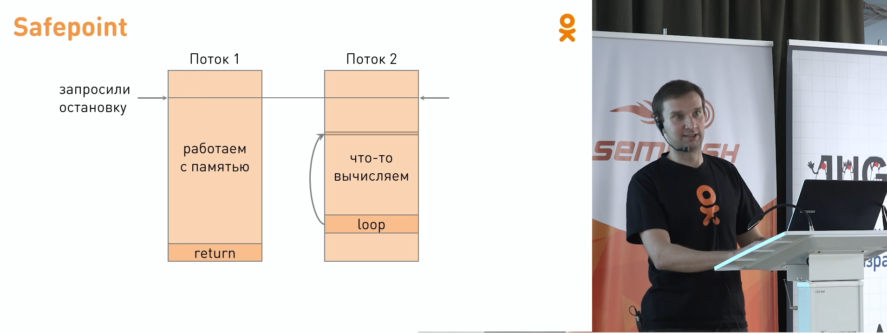

**Safe Point** — точка в программе, где существует однозначное отображение состояния JVM на исходный байт-код.
(все изменения, ожидаемые в байт-коде, зафиксированы в памяти)

HotSpot обычно ставит SafePoints перед выходом из цикла или метода.

HotSpot обычно НЕ ставит SafePoints перед выходом из счетного цикла. (см. `-XX:+UseCountedLoopsSafepoints`)

<!-- _footer: https://jug.ru/talks/meetups/the-art-of-the-java-profiling/ -->

---

# SafePoint in Android

Автору данной презентации достоверно не известно о ситуации с SafePoints в ART (скорее всего, они есть).

`System.arrcopy` хорошо видно в Android Profiler в Sampling Java режиме
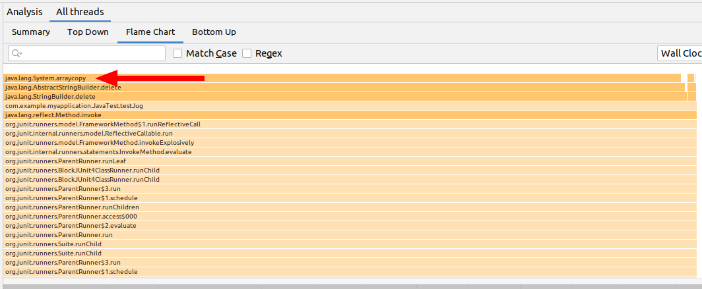

---

# Profilers / Memory

Можно профилировать аллокации

Можно изучать состояние (heap dump)

---

# Saving Memory

JVM: [Class Data Sharing](https://docs.oracle.com/javase/8/docs/technotes/guides/vm/class-data-sharing.html)

Android: Zygote

<!-- _footer: https://developer.android.com/topic/performance/memory-overview -->

---

# Подробнее про Zygote

<style scoped>
ul {
width: 600px;
}
</style>

<!-- _class: flexrow -->

> the initial cell formed when a new organism is produced


- `fork()`
- Copy-on-Write shared memory уже содержит наиболее востребованные классы из Android Framework


<!-- _footer: https://medium.com/@voodoomio/what-the-zygote-76f852d887d9 -->

<!--
Bootrom is a small piece of write-protected flash rom memory embedded inside the processor chip. It contains the very first code that is executed by the processor when it powers up or resets.

BootLoader is started by the bootrom, it’s job is to execute any specific setup before starting the Kernel, which literary means to copy os files to working memory.

Kernel will start setup cache, protected memory, scheduling and loads drivers. When kernel finishes system setup first thing it does is look for “init” in system files and launches root process or the first process of the system.

init is a root process, it has two responsibilities, mount directories like /sys, /dev, /proc and run init.rc script that starts among other things native daemons like Service Manager, Media Server etc..

Android runtime is started by init root process with app_process command which tells it to start Art or Dalvik process virtual machine and to call Zygote's main() function.

Art/Dalvik are process virtual machines. Dalvik is used on devices below Lollipop where's it is replaced by Art. The biggest difference between them is that Dalvik uses JIT (just in time) and Art uses AOT (ahead of time) compilation.

Zygote is a special Android OS process that enables shared code across Dalvik/Art VM in contrast with Java VM where each instance has its own copy of core library class files and heap objects.
-->

---

# Garbage Collectors

JVM: serial, parallel, CMS, G1, ... (Shenandoah)

Android: GC in Dalvik, GC in ART

:)

---

# Общие Характеристики GC

Традиционно, при определении эффективности работы сборщика мусора учитываются следующие факторы:

- Максимальная задержка — максимальное время, на которое сборщик приостанавливает выполнение программы для выполнения одной сборки. Такие остановки называются stop-the-world (или STW).
- Пропускная способность — отношение общего времени работы программы к общему времени простоя, вызванного сборкой мусора, на длительном промежутке времени.
- Потребляемые ресурсы — объем ресурсов процессора и/или дополнительной памяти, потребляемых сборщиком.


<!-- footer: https://habr.com/ru/post/269621/ -->

---

# Слабая Гипотеза о Поколениях

<style scoped>
p {
width: 50%;
}
</style>

<!-- _class: flexrow -->

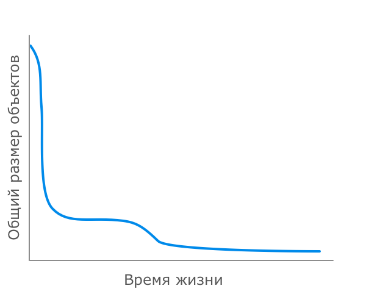

Большинство объектов создаются на короткий срок.

---

# Serial & Parallel GC. Организация Кучи.


Все объекты аллоцируются в Eden (YoungGen), кроме *акселератов*.

Tenured = OldGen

<!-- footer: https://habr.com/ru/post/269707/ -->

---

# Serial & Parallel GC. Малая Сборка (minor gc)

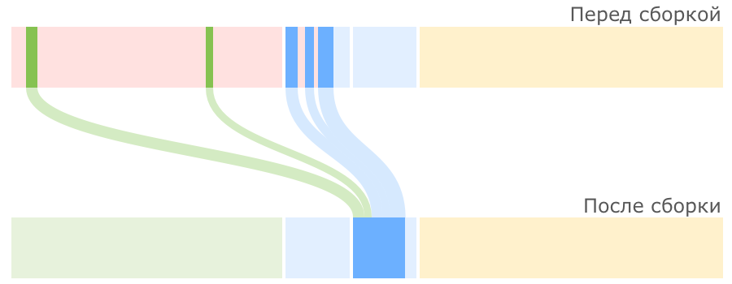

---

# Serial & Parallel GC. Большая Сборка (full gc)

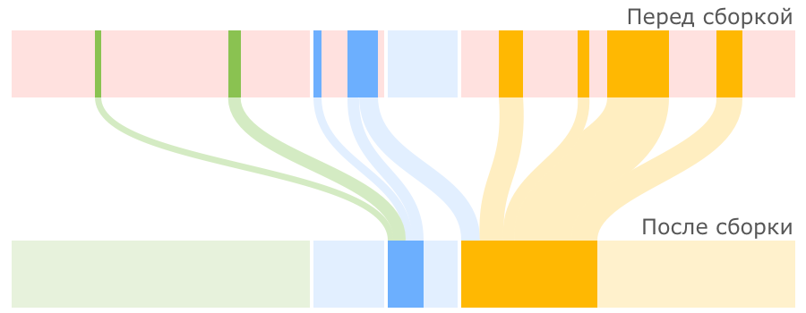

---

# STW (Stop-the-World)

GC происходит в SafePoint при полностью отсановленных потоках приложения

Serial GC - все операции выполняет в одном потоке, Parallel GC - на нескольких

---

# Зачем Нужны Поколения?

Чем меньше размер кучи (поколения), тем
- быстрее в нем сборка мусора. (=> уменьшается размер STW паузы)
- чаще срабатывает GC, уменьшая throughput

В маленьком NewGen удается собирать мусор быстро
В большом OldGen нужно собирать мусор редко (в идеале — никогда)

Object Pools & Caches плохо вписываются в гипотезу о поколениях.

---

# Как Найти Выжившие Объекты?

GC roots:
- local variables
- active threads
- static variables
- JNI references


---

# Concurrent Mark Sweep (CMS) GC

Организация памяти — как в Parallel GC (New,Old,Survival)

Малая сборка — как в Parallel GC

Большая сборка — параллельно с приложением, не дожидаясь полного заполнения tenured

Малые (minor) и большие (major) сборки разделены во времени (full gc происходит в случае concurrent mode failure)

<!-- _footer: https://docs.oracle.com/javase/8/docs/technotes/guides/vm/gctuning/cms.html -->

---

# CMS: Major GC

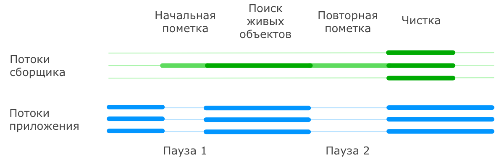

**initial mark** — обычно очень короткая. Пометка GC roots
**remark** нужен для поиска выживших объектов по изменившимся ссылкам (SATB = snapshot at the begining), допускается "плавающий" (*floating*) мусор

<!-- footer: https://habr.com/ru/post/269863/ -->

---

> Why do I get OutOfMemory when 20% of the heap is still free

CMS после очистки не производит упаковку объектов в старшем поколении, так как делать это при работающем приложении весьма затруднительно.

---

# Android / Dalvik

1. STW для пометки GC roots
1. Поиск живых объектов (concurrent)
1. Поиск живых объектов (pause) (=remark)
1. Сборка (concurrent)

Упаковка не производится.

Сравните с CMS OldGen

<!-- footer: https://www.youtube.com/watch?v=Zc4JP8kNGmQ -->

---

# Dalvik: GC_FOR_ALLOC

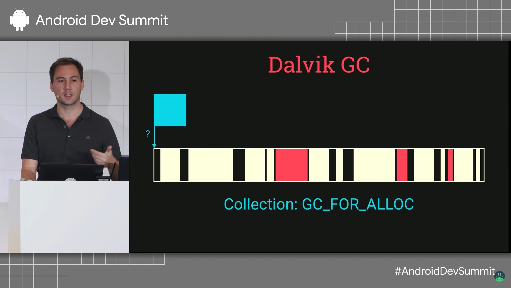

---

# Dalvik: OOM

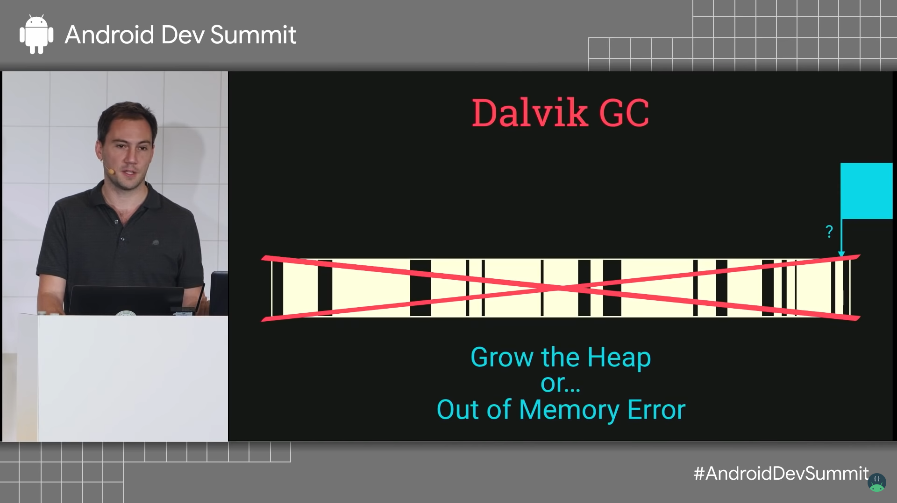

---

# Dalvik: Allocating on Fragmented Heap

> We cannot find space for 2 megs out of 200 because apparently Dalvik was really bad at math :)

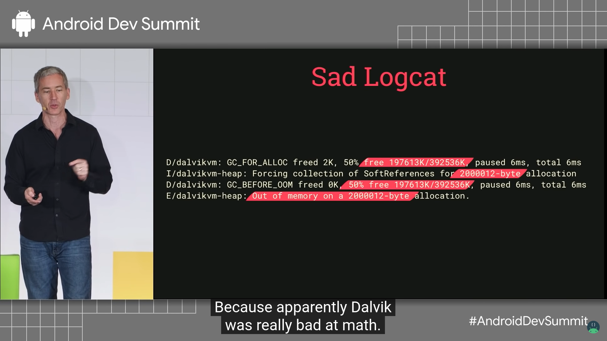

---

# HotSpot: G1 GC

https://docs.oracle.com/javase/8/docs/technotes/guides/vm/gctuning/g1_gc.html#garbage_first_garbage_collection

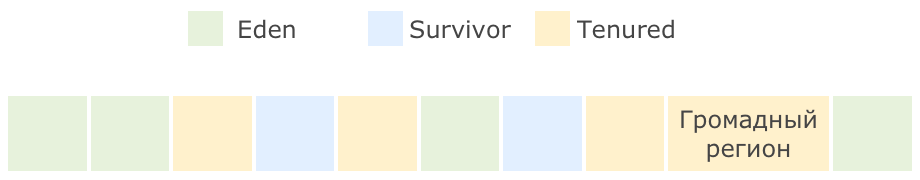

1. Регионы (общее количество <=2048)
2. Есть поколения (логические)
3. Основная цель - предсказуемые STW паузы (по умолчанию цель 100 мc)

<!-- footer: https://habr.com/ru/post/269863/ -->

---

# G1 Minor GC

С остановкой приложения

Очищается не весь Eden, а только некоторые регионы, которые можно успеть очистить не превышая целевое время.

В первую очередь очищаются регионы, где ожидается больше всего мусора (эвристики) => Garbage First (G1)

---

# G1 Mixed GC. Marking Cycle (Цикл Пометки)

Как в CMS:
1. Initial mark. Пометка корней (STW).
1. Concurrent marking. Пометка всех живых объектов в куче в нескольких потоках параллельно с работой приложения.
1. Remark. Дополнительный поиск не учтенных ранее живых объектов (STW).
1. Cleanup. Очистка вспомогательных структур учета ссылок на объекты (два шага, первый — STW)

---

# G1 Mixed GC. Evacuation.

Во время сборок к регионам NewGen добавляются регионы OldGen. Количество регионов вычисляется на основве статистики и с целью не превысить допустимую паузу.

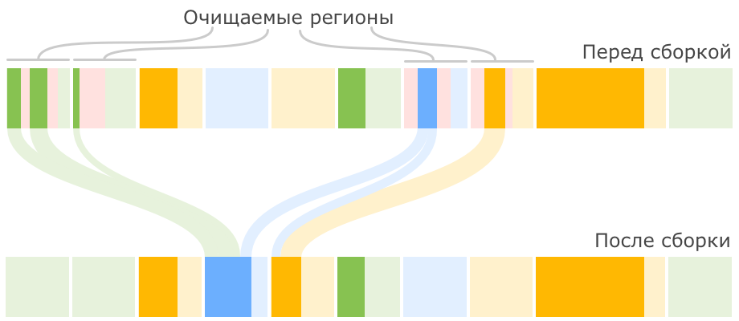

---

# G1 Allocation (Evacuation) Failure

Может оказаться, что нет больше свободных регионов для allocation или evacuation.

Тогда приложение останавливается и начинается Full GC

---

# Android: ART GC

2018: concurrent heap compaction (сравним с G1), без поколений. Регион 256Кб
2019: generations, пока без survival space (see https://www.youtube.com/watch?v=1uLzSXWWfDg)


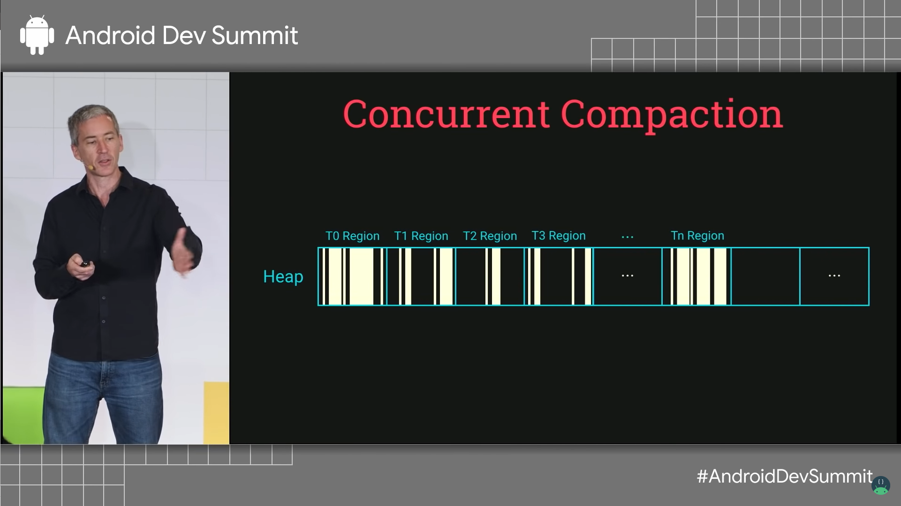

<!-- footer: https://www.youtube.com/watch?v=Zc4JP8kNGmQ -->

---

# Несколько Тонкостей

## Чтобы мир GC не казался слишком простым 

Многопоточное приложение. Как быстро выделить память под новый объект и случайно не отдать один и тот же регион под разные объеты в рахных потоках?

Dalvik: lock
JVM: TLAB (Thread Local Allocation Block). 
В ART тот же принцип (thread local allocation regions)

---

# Inspections

Тема отдельной лекции